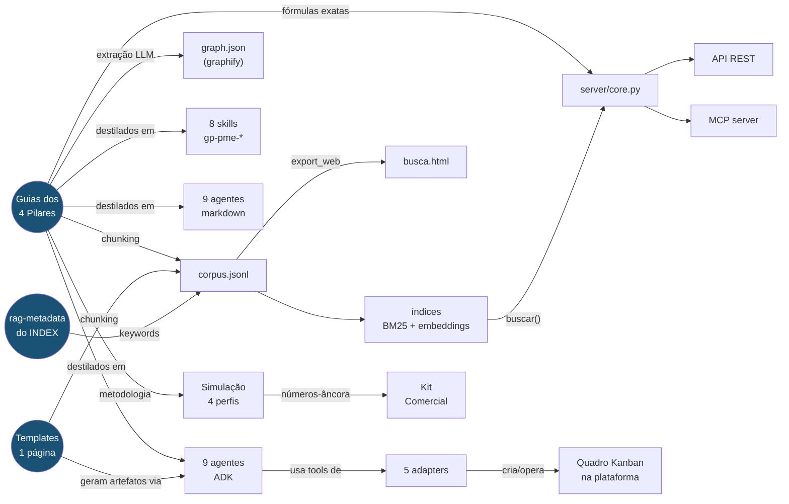
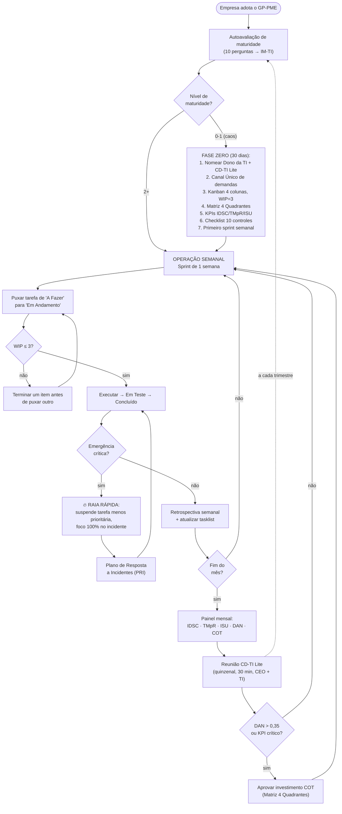
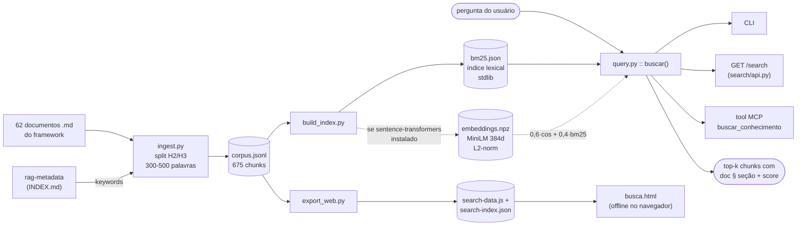
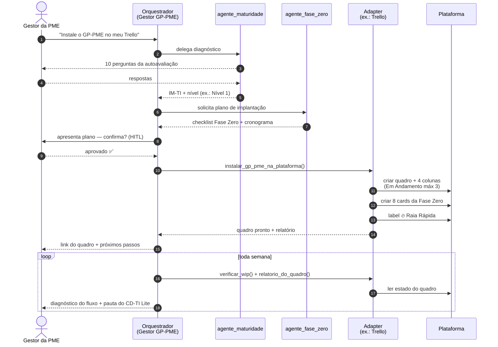

# 🗺️ Arquitetura — GP-PME Edição Comercial v2.0

> Visão completa do produto: do núcleo de conhecimento às camadas de descoberta,
> IA, plataformas de gestão e negócio. Detalhes de cada componente em
> [progress.md](progress.md) e [RELATORIO_ENTREGA_v2.md](RELATORIO_ENTREGA_v2.md).

```mermaid
flowchart TB
    subgraph NUCLEO["📚 Núcleo de Conhecimento (fonte da verdade)"]
        INDEX["INDEX.md v2.0<br/>(vitrine + rag-metadata)"]
        GUIAS["Guides/ — 7 guias<br/>(Pilares 1-4, Fase Zero,<br/>KPIs, Maturidade)"]
        TPL["Templates/ — 7 artefatos<br/>de 1 página"]
        DUM["guide-for-dummies/ +<br/>GP-Pme complete/ + GP-PME/"]
    end

    subgraph BUSCA["🔎 Camada de Descoberta"]
        ING["ingest.py<br/>(chunking por heading<br/>+ keywords do rag-metadata)"]
        CORPUS[("corpus.jsonl<br/>675 chunks / 62 docs")]
        BM25[("bm25.json<br/>(stdlib, sempre)")]
        EMB[("embeddings.npz<br/>MiniLM multilíngue<br/>(opcional)")]
        CLI["CLI<br/>python -m search.query"]
        SAPI["API FastAPI<br/>/search"]
        WEB["busca.html<br/>(offline, file://)"]
        GRAPH["graphify-out/<br/>graph.html + query"]
    end

    subgraph IA["🤖 Ecossistema de IA (4 camadas)"]
        SKILLS["Skills Claude Code<br/>.claude/skills/gp-pme-*<br/>(8 skills engatáveis)"]
        PRONTOS["Agentes_Prontos/<br/>9 system prompts<br/>(Claude Projects / GPTs)"]
        subgraph ADK["Agentes Google ADK"]
            ORQ["orquestrador_gp_pme<br/>(Gestor GP-PME)"]
            ESP["8 especialistas:<br/>governança · execução ágil<br/>segurança · métricas<br/>maturidade · fase zero<br/>PRD · prompts"]
            ADAPT["adapters/<br/>base.py (contrato +<br/>quadro canônico WIP=3)"]
        end
        subgraph SRV["server/ (ambientes restritos)"]
            CORE["core.py<br/>(regras puras: IM-TI,<br/>KPIs, DAN, COT, ROI)"]
            REST["api.py<br/>FastAPI · 12 rotas"]
            MCP["mcp_server.py<br/>FastMCP · 11 tools"]
        end
    end

    subgraph PLAT["🏢 Plataformas de Gestão"]
        CU["ClickUp"]
        NO["Notion"]
        TR["Trello"]
        JI["Jira"]
        LI["Linear"]
    end

    subgraph NEGOCIO["💼 Camada de Negócio"]
        SIM["Simulacao/<br/>4 perfis + Calculadora ROI<br/>(payback 1,8-3,0 meses)"]
        COM["Comercial/<br/>proposta · one-pager ·<br/>precificação · onboarding"]
    end

    GUIAS --> ING
    TPL --> ING
    INDEX -->|rag-metadata| ING
    DUM --> ING
    ING --> CORPUS --> BM25 & EMB
    BM25 & EMB --> CLI & SAPI
    CORPUS -->|export_web| WEB
    GUIAS -.->|extração semântica| GRAPH

    GUIAS -->|fonte das instructions| ESP & PRONTOS & SKILLS
    GUIAS -->|fórmulas| CORE
    ORQ --> ESP
    ORQ --> ADAPT
    ADAPT --> CU & NO & TR & JI & LI
    CORE --> REST & MCP
    CLI -->|buscar()| CORE

    GUIAS -->|metodologia| SIM --> COM

    CLIENTE(("👤 Cliente /<br/>Consultor")) --> WEB & CLI & MCP & REST & ORQ & SKILLS & PRONTOS & SIM & COM
```

## 🧱 Diagrama de blocos (visão em quadradinhos)

A mesma arquitetura em blocos, camada por camada, com o fluxo que cada coisa segue —
de onde o conhecimento nasce (topo) até quem consome (base):

```
┌───────────────────────────────────────────────────────────────────────────────┐
│                     📚 NÚCLEO DE CONHECIMENTO (fonte da verdade)               │
│  ┌──────────────┐ ┌──────────────┐ ┌──────────────┐ ┌───────────────────────┐  │
│  │  INDEX.md    │ │  Guides/     │ │  Templates/  │ │  dummies + capítulos  │  │
│  │  v2.0 + rag- │ │  7 guias dos │ │  7 artefatos │ │  + documentos mestre  │  │
│  │  metadata    │ │  4 pilares   │ │  de 1 página │ │  (leigos e técnico)   │  │
│  └──────┬───────┘ └──────┬───────┘ └──────┬───────┘ └───────────┬───────────┘  │
└─────────┼────────────────┼────────────────┼─────────────────────┼──────────────┘
          │ keywords       │ chunking / destilação / fórmulas     │
          ▼                ▼                ▼                     ▼
┌───────────────────────────────────────────────────────────────────────────────┐
│                          🔎 CAMADA DE DESCOBERTA                               │
│  ┌───────────┐   ┌──────────────┐   ┌─────────────┐   ┌────────────────────┐  │
│  │ ingest.py │──▶│ corpus.jsonl │──▶│ bm25.json + │──▶│ CLI · API /search  │  │
│  │ (chunks)  │   │  675 chunks  │   │ embeddings  │   │ · busca.html (off) │  │
│  └───────────┘   └──────┬───────┘   └─────────────┘   └────────────────────┘  │
│                         │ export_web        ┌──────────────────────────────┐  │
│                         └───────────────▶   │ graphify-out/ (grafo:        │  │
│                                             │ graph.html + query + report) │  │
│                                             └──────────────────────────────┘  │
└───────────────────────────────────────────────────────────────────────────────┘
          │
          ▼
┌───────────────────────────────────────────────────────────────────────────────┐
│                    🤖 ECOSSISTEMA DE IA (4 camadas, leve → integrado)          │
│                                                                                │
│  ① ┌────────────────────┐  ② ┌────────────────────┐                            │
│    │ .claude/skills/    │    │ Agentes_Prontos/   │                            │
│    │ 8 skills gp-pme-*  │    │ 9 system prompts   │                            │
│    │ (Claude Code)      │    │ (Projects/GPTs)    │                            │
│    └────────────────────┘    └────────────────────┘                            │
│                                                                                │
│  ③ ┌─────────────────────────────────────────────┐                             │
│    │        agents/gp-pme-adk/ (Google ADK)      │                             │
│    │  ┌───────────────┐   ┌────────────────────┐ │                             │
│    │  │ orquestrador  │──▶│ 8 especialistas    │ │                             │
│    │  │ Gestor GP-PME │   │ gov·agil·seg·metr· │ │                             │
│    │  └───────┬───────┘   │ mat·fz·prd·prompts │ │                             │
│    │          │           └────────────────────┘ │                             │
│    │          ▼                                  │                             │
│    │  ┌───────────────────────────────────────┐  │                             │
│    │  │ adapters/ (base + 5 plataformas)      │  │                             │
│    │  └──────────────────┬────────────────────┘  │                             │
│    └─────────────────────┼───────────────────────┘                             │
│                          ▼                                                     │
│    ┌────────┐ ┌────────┐ ┌────────┐ ┌──────┐ ┌────────┐                        │
│    │ClickUp │ │ Notion │ │ Trello │ │ Jira │ │ Linear │  🏢 plataformas        │
│    └────────┘ └────────┘ └────────┘ └──────┘ └────────┘                        │
│                                                                                │
│  ④ ┌─────────────────────────────────────────────┐                             │
│    │   server/ (para ambientes restritos)        │                             │
│    │  ┌─────────┐    ┌──────────┐  ┌───────────┐ │                             │
│    │  │ core.py │───▶│ api.py   │  │ mcp_      │ │                             │
│    │  │ (regras │    │ REST ·12 │  │ server.py │ │                             │
│    │  │  puras) │───▶│ rotas    │  │ ·11 tools │ │                             │
│    │  └─────────┘    └──────────┘  └───────────┘ │                             │
│    └─────────────────────────────────────────────┘                             │
└───────────────────────────────────────────────────────────────────────────────┘
          │
          ▼
┌───────────────────────────────────────────────────────────────────────────────┐
│                          💼 CAMADA DE NEGÓCIO                                  │
│  ┌─────────────────────────────┐        ┌─────────────────────────────────┐   │
│  │ Simulacao/                  │───────▶│ Comercial/                      │   │
│  │ 4 perfis (10→100 func.)     │números │ proposta · one-pager ·          │   │
│  │ + Calculadora_ROI           │        │ precificação · onboarding 30d   │   │
│  └─────────────────────────────┘        └─────────────────────────────────┘   │
└───────────────────────────────────────────────────────────────────────────────┘
          │
          ▼
   ┌─────────────────┐
   │ 👤 CLIENTE /    │   consome por qualquer porta: busca.html, CLI, API,
   │    CONSULTOR    │   MCP, agentes, skills, simulação e kit comercial
   └─────────────────┘
```

## 🕸️ Grafo de relações entre componentes

Visão em grafo (estilo knowledge graph): quem **deriva de**, **consome** ou **opera** quem.



## 🔁 Fluxograma do protocolo de gestão (o que os agentes executam)

O protocolo operacional do framework — é este fluxo que o orquestrador "Gestor GP-PME",
as skills e os agentes prontos conduzem na empresa:



## 📊 Pipeline de dados da busca semântica



## 🤝 Sequência: instalando o GP-PME numa plataforma de gestão



## Leitura do diagrama

- **Fluxo de conhecimento:** os guias/templates são a única fonte da verdade. Tudo deriva deles — chunks da busca, instructions dos agentes, fórmulas do server, metodologia da simulação. Atualizou um guia → reindexe (`python -m search.ingest && python -m search.build_index && python -m search.export_web`) e revise o agente correspondente.
- **4 camadas de IA, do mais leve ao mais integrado:** skills (dentro do Claude Code) → agentes markdown (qualquer chat) → agentes ADK (executáveis, instalam o kanban nas plataformas) → MCP/API (o framework como serviço para ambientes restritos).
- **Duas portas para plataformas de gestão:** o orquestrador ADK opera ClickUp/Notion/Trello/Jira/Linear via adapters (com dry-run para demo); onde nada disso pode ser instalado, o `server/` expõe o protocolo via MCP ou REST.
