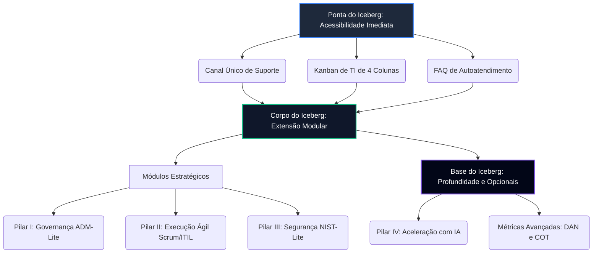

# Capítulo 1: Arquitetura Geral do GP-PME e Princípios Fundamentais

---

## 1.1. O Modelo "Iceberg Invertido" e a Modularidade do Framework

O framework **GP-PME (Governança Prática para Pequenas e Médias Empresas)** adota o modelo do **"Iceberg Invertido"** como sua arquitetura fundamental. Esta metáfora ilustra de forma clara e intuitiva o equilíbrio entre a entrega de valor ágil na superfície e a solidez teórica de mercado nas camadas profundas:

```
                    A PONTA DO ICEBERG (Acessibilidade Imediata)
                  - Fase Zero: Playbook Salva-Vidas de 30 Dias
                  - Mapeamento Manual de Canais de Suporte
                  - Kanban de TI de 4 Colunas
     =================================================================
                    O CORPO DO ICEBERG (Extensão Modular)
                  - Pilar I: ADM-Lite (CD-TI Lite e 4 Quadrantes)
                  - Pilar II: Execução Ágil (PRD e MVP)
                  - Pilar III: NIST-Lite (Inventário 80/20, Backups, PRI)
     =================================================================
                    A BASE DO ICEBERG (Opcionais e Métricas)
                  - Pilar IV: Aceleração por IA (Agentes e Prompts)
                  - Pilar V: Métricas Avançadas (DAN e COT)
```

Na ponta do iceberg, visível na superfície operacional, situam-se as ferramentas de **acessibilidade imediata** focadas em *Quick Wins* (vitórias rápidas). Essas ferramentas — como o Kanban básico e o Canal Único — resolvem o caos operacional imediato da empresa nas primeiras horas, exigindo esforço administrativo baixíssimo e gerando alta visibilidade para a liderança.

No corpo e na base do iceberg encontram-se os pilares táticos e estratégicos. Eles representam a **extensão modular** e a **profundidade metodológica** do framework. Embora baseados em complexas normas internacionais de TI, essas bases são destiladas e operacionalizadas de forma simples, permitindo à PME expandir a maturidade da sua governança no seu próprio ritmo, ativando módulos adicionais apenas quando a rotina anterior estiver consolidada.

### Adoção Modular na TI Enxuta
Diferente dos grandes modelos corporativos que geram burocracia excessiva e demandam departamentos de conformidade inteiros, o GP-PME apoia-se na **Filosofia da TI Enxuta**. O framework reconhece que as práticas de TI devem se adaptar ao tamanho da equipe técnico-estratégica, e não o contrário. 

Essa modularidade garante que um único profissional (*One-Man-Band*) ou uma pequena equipe de tecnologia possa implementar o framework sem interromper as operações do dia a dia. A evolução ocorre de forma natural, liberando capacidade de trabalho por meio de automações simples para focar em inovações de alto impacto financeiro.



---

## 1.2. Princípios de Design: Adaptabilidade, Acionabilidade, Mensurabilidade e Incrementalidade

O design conceitual e as ferramentas do GP-PME são estruturados sobre quatro pilares metodológicos fundamentais que garantem sua eficácia prática no dia a dia dinâmico das PMEs:

*   **Adaptabilidade**: O framework rejeita receitas rígidas e padronizações estáticas. Ele molda-se ao contexto, orçamento e tamanho da equipe da PME. Cada processo e indicador pode ser simplificado ou ampliado dependendo das dores da empresa, garantindo aderência cultural e operacional.
*   **Acionabilidade**: O GP-PME foca 100% na execução e na remoção de abstrações teóricas. O framework não apenas enuncia o que deve ser feito, mas traduz cada princípio de mercado em artefatos práticos de 1 página (templates, roteiros e listas binárias de validação) prontos para preenchimento manual ou por IA.
*   **Mensurabilidade**: A saúde da tecnologia e o alinhamento de investimentos são monitorados através de indicadores numéricos objetivos. O framework utiliza métricas financeiras e de esforço claras para a liderança (como os 3 KPIs Visíveis e os passivos de arquitetura DAN e COT), convertendo dados técnicos em linguagem comercial consumível pelo CEO e diretores.
*   **Incrementalidade**: O roadmap de adoção é dividido em marcos progressivos de maturidade. A PME inicia estabilizando a operação para recuperar capacidade produtiva (Fase Zero), formaliza a governança estratégica e cibersegurança básica (Fase Um) e escala suas automações analíticas e de IA (Fase Dois), mitigando a resistência à mudança.

---

## 1.3. O Papel Central da Inteligência Artificial (IA) como Habilitador Transversal

No framework GP-PME, a Inteligência Artificial Generativa (IAG) atua como um **co-piloto transversal e habilitador opcional**. Ela foi desenhada para suprir a escassez crônica de braços técnicos e orçamentos em PMEs, multiplicando a produtividade do profissional de TI de forma extraordinária.

### O Desacoplamento de IA
O framework opera sob uma **arquitetura estritamente desacoplada**: todos os pilares, processos e rituais operam 100% de forma manual, analógica e sem custos extras (usando planilhas locais, post-its em quadros físicos e reuniões diretas). 

Para PMEs que decidirem ativar a aceleração, a IA atua nos bastidores:
1.  **Orquestração de Suporte (Fase 1)**: Automatiza o autoatendimento de chamados rotineiros (FAQs) através de agentes inteligentes, liberando até 80% do tempo do técnico para focar em melhorias do negócio.
2.  **Burocracia Zero na Execução**: Rascunha especificações técnicas, PRDs, histórias de usuário ágeis e planos de testes em minutos, removendo o overhead administrativo da equipe.
3.  **Grounding e HITL (Human-in-the-loop)**: A IA opera sob regras rígidas de segurança corporativa (grounding em dados locais) e crivo de validação humana mandatória antes de colocar qualquer saída em produção.

---

## 1.4. Mapeamento dos Módulos GP-PME aos Frameworks Basilares

Para garantir rigor metodológico e conformidade com os maiores padrões internacionais de mercado, o GP-PME destila e simplifica os princípios mais conceituados de governança corporativa, infraestrutura ágil e cibersegurança:

| Módulo/Pilar GP-PME | Frameworks Basilares Mapeados | Principais Conceitos Destilados e Simplificados | Adaptação e Abordagem Enxuta para PMEs |
|:---|:---|:---|:---|
| **Pilar I: Governança Essencial** | ISO/IEC 38500:2024 [1]<br>COBIT 2019 (EDM/APO02) [2] | Avaliar, Dirigir e Monitorar (ADM); Managed Strategy e Alinhamento Estratégico. | **ADM-Lite**: CD-TI Lite (reunião estratégica quinzenal de 30 minutos), Matriz RACI-Lite de 1 página e Matriz 4 Quadrantes. |
| **Pilar II: Execução Ágil** | ITIL 4 SVS [3]<br>Scrum Framework [7] | Gestão de Requisições de Serviço, Gerenciamento de Incidentes, Ciclo de Sprints. | **Ciclo Micro-Adaptativo**: Canal Único obrigatório, Kanban de 4 colunas com WIP Limit de 3, PRD de 1 página e MVP de 2 semanas. |
| **Pilar III: Segurança Crítica** | NIST CSF 2.0 (Functions) [4]<br>CIS Controls v8 (IG1) [5] | Identificar ativos, Proteção de Identidades, Resposta e Mitigação de Incidentes Cibernéticos. | **NIST-Lite**: Inventário de Ativos 80/20, Princípio do Privilégio Mínimo (LUA/MFA), backups 3-2-1 na nuvem e PRI de 1 página. |
| **Métricas e Habilitadores** | ATD Index [6]<br>TCO e ROI Analysis | Dívida Técnica de Arquitetura, Custos de Infraestrutura e Retorno de Investimentos. | **DAN e COT**: Dívida de Arquitetura Normalizada (DAN) e Custo de Otimização (COT) traduzindo dívidas técnicas para o financeiro. |

Este mapeamento assegura que a PME implemente processos extremamente leves, mas com a chancela das normas técnicas globais mais respeitadas por auditorias e parceiros de mercado.

---

## Referências Bibliográficas

*   **[1]** ISO/IEC 38500:2024. *Information technology — Governance of IT for the organization*.
*   **[2]** ISACA. (2019). *COBIT 2019 Framework: Governance and Management Objectives*.
*   **[3]** Axelos. (2019). *ITIL Foundation: ITIL 4 edition*.
*   **[4]** NIST. (2024). *NIST Cybersecurity Framework (CSF) 2.0*.
*   **[5]** CIS. (2023). *CIS Critical Security Controls Version 8: Implementation Group 1*.
*   **[6]** Verdecchia, R. (2022). *Empirical evaluation of architectural technical debt indices in software-intensive systems*.
*   **[7]** Schwaber, K., & Sutherland, J. (2020). *The Scrum Guide™: The Definitive Guide to Scrum*.
