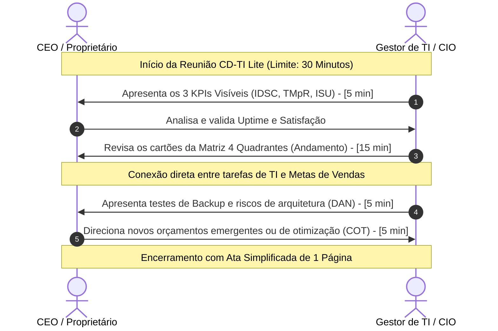

# Capítulo 2: Pilar I: Governança Essencial (ADM-Lite)

---

## 2.1. O Ciclo ADM-Lite (Avaliar, Dirigir e Monitorar)

O Pilar I do GP-PME baseia-se na simplificação do ciclo clássico de governança corporativa estabelecido pela norma **ISO/IEC 38500:2024**, denominado **ADM-Lite (Avaliar, Dirigir, Monitorar)**. Projetado para ser executado de forma enxuta e puramente manual, o ciclo remove a burocracia documental tradicional e foca em conexões diretas entre a tecnologia e a saúde financeira e comercial da PME.

```
                    [ AVALIAR ] 
                         |
                         v (Dores de Negócio e Gargalos de TI)
                    [ DIRIGIR ] 
                         |
                         v (Prioridades na Matriz 4 Quadrantes)
                    [ MONITORAR ]
                         |
                         +---> (3 KPIs Visíveis e CD-TI Lite)
```

1.  **Avaliar**: O Gestor de TI e o CEO realizam uma auditoria contínua dos gargalos técnicos de infraestrutura e do andamento de chamados operacionais. O objetivo é mapear se existem lentidões ou falhas tecnológicas impactando setores vitais da empresa (como vendas, notas fiscais ou atendimento).
2.  **Dirigir**: Com base nas dores avaliadas, as prioridades e recursos da quinzena são estabelecidos e direcionados utilizando a **Matriz 4 Quadrantes**. Cada iniciativa de TI é obrigatoriamente vinculada a um objetivo comercial (como vender mais, mitigar custos ou agilizar o suporte).
3.  **Monitorar**: O desempenho geral da TI e o cumprimento das prioridades direcionadas são acompanhados quinzenalmente através dos **3 KPIs Visíveis**, alimentando o comitê CD-TI Lite com dados reais e eliminando achismos e relatórios volumosos.

---

## 2.2. O Comitê de Direção de TI de Baixo Custo (CD-TI Lite)

O **CD-TI Lite** é a estrutura decisória central do framework. Ele substitui comitês corporativos pesados por uma reunião executiva quinzenal ou mensal estritamente limitada a **30 minutos** entre o **CEO/Dono da PME** e o **Gestor de TI**.

Nesse ritual estratégico, a governança atua como a **bússola do crescimento seguro da PME (TI Enxuta Fase 3)**. A tecnologia deixa de ser vista como um departamento técnico reativo focado em "consertar cabos e servidores" e transita para parceiro estratégico do negócio, capacitando o profissional de TI a atuar como **Chief Innovation Officer (CIO)**.



### Pauta Rígida e Gestão de Tempo:

*   **Março de Performance (0 a 5 minutos) - Revisão de KPIs**: O Gestor de TI apresenta o uptime de sistemas críticos, o tempo médio de suporte e a satisfação média dos usuários finais.
*   **Alinhamento Tático (5 a 20 minutos) - Matriz 4 Quadrantes**: Revisão dos cartões de projetos em execução no Kanban e acompanhamento das iniciativas conectadas às metas comerciais do CEO.
*   **Gestão de Riscos (20 a 25 minutos) - NIST-Lite & DAN**: O Gestor de TI reporta o sucesso dos testes de recuperação de backup diário e o índice matemático de dívida técnica DAN.
*   **Decisões e Orçamento (25 a 30 minutos) - Resumo & COT**: Liberação de verbas operacionais ou aportes para otimização tecnológica (COT) e assinatura física da ata simplificada de 1 página.

---

## 2.3. Artefatos de Governança Estratégica (Manual)

O Pilar I operacionaliza-se através de três ferramentas enxutas de 1 página:

### 2.3.1. Matriz de Responsabilidades Simplificada (RACI-Lite)
Uma planilha enxuta contendo quem executa a tarefa técnica (R - Responsável) e quem detém o poder de decisão e aprovação final de verbas e prioridades (A - Aprovador) para cada serviço essencial de TI. Isso elimina ambiguidades corporativas comuns ("quem é dono de qual processo").

### 2.3.2. A Matriz 4 Quadrantes
Painel visual de alinhamento tático que divide 100% dos cartões de projetos e infraestrutura de TI em quatro áreas de geração de valor para o negócio:
*   **Quadrante 1: Injeção de Receita (Vender Mais)**: Projetos que geram faturamento (ex: instalar Pix no PDV ou otimizar portal de vendas).
*   **Quadrante 2: Redução de Custos (Economizar)**: Projetos que otimizam despesas (ex: desligar licenças ociosas de software ou virtualizar servidores físicos).
*   **Quadrante 3: Experiência do Cliente e Usuário (Agilizar)**: Iniciativas que destravam o time (ex: construir FAQ de autoatendimento ou reestruturar Wi-Fi).
*   **Quadrante 4: Resiliência e Segurança (Proteger)**: Controles que evitam desastres (ex: automatizar backups diários ou implantar privilégios mínimos).

### 2.3.3. Dashboard dos 3 KPIs Visíveis
O GP-PME monitora apenas três indicadores cruciais que refletem a saúde da TI de forma inteligível para a diretoria:

1.  **IDSC (Índice de Disponibilidade de Serviços Críticos)**: Mede a porcentagem de tempo que os sistemas vitais de faturamento ficaram de pé no mês.
    $$\text{IDSC} = \left( 1 - \frac{\text{Tempo Total de Parada Operacional Inesperada (Horas)}}{\text{Tempo Comercial de Operação da PME (Horas)}} \right) \times 100$$
    *   *Meta de Mercado*: **> 99.5%**.
2.  **TMpR (Tempo Médio para Resolução)**: Velocidade com que as solicitações de chamados comuns dos colaboradores são encerradas.
3.  **ISU (Índice de Satisfação do Usuário Final)**: Nota média de 1 a 5 estrelas coletada pós-atendimento aos chamados.
    *   *Meta de Mercado*: **> 4.5/5.0**.

---

## 2.4. Aceleração Opcional com Inteligência Artificial

Para PMEs que utilizarem o **Pilar IV (IA)**, o Gestor de TI pode acionar o **Agente 1: Orquestrador Estratégico (ADM-Lite)** para remover o overhead burocrático:

*   **Briefings e Pautas Automáticas**: Ao alimentar a IA com as planilhas brutas de chamados e status de cartões do Kanban, o agente gera em menos de 2 minutos uma pauta focada de 30 minutos com os tópicos de alerta e as perguntas que o CEO deve realizar para auditar a TI.
*   **Grounding Estratégico**: A IA está restrita a sugerir iniciativas de preenchimento dos quadrantes da Matriz que respeitem as premissas de orçamento descritas nas metas do CEO, evitando sugestões inviáveis.
*   **Validação HITL**: Toda pauta ou ata gerada por IA deve obrigatoriamente passar pela verificação e assinatura do Gestor técnico humano antes de sua oficialização.
