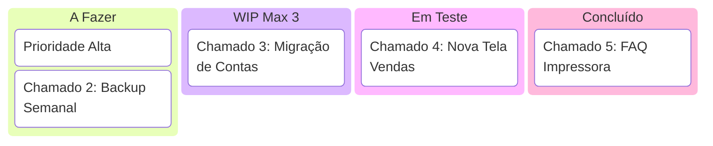

# Capítulo 3: Pilar II: Execução Ágil (Ciclo de Serviço Micro-Adaptativo)

---

## 3.1. O Ciclo de Serviço Micro-Adaptativo (Scrum + ITIL Lite)

O Pilar II operacionaliza o gerenciamento diário da TI, traduzindo as diretrizes estratégicas da Governança (Pilar I) em entregas rápidas semanais. Ele destila os princípios de entrega contínua de valor e melhoria contínua da **ITIL 4 SVS** [3] e a agilidade estruturada de Sprints do **Scrum** [7], unificando-os em um **Ciclo de Serviço Micro-Adaptativo** de baixíssimo custo administrativo.

```
[ METAS DO NEGÓCIO ] -> Priorizadas quinzenalmente no CD-TI Lite (4 Quadrantes)
          |
          v
   [ SPRINT PLANNING ]  -> TI planeja tarefas manuais da sprint (1-2 semanas)
          |
          v
   [ SPRINT EXECUTION ] -> Execução diária no Kanban com limite estrito de WIP
          |
          v
   [ ENTREGA & SUPORTE ]-> Implantação e monitoramento através de Canal Único
```

Na **TI Enxuta (Fase 1 e Fase 2)**, a execução é dividida em dois marcos fundamentais:
*   **Fase 1: Orquestração do Valor e Fim do Caos**: Foco no autoatendimento de dúvidas comuns por FAQs ou chatbot inteligente para economizar até **80% do tempo técnico**, centralizando chamados operacionais e disciplinando os canais.
*   **Fase 2: O Laboratório de Inovação (Ciclo "One-Man-Band")**: Utilização do tempo livre recuperado para prototipação rápida de automações e ferramentas internas de alto valor, entregando versões utilizáveis em no máximo **2 semanas (MVP)**.

Este pilar funciona de forma **100% manual e analógica** (usando lousas físicas, formulários simples e post-its), com a IA atuando de forma estritamente opcional como aceleradora de documentações.

---

## 3.2. Gestão de Fluxo de Trabalho (Kanban e Canal Único)

### 3.2.1. O Quadro Kanban de 4 Colunas
Todas as demandas (incidentes de suporte, manutenções e novos projetos) são registradas e gerenciadas visualmente em um único quadro Kanban contendo quatro colunas estritas:



*   **A Fazer (Backlog)**: Fila de espera de chamados e tarefas, ordenados de cima para baixo por prioridade estratégica do CD-TI Lite.
*   **Em Andamento**: O que o técnico de TI está trabalhando fisicamente no momento.
    *   *Regra de Ouro (Manual)*: O limite de Trabalho em Progresso (**WIP - Work in Progress**) deve ser de **no máximo 3 tarefas simultâneas** por técnico, garantindo foco extremo e finalização rápida de gargalos operacionais antes de abrir novas frentes.
*   **Em Teste**: Tarefas finalizadas pela TI aguardando a validação e assinatura do colaborador solicitante.
*   **Concluído**: Histórico de demandas devidamente finalizadas e entregues.

### 3.2.2. O Canal Único de Suporte
Para eliminar o estresse e a perda de chamados oriundos de chats informais (WhatsApp pessoal, e-mail pessoal, conversas de corredor), o framework estabelece um **ponto de entrada unificado obrigatório** (como um formulário eletrônico simples ou e-mail corporativo dedicado de suporte).
*   Nenhuma tarefa entra no Kanban se não estiver registrada no Canal Único.
*   O técnico de TI só inicia atividades que estejam documentadas no quadro, disciplinando a empresa e dando transparência de esforço para a diretoria.

---

## 3.3. Desenvolvimento de Soluções e Laboratório de Inovação

### 3.3.1. PRD Simplificado (1 Página)
Para o desenvolvimento de novos recursos ou aquisições tecnológicas, o Gestor de TI rascunha um **Product Requirements Document (PRD) Simplificado** de apenas **1 página**, contendo:
1.  *A dor de origem* (o problema real a ser sanado).
2.  *A história de usuário* ("Como [persona], eu quero [ação] para que [benefício]").
3.  *Os critérios de aceitação binários* (passa / não passa, no modelo Dado que / Quando / Então).
4.  *O escopo negativo* (o que expressamente não faremos agora para não inchar o projeto).
5.  *As métricas de sucesso* (KPIs mensuráveis do projeto).

### 3.3.2. Matriz de Priorização Urgência vs. Impacto (Eisenhower Adaptada)
Classificação ágil de incidentes e projetos com base na gravidade de parada de faturamento:

| Severidade de Impacto | Urgência Alta (Sistemas Parados) | Urgência Média (Lentidão Operacional) | Urgência Baixa (Dúvida/Estética) |
|:---|:---:|:---:|:---:|
| **Alto** (ERP / Notas Fiscais) | **Crítico** (Fazer Agora) | **Alto** (Resolver Hoje) | **Médio** (Agendar Sprint) |
| **Médio** (Parada de 1 Setor) | **Alto** (Resolver Hoje) | **Médio** (Agendar Sprint) | **Baixo** (Tratar no Backlog) |
| **Baixo** (Individual / Dúvida) | **Médio** (Agendar) | **Baixo** (Fila Comum) | **Descarte** (Eliminar se sem valor) |

---

## 3.4. Aceleração Opcional com Inteligência Artificial

Caso a PME opte pelo **Pilar IV (Aceleração por IA)**, o Gestor de TI pode acionar o **Agente 2: Analista de Execução Ágil (Scrum/ITIL)** para automatizar a burocracia do Pilar II:

*   **Preenchimento Automático de PRDs**: O gestor dita a dor do negócio em linguagem natural (ex: "o financeiro perde 2 horas conferindo conciliações bancárias") e a IA especialista preenche instantaneamente o template oficial de PRD do GP-PME com histórias de usuário e critérios de aceitação.
*   **Prompt Chaining de Desenvolvimento**: A IA encadeia prompts: o PRD gera histórias de usuário, que alimentam a geração de boilerplate de código base, que gera os roteiros automáticos de testes unitários do MVP de 2 semanas.
*   **HITL obrigatório**: O Gestor de TI humano revisa e assina todos os critérios antes da Sprint.
