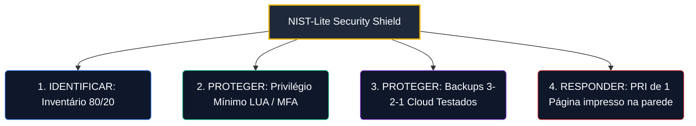

# Capítulo 4: Pilar III: Segurança Crítica (NIST-Lite)

---

## 4.1. Ameaças Cibernéticas em PMEs e a Necessidade de uma Segurança Adaptada

Pequenas e Médias Empresas (PMEs) são atualmente os alvos mais frequentes e vulneráveis a ataques cibernéticos globais. Ameaças como sequestro de dados por **ransomware**, golpes de **phishing** e roubo de credenciais corporativas representam riscos existenciais reais que podem paralisar faturamentos e destruir a reputação de negócios em minutos.

Diferente de grandes corporações, as PMEs não possuem orçamentos massivos nem equipes inteiras dedicadas à segurança da informação. O Pilar III introduz o modelo **NIST-Lite**, que destila as principais funções de proteção do **NIST CSF 2.0** [4] e as defesas prioritárias do **CIS Controls v8 (Grupo de Implementação 1 - IG1)** [5] em processos extremamente simples e de baixíssimo custo.

Na **TI Enxuta (Fase 3)**, a segurança cibernética atua como a **bússola de crescimento seguro**. À medida que a PME automatiza seus processos e desenvolve inovações rápidas (Fase 1 e 2), a exposição digital aumenta. O NIST-Lite estabelece controles manuais e binários sistemáticos para assegurar que esse crescimento comercial acelerado seja seguro e sustentável.

---

## 4.2. A Estrutura de Controles Mínimos do NIST-Lite

A cibersegurança do GP-PME é simplificada em torno de 4 funções essenciais operadas de forma manual e analógica:

### 4.2.1. Inventário 80/20 de Ativos Críticos (Identificar)
Tentar mapear e blindar 100% da rede e computadores de forma contínua é inviável para equipes enxutas. O GP-PME foca na Regra de Pareto: registrar em uma planilha local simples apenas os **20% dos ativos e servidores de dados que, se pararem, paralisam 80% do faturamento da empresa** (ex: o banco de dados do ERP, o notebook do faturamento financeiro e as contas de administração de e-mails em nuvem). Nossa prioridade total de segurança será voltada para esses ativos críticos.

### 4.2.2. Princípio do Privilégio Mínimo e MFA (Proteger)
*   **Privilégio Mínimo (LUA - Least User Access)**: Remoção sistemática de acessos de "Administrador local" das contas de computadores utilizadas pelos colaboradores no dia a dia. Se uma conta de funcionário sofrer invasão por malware, o vírus não conseguirá se instalar ou se espalhar pela rede, pois o sistema operacional exigirá a senha de administrador da TI.
*   **MFA (Autenticação de Dois Fatores)**: Ativação mandatória de confirmação de logins (código por aplicativo de celular ou SMS) em 100% das contas de e-mail e sistemas de dados da PME, bloqueando até 98% dos roubos de credenciais corporativas comuns.

### 4.2.3. Backups Automatizados e Testados (Proteger)
*   **Automação**: Configuração de cópias de segurança diárias automáticas dos dados listados no Inventário 80/20 para a nuvem (ex: Google Drive corporativo, AWS S3, OneDrive, etc.).
*   **Testes de Recuperação**: O Gestor de TI deve realizar, a cada **3 meses**, um teste manual prático de restauração de um arquivo excluído de forma fictícia. O sucesso do teste deve ser registrado e apresentado em ata para o CD-TI Lite, garantindo que o backup funcionará em momentos de desastre.

---

## 4.3. Resposta a Incidentes: Plano de Resposta a Incidentes (PRI) de 1 Página

O **PRI de 1 Página** é um roteiro de emergência visual em formato de checklist de 1 página contendo os passos imediatos a serem seguidos em momentos de desastre hacker (ransomware ou vírus):

1.  **Contenção Imediata**: Desplugar fisicamente cabos de rede e desativar o Wi-Fi das máquinas afetadas **sem desligá-las da tomada** (evitando alastramento pela rede local e mantendo logs importantes na memória RAM para análise posterior).
2.  **Lista de Chamada**: Relação contendo contatos emergenciais de provedores locais, CEO, backups de suporte de infraestrutura e consultores parceiros de TI a serem acionados imediatamente na primeira hora da crise.
3.  **Restauro Planejado**: Etapas de formatação física e restauração de dados a partir das mídias de backup em nuvem testadas de forma trimestral.

---

## 4.4. Aceleração Opcional com Inteligência Artificial

Caso a PME adote o **Pilar IV (Aceleração por IA)**, o Gestor de TI pode acionar o **Agente 3: Guardião de Segurança (NIST/CIS)** para acelerar as auditorias de risco:

*   **Auditoria de Configurações de MFA/Contas**: O gestor pode submeter o relatório de permissões dos usuários gerado pelo painel G Workspace ou Microsoft Active Directory à IA especialista, solicitando a identificação imediata de contas ociosas ou usuários que possuam privilégios excessivos na rede.
*   **Geração de Políticas de Segurança para Colaboradores**: O agente de IA pode formular checklists rápidos de higiene cibernética (ex: regras para criação de senhas fortes, alertas contra phishing) em português direto e de fácil leitura para treinamento da equipe da PME.
*   **Simulação de Mesa (Tabletop Simulation)**: A IA pode atuar simulando incidentes de segurança (ex: "Sua PME sofreu um sequestro de banco de dados por Ransomware X. Qual o seu primeiro passo no PRI?"), treinando o Gestor de TI para crises reais de forma interativa.
