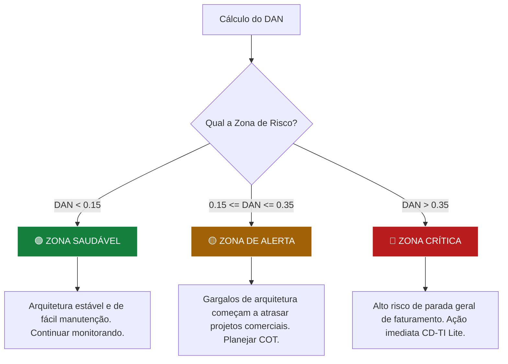

# Capítulo 5: Métricas Avançadas (DAN e COT) e KPIs

---

## 5.1. A Importância de Traduzir TI em Linguagem Financeira

Um dos maiores desafios enfrentados por profissionais de TI em pequenas e médias empresas é a barreira de comunicação com a alta diretoria (CEO/Financeiro). Termos técnicos complexos — como "refatoração de código", "migração de banco de dados" ou "substituição de switches" — são muitas vezes percebidos pela gestão comercial como despesas técnicas desnecessárias, e não como investimentos.

O GP-PME resolve essa barreira de diálogo através de duas métricas avançadas que quantificam a saúde técnica e a financeira da infraestrutura de TI da PME:
*   **DAN (Dívida de Arquitetura Normalizada)**: Expressa matematicamente o tamanho do passivo tecnológico acumulado.
*   **COT (Custo da Otimização Tecnológica)**: Quantifica o investimento focado em reduzir esse passivo e demonstra seu Retorno sobre o Investimento (ROI) estratégico para o faturamento da empresa.

---

## 5.2. Dívida de Arquitetura Normalizada (DAN)

A **DAN** é baseada no conceito acadêmico de **Dívida Técnica de Arquitetura (Architectural Technical Debt - ATD)** [6]. Ela representa o custo futuro acumulado implícito de retrabalho ou remendos necessários devido a decisões arquiteturais subótimas ou atalhos de infraestrutura tomados no passado para economizar tempo.

### 5.2.1. Fórmula de Cálculo do DAN
A normalização permite comparar a gravidade da dívida técnica entre diferentes PMEs ou ao longo do tempo, dividindo o passivo pelo orçamento anual disponível da TI:

$$\text{DAN} = \frac{\text{Custo Estimado de Refatoração da Dívida Técnica (Horas Técnicas $\times$ Custo-Hora)}}{\text{Orçamento Anual de TI da PME}}$$

*   **Custo Estimado de Refatoração**: Levantamento de quanto custará (em horas de esforço de engenharia multiplicadas pelo custo-hora do técnico) para solucionar gargalos críticos, como a migração de um servidor local instável sem suporte ou a reescrita de uma planilha complexa de controle de vendas.
*   **Orçamento Anual de TI**: A soma de todas as despesas e investimentos de TI aprovados para o ano (incluindo licenças, hardware, suporte técnico e internet).

### 5.2.2. Zonas de Risco e Tomada de Decisão:

*   **🟢 Zona Saudável (DAN < 0.15)**: O passivo tecnológico é baixo. A arquitetura de TI é ágil e as melhorias comerciais podem ser implementadas rapidamente e com baixos riscos de paradas inesperadas.
*   **🟡 Zona de Alerta (0.15 $\le$ DAN $\le$ 0.35)**: O acúmulo de remendos técnicos começa a atrasar a entrega de novos projetos e a gerar incidentes recorrentes de lentidão no suporte. O Gestor de TI deve propor projetos de COT no CD-TI Lite.
*   **🔴 Zona Crítica (DAN > 0.35)**: A infraestrutura corre risco iminente de parada geral inesperada de sistemas vitais (como ERP ou emissão de notas), ameaçando diretamente o faturamento. Exige injeção imediata de COT estratégico.

---

## 5.3. Custo da Otimização Tecnológica (COT)

O **COT** representa o aporte financeiro direcionado especificamente para a redução da dívida técnica de arquitetura (eliminar o DAN), migrações planejadas, automações de processos repetitivos ou auditorias preventivas de cibersegurança.

### 5.3.1. Fórmula de Cálculo do ROI da Otimização
Para demonstrar o valor financeiro do COT ao CEO, o Gestor de TI calcula o ROI da iniciativa comparando as economias de horas e horas de parada evitadas com o investimento aportado:

$$\text{ROI do COT (\%)} = \left( \frac{\text{Redução Mensal de Custos Operacionais ou Perdas Evitadas}}{\text{Investimento Total Aportado no COT}} \right) \times 100$$

*   **Redução Mensal de Custos**: Horas do time de funcionários recuperadas por automação, desativação de licenças obsoletas de software ou custos financeiros estimados de paradas no faturamento que serão mitigados após o projeto de otimização.

### 5.3.2. Exemplo Prático de Negócio:
*   *Problema*: O servidor local de arquivos da PME cai constantemente devido ao superaquecimento. Em média, ocorrem **8 horas de parada operacional por mês**, paralisando o time de faturamento (10 pessoas, custo-hora médio de R$ 30,00 por colaborador).
    *   *Perda Mensal Estimada*: $8 \text{ horas} \times 10 \text{ pessoas} \times \text{R\$ } 30,00 = \text{R\$ } 2.400,00 \text{ de prejuízo absoluto por mês}$.
*   *Projeto de Otimização (COT)*: Migração definitiva dos arquivos locais para a nuvem corporativa compartilhada (Google Workspace).
    *   *Investimento Total (COT)*: R$ 4.800,00 (esforço técnico de migração + licenças).
*   *Cálculo de ROI do COT*:
    $$\text{ROI} = \left( \frac{\text{R\$ } 2.400,00}{\text{R\$ } 4.800,00} \right) \times 100 = 50\% \text{ ao mês}$$
*   *Resultado*: O projeto se paga em apenas **2 meses** de operação, e o DAN é reduzido, dando total clareza e poder de aprovação imediata de verbas na reunião CD-TI Lite pelo CEO.
