# Bloco 1: O Pilar Estratégico: Transformando a TI em Vantagem Competitiva

---

## 1.1. O Método DAA: Direcionar, Agir e Acompanhar

O coração estratégico da TI Enxuta na sua empresa bate através do método **DAA (Direcionar, Agir, Acompanhar)**, que é a simplificação prática do ciclo corporativo ADM-Lite. Ele garante que cada centavo investido em tecnologia traga retorno direto e mensurável para os seus negócios:

```
                  [ DIRECIONAR ] 
                        |
                        v (Foco estratégico do CEO no comitê)
                     [ AGIR ]    
                        |
                        v (Execução no Mapa do Tesouro)
                  [ ACOMPANHAR ] 
                        |
                        +---> (Termômetro do Sucesso)
```

*   **Direcionar**: Você (CEO/dono) define as prioridades comerciais da empresa (ex: vender mais, cortar custos ou melhorar a velocidade de entrega) e a TI direciona os cartões de esforço técnico para essas prioridades.
*   **Agir**: O técnico de TI implementa as ações diretamente vinculadas a esses objetivos estratégicos, concentrando seu tempo e energia naquilo que gera receita ou protege os dados.
*   **Acompanhar**: O progresso das atividades e a estabilidade dos sistemas são monitorados através de indicadores simples, que mostram se estamos atingindo as metas desejadas.

---

## 1.2. O "Papo Reto com o Chefe" (A Reunião CD-TI Lite)

Esqueça relatórios longos e conversas chatas e cheias de jargão técnico sobre cabos e redes. A governança da TI Enxuta baseia-se em um ritual de apenas **30 minutos quinzenais ou mensais** entre o **Dono da Empresa** e o **Responsável pela TI**:

```mermaid
gantt
    title Pauta Rígida de 30 Minutos (Papo Reto)
    dateFormat  X
    axisFormat %M min
    section Pauta
    Termômetro do Sucesso (KPIs) : active, 0, 5
    Mapa do Tesouro (Projetos)   : 5, 20
    Escudo de Segurança (Riscos) : 20, 25
    Ata de 1 Página (Decisões)   : 25, 30
```



1.  **Minuto 1 ao 5: Termômetro do Sucesso (KPIs)**: Revisão dos KPIs básicos de satisfação e estabilidade.
2.  **Minuto 6 ao 20: Mapa do Tesouro (Projetos)**: Acompanhamento de projetos e validação do andamento das prioridades de negócios.
3.  **Minuto 21 ao 25: Escudo de Segurança (NIST)**: Validação de backups diários e mitigação de riscos críticos de invasões digitais.
4.  **Minuto 26 ao 30: Ata de 1 Página (Decisões)**: Fechamento das prioridades, liberação rápida de verbas e encerramento.

---

## 1.3. O "Mapa do Tesouro" (Matriz 4 Quadrantes)

O **Mapa do Tesouro** é uma ferramenta visual de 1 página que divide o andamento da tecnologia na empresa em quatro quadrantes de valor de negócio, garantindo alinhamento total:

*   **Quadrante 1: Ajudar a Vender Mais (Injeção de Receita)**: Projetos que geram faturamento rápido (ex: instalar Pix no ponto de venda, otimizar página de checkout).
*   **Quadrante 2: Economizar Dinheiro (Redução de Custos)**: Otimização de despesas (ex: desativar licenças de softwares ociosos, renegociar contratos de internet).
*   **Quadrante 3: Atender Rápido (Experiência e Agilidade)**: Iniciativas que destravam o dia a dia do time (ex: criar FAQ de autoatendimento para o Wi-Fi ou impressora).
*   **Quadrante 4: Proteger a Empresa (Segurança e Risco)**: Defesas que evitam paradas operacionais (ex: backup automático cloud, MFA nas contas).

---

## 1.4. O "Termômetro do Sucesso" (3 KPIs Visíveis)

Para que o CEO saiba como está a saúde da TI em menos de 1 minuto, nós acompanhamos apenas 3 métricas básicas:
1.  **Os sistemas caíram? (Disponibilidade)**: Percentual de uptime das ferramentas vitais de faturamento da empresa (ERP, site). Meta: **> 99.5%**.
2.  **O suporte está ágil? (Velocidade)**: Tempo médio que o técnico gasta para encerrar os problemas relatados pelos funcionários.
3.  **A equipe está feliz? (Satisfação)**: Nota média de 1 a 5 estrelas dada pós-atendimento aos colaboradores. Meta: **> 4.5/5.0**.
