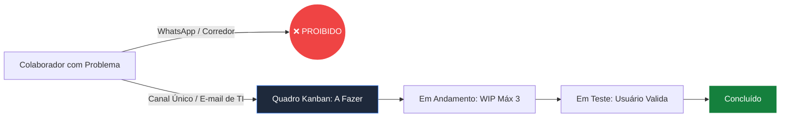

# Bloco 2: O Pilar da Execução Ágil: Transformando Ideias em Resultados Rápidos

---

## 2.1. O Quadro Kanban de Post-its: Fim da Desorganização

Um dos maiores causadores de lentidão e retrabalho na TI das PMEs é a desorganização. Cadernos de anotações soltos, WhatsApps pessoais de diretores e e-mails perdidos fazem com que tarefas importantes sejam esquecidas.

O GP-PME resolve isso organizando o fluxo diário em um **Quadro Kanban Básico**, que pode ser desenhado em uma lousa física na parede usando post-its coloridos ou em um sistema virtual simples (como o Trello gratuito). O quadro possui 4 colunas estritas:

1.  **A Fazer (Fila de Espera)**: Todas as solicitações que chegam entram no topo desta coluna, organizadas por prioridade.
2.  **Em Andamento**: O que o técnico de TI está trabalhando de fato neste momento.
    *   *Regra de Ouro da TI Enxuta*: O limite de Trabalho em Progresso (**WIP Limit**) deve ser de **no máximo 3 tarefas simultâneas** por técnico! Focar em poucas atividades por vez garante que o técnico termine o que começou com muito mais velocidade e qualidade, eliminando o estresse operacional de "atirar para todos os lados".
3.  **Em Teste**: Tarefas concluídas pela TI que estão aguardando o colaborador que pediu o chamado realizar a validação (conferir se o problema sumiu).
4.  **Concluído**: Onde o trabalho resolvido e testado é armazenado, gerando histórico de valor para a empresa.

---

## 2.2. O Canal Único de Suporte: Fim das Interrupções Constantes

Um dos maiores causadores de lentidão e estresse técnico em PMEs são as interrupções constantes: colaboradores parando o técnico nos corredores, mandando WhatsApp pessoal no meio da noite ou ligando a todo instante.

**A Regra é Rígida**: a empresa deve estabelecer um **Canal Único de Suporte** (como um e-mail específico de suporte ou um formulário eletrônico simples). 
*   Todas as dores dos colaboradores entram exclusivamente por este canal, gerando cartões automáticos na coluna *A Fazer* do Kanban.
*   O técnico de TI fica expressamente proibido de iniciar qualquer chamado informal que não tenha sido devidamente registrado no Canal Único. Isso disciplina a equipe e dá total visibilidade de trabalho para o CEO.

---

## 2.3. O Ciclo de Inovação de 2 Semanas (O MVP)

Quando o profissional de TI consegue organizar a rotina básica e responder autonomamente a dúvidas simples dos colaboradores (através de chatbots de FAQs ou documentos compartilhados), ele ganha tempo para propor inovações comerciais.

Em vez de projetar softwares complexos e caros que demoram meses para ficar prontos e podem não servir para nada:
1.  **PRD de 1 Página (Requisitos)**: O gestor de TI escreve em apenas uma folha o que a nova ideia deve fazer, para quem serve e como mediremos o sucesso.
2.  **MVP (Produto Mínimo Viável)**: Desenvolvemos a versão mais básica e utilizável da ideia em **no máximo 2 semanas**.
3.  **Grupo Piloto**: Colocamos essa ferramenta simples imediatamente em produção para ser testada por um pequeno grupo de colaboradores ou clientes reais da PME.
4.  **Ajuste Rápido**: O feedback dos usuários é coletado de forma contínua para decidir se devemos continuar investindo tempo no projeto ou se a ideia inicial precisa ser ajustada, evitando desperdício de tempo e recursos da PME.
