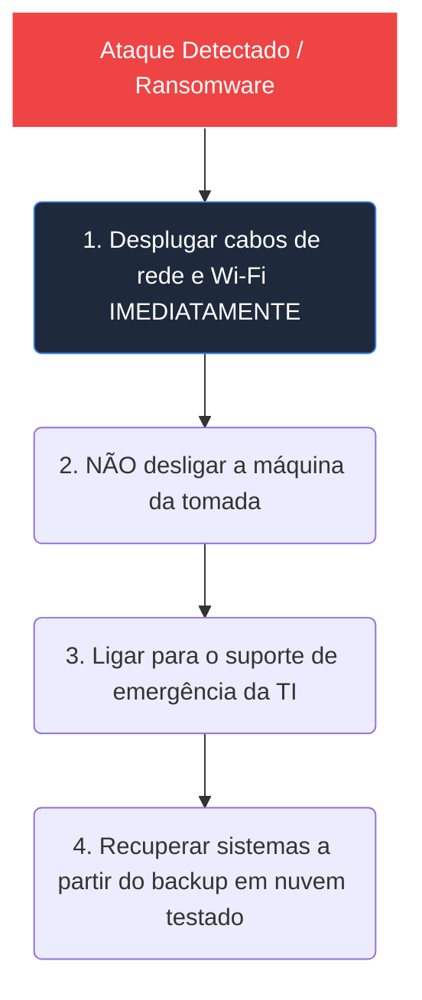

# Bloco 3: O Pilar da Segurança Essencial: Proteja Seu Negócio sem Complicação

---

## 3.1. O Escudo de Segurança Mínimo (Sem Custos Altos!)

Você não precisa gastar milhares de reais em softwares complexos de segurança digital. O GP-PME estabelece o **NIST-Lite**, focando nos **4 controles essenciais** que geram a máxima proteção prática com o menor custo e esforço operacional:

```
[ IDENTIFICAR ] -> Mapa de Ativos Críticos 80/20 (Saber o que proteger)
      |
      +---> [ PROTEGER ] -> Privilégio Mínimo (MFA ativo, sem logins Admin)
      |
      +---> [ PROTEGER ] -> Backups Automáticos (Testados a cada 3 meses)
      |
      +---> [ RESPONDER ] -> Plano de Emergência de 1 Página (Checklist físico)
```

Estes controles atuam como a **bússola de crescimento seguro** da sua empresa, garantindo que o seu faturamento e sua expansão comercial estejam protegidos contra incidentes catastróficos.

---

## 3.2. Os 4 Controles de Segurança que Você Deve Exigir da TI

### Controle 1: O Mapa de Ativos Críticos (Inventário 80/20)
Tentar blindar 100% de tudo em uma PME de uma vez gera perda de foco. Nós focamos na Regra de Pareto: o seu gestor de TI mantém uma planilha simples local listando apenas os **20% dos computadores e sistemas que se pegarem vírus ou pararem de funcionar, destroem seu faturamento** (ex: o banco de dados do ERP, o notebook do faturamento financeiro e a conta de e-mail do administrador). Toda nossa proteção prioritária é voltada para esses ativos críticos.

### Controle 2: Contas Sem Acesso "Admin" e MFA Ativo
*   **MFA (Confirmação de Acesso)**: Você deve exigir a ativação obrigatória de confirmação de dois fatores (código enviado ao celular) em 100% dos e-mails profissionais dos colaboradores e contas de sistemas. Isso bloqueia até 98% dos roubos de contas tradicionais.
*   **Privilégio Mínimo (Sem Admin local)**: Seus colaboradores comuns **não devem ter contas com acesso de "Administrador local"** nos computadores corporativos. Se um colaborador clicar acidentalmente em um link malicioso e um vírus for baixado, o computador pedirá a senha do administrador da TI para instalar, impedindo que o vírus contamine a máquina ou se alastre pela rede de forma invisível.

### Controle 3: Backup Automático em Nuvem (e Testado de Verdade!)
*   Os arquivos e dados cruciais da sua empresa (listados no Mapa de Ativos Críticos) devem ser copiados sozinhos diariamente para um local seguro na internet (Google Drive corporativo, OneDrive, etc.).
*   **O Teste do Balde de Água Fria**: A cada **3 meses**, o seu profissional de TI deve realizar um teste manual prático simulando que um arquivo vital sumiu da rede, recuperando-o do backup em menos de 30 minutos. O sucesso desse teste prático de recuperação deve ser obrigatoriamente apresentado e assinado na ata da sua reunião quinzenal Papo Reto com o Chefe.

### Controle 4: O Plano de Ação de Emergência (PRI) de 1 Página
Se a empresa for atacada por hackers ou pegarem um vírus ransomware (sequestrador de dados), o pânico e o desespero podem piorar a situação (ex: funcionários apagando coisas erradas ou desligando sistemas incorretamente).

A empresa deve manter uma **folha física impressa e fixada na parede da TI** contendo as seguintes diretrizes emergenciais de 1 página:



1.  **Contenção Imediata**: Desconectar fisicamente todos os cabos de rede e desligar o Wi-Fi de computadores infectados ou suspeitos, **sem desligar a máquina da tomada** (isso impede o vírus de contaminar outras máquinas na rede local e preserva evidências digitais importantes na memória).
2.  **Lista de Chamada**: Nome e contato direto dos técnicos emergenciais da TI, do CEO e de provedores de internet a serem notificados imediatamente na primeira hora da crise.
3.  **Restauro Planejado**: Roteiro simples de reinstalação dos sistemas operacionais e início da restauração passo a passo dos arquivos do backup em nuvem testado.
