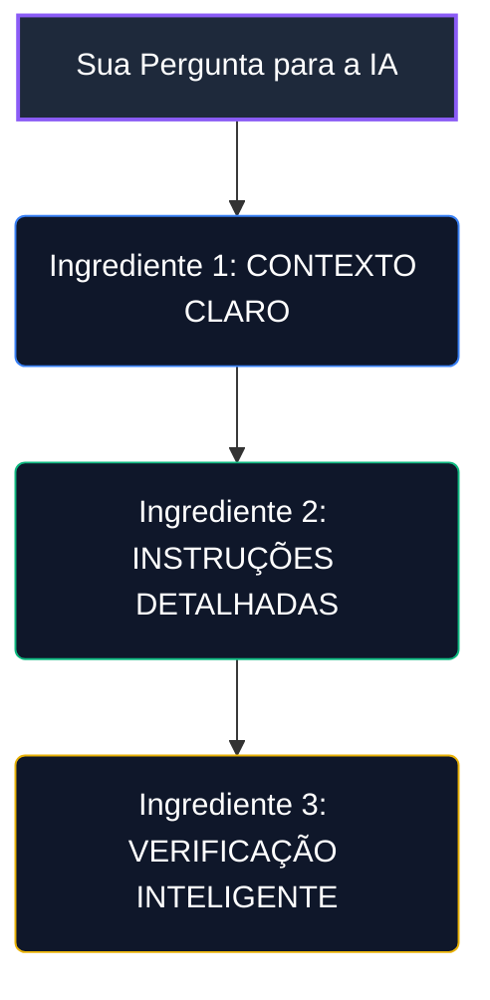

# Bloco 4: O Motor de IA: Seu Assistente Inteligente para o Sucesso

---

## 4.1. A IA como Seu Assistente Pessoal (Multiplicador de Produtividade)

No framework **GP-PME**, a Inteligência Artificial Generativa (IAG) atua como um **co-piloto inteligente transversal e opcional**. Ela foi desenhada para suprir a escassez de recursos humanos em pequenas e médias empresas, dando ao profissional técnico a eficiência produtiva de um departamento inteiro de tecnologia.

Se a sua empresa optou por não utilizar Inteligência Artificial, o framework funciona de forma **100% manual e analógica**. Caso deseje acelerar seus processos, a IA atua nos bastidores automatizando o atendimento de suporte via chatbot (FAQ) e rascunhando relatórios estratégicos e especificações técnicas de novos projetos.

---

## 4.2. A "Receita" para Perguntar Certo (Prompt Eficaz)

Para obter as melhores respostas da Inteligência Artificial sem que ela invente dados falsos ("alucinações") ou traga respostas técnicas vagas, o GP-PME estabelece uma **"Receita" simples e poderosa** em três etapas para você formular suas instruções:

*   **1. Contexto Claro**: Explique as características básicas do seu negócio (ex: "Minha empresa é uma loja de roupas com 10 computadores locais e usamos um sistema de vendas em nuvem").
*   **2. Instruções Detalhadas**: Diga exatamente qual formato e limites você espera na resposta (ex: "Gere um checklist de segurança de no máximo 1 página, em português direto, livre de termos difíceis para leigos").
*   **3. Verificação Inteligente**: Instrua a IA a se abster de adivinhar ou inventar dados se houver informações pendentes, forçando-a a deixar lacunas explícitas sob a frase "Perguntas de Negócio Pendentes".

---

## 4.3. Os Seus 4 Assistentes Especialistas (Opcionais)

Se você decidir usar a IA de forma avançada corporativamente, o framework define quatro assistentes especialistas prontos para atuar:

1.  **O Orquestrador (Pilar I)**: Ajuda a montar atas simplificadas, briefings e pautas estruturadas para o CD-TI Lite em menos de 2 minutos.
2.  **O Analista (Pilar II)**: Auxilia a detalhar histórias de usuário, PRDs e checklists operacionais do Kanban.
3.  **O Guardião (Pilar III)**: Audita permissões de usuários e logs, e gera políticas rápidas de segurança cibernética em português simples.
4.  **O Auditor (Métricas)**: Auxilia nos cálculos das dívidas técnicas de arquitetura (DAN/COT), calculando o ROI real de projetos de TI para apresentar ao financeiro.

### Regra de Ouro da IA (HITL):
Nunca coloque em produção ou utilize qualquer documento, código ou política gerado por IA sem que ele passe pela **leitura, validação e assinatura física do Gestor técnico humano** (*Human-in-the-loop*). A IA é um excelente copiloto, mas a responsabilidade de negócios e a decisão final são sempre humanas!
