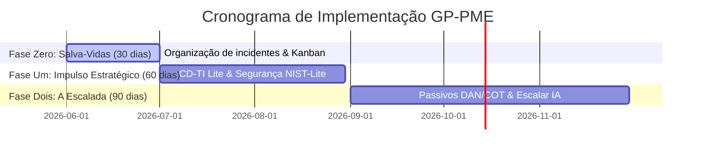

# Bloco 5: O Roadmap de Implementação: Seu Caminho para o Sucesso

---

## 5.1. O Desafio da Mudança

Implantar novos processos em qualquer empresa gera ansiedade e natural resistência da equipe. Para garantir total segurança e eficácia, o GP-PME estabelece um roteiro passo a passo com marcos progressivos focado em **vitórias rápidas (*Quick Wins*)**, respeitando o andamento e a capacidade operacional da PME.

Antes de qualquer alteração física na TI, o framework sugere realizar um teste conceitual virtual — o **Frame-sim (Simulador de Negócios)** —, onde o gestor técnico modela as mudanças operacionais e simula as economias de esforço e redução de paradas em um "laboratório seco" (planilhas de modelagem ou prompts de simulação), demonstrando o sucesso do plano antes de gastar recursos.

---

## 5.2. O Roadmap de Implementação em 3 Fases

A evolução da sua TI é dividida em três fases progressivas e pragmáticas:

### Fase Zero: O Salva-Vidas (Dias 1 a 30)
*   **Foco Principal**: Eliminar o caos operacional diário de chamados, restaurando a tranquilidade na TI.
*   **Ações**: Implantação de Canal Único obrigatório para chamados, quadro Kanban de 4 colunas com WIP Limit de 3 e chatbot inteligente de respostas automáticas (FAQs).
*   **Resultados Imediatos**: Redução de até 30% a 40% nas interrupções, e o profissional de TI recupera tempo produtivo precioso.

### Fase Um: O Impulso Estratégico (Dias 31 a 90)
*   **Foco Principal**: Alinhar a tecnologia às metas financeiras do CEO e blindar os dados cruciais da PME.
*   **Ações**: Reuniões quinzenais CD-TI Lite de 30 minutos, Matriz 4 Quadrantes, Mapa de Ativos Críticos, MFA ativado e backups Cloud automáticos.
*   **Resultados Imediatos**: Visibilidade total dos custos de TI pelo CEO, projetos conectados a metas de vendas e proteção segura contra vírus de sequestro (ransomware).

### Fase Dois: A Escalada do Sucesso (Dias 91 a 180+)
*   **Foco Principal**: Otimizar custos técnicos avançados, calcular passivos de arquitetura e escalar a IA.
*   **Ações**: Cálculos sistemáticos de Dívida de TI (DAN e COT), orquestração de prompts de IA encadeados e planejamento de infraestruturas em nuvem escaláveis.
*   **Resultados Imediatos**: Comunicação matemática com o financeiro demonstrando o ROI real de melhorias, e a TI atuando como o motor de crescimento estratégico e inovação contínua da PME.
