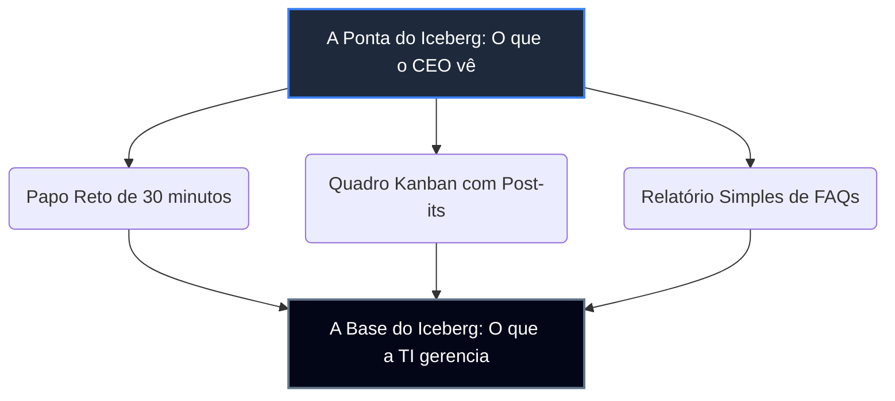

# Sumário Leigo: O Início Rápido e Descomplicado da TI da Sua Empresa

---

## O Conceito do "Iceberg Invertido"

Se você é proprietário de uma Pequena ou Média Empresa (PME), provavelmente já sentiu que a TI é uma "caixa preta" ou um "buraco negro" que só absorve investimentos sem deixar claro o retorno prático. 

O **GP-PME** foi desenhado exatamente para você! Ele simplifica as regras complexas de tecnologia do mundo corporativo usando uma metáfora visual muito simples chamada **"Iceberg Invertido"**:

```
                  [ A PONTA DO ICEBERG: O que você vê e usa ]
                 -> Suas tarefas organizadas no Kanban (Post-its).
                 -> Um canal único (como um e-mail simples) para pedir ajuda à TI.
                 -> Reuniões rápidas de 30 minutos quinzenais (CD-TI Lite).
  ---------------------------------------------------------------------
                  [ A BASE DO ICEBERG: A engenharia complexa ]
                 -> Normas internacionais (ISO, NIST, CIS, ITIL).
                 -> Acelerador de IA e Agentes de IA especialistas (Opcional).
                 -> Fórmulas matemáticas de Dívida de TI (DAN e COT).
```

Na **ponta do iceberg**, situam-se os processos e painéis visuais que você e sua equipe utilizam no dia a dia. Eles são simples, rápidos, diretos e livres de termos técnicos chatos (jargão zero!). 

Abaixo da linha da água, no **corpo e base do iceberg**, fica a engenharia e as regras complexas baseadas em normas globais de segurança e governança. **A boa notícia é que você não precisa entender essa base complexa!** A base é gerenciada internamente pela sua TI ou pela Inteligência Artificial. Para a sua tomada de decisões, a tecnologia será sempre transparente, visual e focada em resultados comerciais de faturamento e economia.



---

## O Diferencial da TI Enxuta: Adaptabilidade no Seu Ritmo

Diferente de consultorias tradicionais que tentam implantar processos complexos exigindo novas contratações e altos custos, a **Filosofia da TI Enxuta** garante que o framework se adapte à sua equipe, e não o contrário. 

Se a sua PME possui apenas um único profissional de TI (*One-Man-Band*), o framework é ativado de forma modular:
1.  **Fase 1 (Orquestração do Valor)**: Organizamos o caos diário de chamados para liberar tempo.
2.  **Fase 2 (Laboratório de Inovação)**: Usamos esse tempo livre para testar melhorias comerciais rápidas de 2 semanas (MVPs).
3.  **Fase 3 (Governança como Bússola)**: Alinhamos a tecnologia às suas metas financeiras e protegemos a empresa contra invasões digitais de forma segura.

Você pode optar por operar o framework de forma **100% manual e analógica**, sem nenhuma Inteligência Artificial. Se e quando desejar, a IA pode ser ativada de forma estritamente opcional como um assistente pessoal para acelerar a redação de pautas e relatórios.
