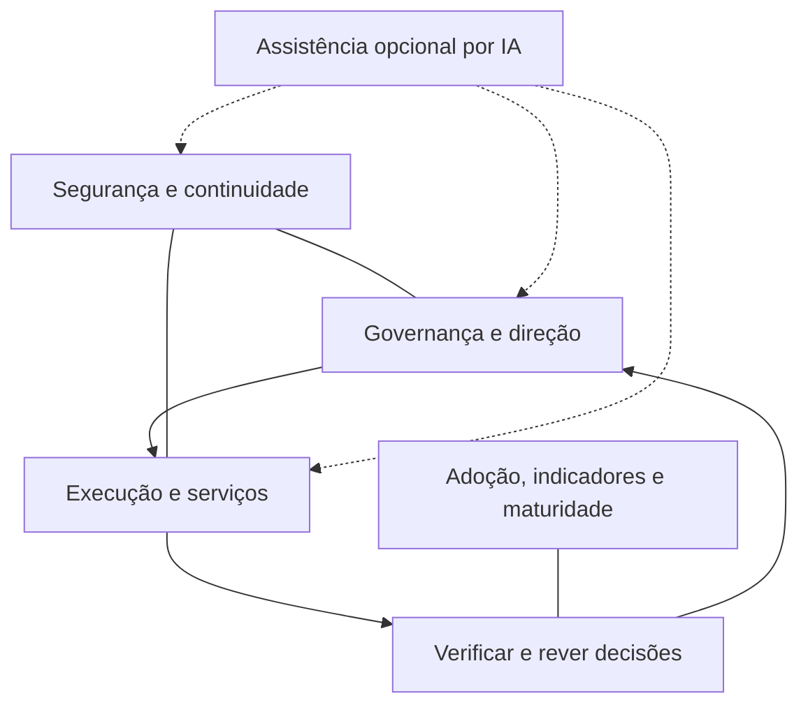

# GEAR: índice do acervo

Gestão, Execução, Agilidade e Risco. Framework de governança e gestão de TI para pequenas e médias empresas.

Edição editorial 2026.10. Este índice conserva os caminhos do acervo GP-PME e aponta para documentos completos. A fonte vigente é a [documentação modular](../framework/README.md). Direitos conforme [LICENSE.md](../LICENSE.md). Responsável pelo método: Andre Victor; créditos declarados das versões anteriores permanecem nos documentos e no histórico preservado.

## Escolher uma primeira tarefa

Direção e TI identificam um problema observável, a pessoa que pode decidir e a evidência disponível. A primeira leitura pode preparar um acordo ou revelar uma lacuna. Tempo de leitura não comprova implantação; o percurso de 30 dias é planejamento ajustável.

| Necessidade | Começar por | Saída esperada |
| --- | --- | --- |
| Conhecer responsabilidades | [Guia introdutório](guide-for-dummies/Guia_GP-PME_para_Leigos.md) | Entender quem decide, executa e verifica |
| Iniciar a adoção | [Adoção inicial](Guides/Guia_de_Implementacao_Fase_Zero.md) | Ações, capacidade e evidências a obter |
| Localizar lacunas | [Maturidade](Guides/Guia_Modelo_de_Maturidade.md) | Respostas com evidência e plano de melhoria |
| Usar um registro | [Biblioteca](Templates_GP-PME.md) | Modelo pertinente à decisão ou tarefa |

## Como o método se organiza

Três domínios essenciais: governança e direção; execução e serviços; segurança e continuidade. Adoção, indicadores e maturidade atravessam os domínios. IA é assistência opcional em todos os níveis. As quatro letras de GEAR não criam quatro pilares adicionais.



Registros podem ser manuais; proteção de acesso e recuperação exigem tecnologia adequada ao serviço. WIP começa em até três itens iniciados por executor, incluindo teste e bloqueio comprometido. Pilotos e metas dependem de capacidade, risco e acordo; o método não garante economia de 80%, retorno em 24 horas ou implantação em trinta minutos.

## Percursos por responsabilidade

- Direção ou dono do negócio: guia introdutório, governança e decisões; conferir recurso, risco aceito e acompanhamento.
- Responsável por TI: adoção, execução, continuidade e biblioteca; manter fila, critérios e evidências.
- Consultor: guias técnicos, maturidade, cenários e escopo comercial; confirmar capacidade e contexto do cliente antes de propor integração.
- Desenvolvedor ou integrador: contratos de assistência, READMEs de busca, ADK e serviços; conferir permissões, runtime e comportamento real antes do uso.

## Catálogo

### Manuais e guias técnicos

| Artefato | Conteúdo | Momento de uso | Acesso |
| --- | --- | --- | --- |
| Manual consolidado | Arquitetura e regras | Conhecer o método | [abrir](<GP-PME_Documento_Mestre_Consolidado.md>) |
| Governança e direção | Alçadas, ciclo e revisão | Decidir com o negócio | [abrir](<Guides/Guia_Pilar_1_Governanca_Essencial.md>) |
| Execução e serviços | Fila, capacidade e aceite | Organizar a rotina | [abrir](<Guides/Guia_Pilar_2_Execucao_Agil.md>) |
| Segurança e continuidade | Dependências, acesso e recuperação | Verificar exposição e resposta | [abrir](<Guides/Guia_Pilar_3_Seguranca_Critica.md>) |
| Assistência opcional | Quatro funções e revisão | Preparar minutas com IA | [abrir](<Guides/Guia_Pilar_4_Assistencia_IA_e_Agentes.md>) |
| Adoção inicial | Agenda e evidências | Distribuir primeiras ações | [abrir](<Guides/Guia_de_Implementacao_Fase_Zero.md>) |
| Indicadores e primeiras melhorias | Métricas, comparação e cenários | Conferir premissas e resultados | [abrir](<Guides/Guia_KPIs_e_Quick_Wins.md>) |
| Maturidade | Questionário e fichas | Localizar lacunas | [abrir](<Guides/Guia_Modelo_de_Maturidade.md>) |

### Leitura introdutória

| Artefato | Conteúdo | Momento de uso | Acesso |
| --- | --- | --- | --- |
| Visão inicial | Governança e gestão | Começar a leitura | [abrir](<guide-for-dummies/Guia_GP-PME_para_Leigos.md>) |
| Decisões | Pauta e finalidades | Participar da revisão | [abrir](<guide-for-dummies/Guia_Leigo_Pilar_1.md>) |
| Fila e melhoria | Quadro e pequeno piloto | Acompanhar trabalho | [abrir](<guide-for-dummies/Guia_Leigo_Pilar_2.md>) |
| Continuidade | Controles e evidências | Conferir com TI | [abrir](<guide-for-dummies/Guia_Leigo_Pilar_3.md>) |

### Registros e prompts

| Artefato | Conteúdo | Momento de uso | Acesso |
| --- | --- | --- | --- |
| Biblioteca completa | Oito grupos de registros | Escolher um modelo | [abrir](<Templates_GP-PME.md>) |
| Instrução de tarefa | FAI e prompt mestre | Delegar ou pedir minuta | [abrir](<Templates/Prompts/Template_Prompt_Mestre.md>) |
| Prompt de requisitos | Contexto, escopo e critérios | Preparar PRD | [abrir](<Templates/Prompts/Template_Prompt_PRD.md>) |
| Prompt de risco | Evidência, alternativas e alçada | Preparar análise | [abrir](<Templates/Prompts/Template_Prompt_Risco.md>) |
| PRD completo | Requisitos e aceite | Delimitar melhoria | [abrir](<Templates/PRDs/Template_PRD_Completo.md>) |
| Lista de tarefas | Passos e verificação | Atribuir execução | [abrir](<Templates/Tasklists/Template_Tasklist_Operacional.md>) |
| Contratos por função | Direção, entrega, segurança e revisão | Configurar assistência | [abrir](<Templates/AI-Skills-and-Agents/Template_System_Prompt_Agentes.md>) |
| Revisão humana | Critérios por tipo de saída | Conferir antes do uso | [abrir](<Templates/AI-Skills-and-Agents/Template_Checklist_Auditoria_HITL.md>) |
| Registro de maturidade | Evidência e plano | Avaliar a rotina | [abrir](<Templates/Mapeamento_Maturidade/Template_Mapeamento_Maturidade.md>) |

### Interface e integrações

| Artefato | Conteúdo | Momento de uso | Acesso |
| --- | --- | --- | --- |
| Portal | Documentação, blog e biblioteca | Navegar pelo método | [abrir](<../GP-Pme Article/index.html>) |
| Busca lexical | Palavras e contexto do corpus revisado | Encontrar uma seção | [abrir](<../GP-Pme Article/busca.html>) |
| Ferramentas locais | Cálculos e quadro de exercício | Conferir fórmulas e capacidade | [abrir](<../GP-Pme Article/ferramentas.html>) |
| Busca em Python | BM25 e opção de embeddings | Integrar recuperação | [abrir](<../search/README.md>) |
| Agentes ADK | Orquestrador e oito especialistas | Examinar implementação e adapters | [abrir](<../agents/gp-pme-adk/README.md>) |
| Contratos Markdown | Nove instruções de assistência | Consultar instruções existentes | [abrir](<Templates/AI-Skills-and-Agents/Agentes_Prontos/>) |
| Skills existentes | Oito comandos de compatibilidade | Consultar a integração antiga | [abrir](<../.claude/skills/>) |
| MCP e API | Ferramentas e núcleo determinístico | Integrar funções | [abrir](<../server/README.md>) |
| Grafo histórico | Artefato gerado anteriormente | Consultar relações antigas | [abrir](<../graphify-out/graph.html>) |

### Cenários e proposta comercial

| Artefato | Conteúdo | Momento de uso | Acesso |
| --- | --- | --- | --- |
| Simulações | Quatro perfis e hipóteses | Comparar premissas | [abrir](<../Simulacao/README.md>) |
| Proposta de valor | Escopo e limites | Discutir adequação | [abrir](<../Comercial/Proposta_de_Valor.md>) |
| Apresentação comercial | Síntese do produto | Preparar conversa | [abrir](<../Comercial/One_Pager_Vendas.md>) |
| Precificação | Composição e hipóteses de preço | Preparar proposta | [abrir](<../Comercial/Modelo_de_Precificacao.md>) |
| Adoção com cliente | Responsáveis e acompanhamento | Planejar entrada | [abrir](<../Comercial/Onboarding_Cliente.md>) |

## Limites das integrações

Contratos e skills descrevem assistência; não constituem agentes já ativos. A implementação ADK tem um orquestrador e oito especialistas, distintos das quatro funções conceituais. Adapters exigem plataforma, acesso, configuração e teste; `dry-run` demonstra uma proposta de ação, sem comprovar gravação externa. O runtime ADK e integrações reais precisam de verificação específica.

A busca pública é lexical e funciona com o índice exportado. Embeddings são opção técnica separada, sem índice semântico novo validado nesta edição. O grafo listado é histórico; não representa automaticamente o corpus GEAR atual. O Graphify global de outro projeto não é usado para este acervo.

Skills existentes permanecem em seus caminhos de compatibilidade durante a revisão. Novas instalações pertencem ao escopo global do usuário. MCP é administrado pelo hub HTTP global; ferramentas e contexto não garantem respostas corretas ou aprovação humana.

## Fontes, exemplos e edição

Consultar [fontes e limites](../framework/referencias/fontes.md) e [origens e adaptações](../framework/fundamentos/origens-adaptacoes.md). DAN financeira, faixas, questionário e metas são instrumentos locais. Simulações são cenários condicionais; o artigo permanece prospectivo enquanto não houver dados documentados.

O acervo evoluiu de GP-PME e NEXUS-PME. O índice de julho de 2026 organizava percursos comerciais, catálogo, quatro camadas técnicas e metadados. A edição atual conserva essas funções de consulta e corrige nomes, contagens, arquitetura e promessas sem suporte. Originais e mapa de revisão são preservados em `.context/`.

## Metadados de consulta

O bloco conserva a interface documental anterior para indexadores que a utilizem. Ele descreve caminhos e temas; não mede desempenho de RAG nem garante recuperação.

```xml
<rag-metadata>
    <framework-name>GEAR — Gestão, Execução, Agilidade e Risco</framework-name>
    <decoupled-ai-architecture>
        <description>Registros manuais ou assistência opcional; tecnologia apropriada para acesso e recuperação.</description>
        <mandatory-pillars>Governança e direção; execução e serviços; segurança e continuidade. Tag mantida por compatibilidade: são domínios.</mandatory-pillars>
        <optional-accelerator>Assistência por IA; opcional inclusive na maturidade máxima.</optional-accelerator>
    </decoupled-ai-architecture>
    <document-mapping>
        <document file="GP-PME_Documento_Mestre_Consolidado.md">
            <topic-coverage>Arquitetura e regras. Conhecer o método.</topic-coverage>
            <keywords>Manual consolidado</keywords>
        </document>
        <document file="Guides/Guia_Pilar_1_Governanca_Essencial.md">
            <topic-coverage>Alçadas, ciclo e revisão. Decidir com o negócio.</topic-coverage>
            <keywords>Governança e direção</keywords>
        </document>
        <document file="Guides/Guia_Pilar_2_Execucao_Agil.md">
            <topic-coverage>Fila, capacidade e aceite. Organizar a rotina.</topic-coverage>
            <keywords>Execução e serviços</keywords>
        </document>
        <document file="Guides/Guia_Pilar_3_Seguranca_Critica.md">
            <topic-coverage>Dependências, acesso e recuperação. Verificar exposição e resposta.</topic-coverage>
            <keywords>Segurança e continuidade</keywords>
        </document>
        <document file="Guides/Guia_Pilar_4_Assistencia_IA_e_Agentes.md">
            <topic-coverage>Quatro funções e revisão. Preparar minutas com IA.</topic-coverage>
            <keywords>Assistência opcional</keywords>
        </document>
        <document file="Guides/Guia_de_Implementacao_Fase_Zero.md">
            <topic-coverage>Agenda e evidências. Distribuir primeiras ações.</topic-coverage>
            <keywords>Adoção inicial</keywords>
        </document>
        <document file="Guides/Guia_KPIs_e_Quick_Wins.md">
            <topic-coverage>Métricas, comparação e cenários. Conferir premissas e resultados.</topic-coverage>
            <keywords>Indicadores e primeiras melhorias</keywords>
        </document>
        <document file="Guides/Guia_Modelo_de_Maturidade.md">
            <topic-coverage>Questionário e fichas. Localizar lacunas.</topic-coverage>
            <keywords>Maturidade</keywords>
        </document>
        <document file="guide-for-dummies/Guia_GP-PME_para_Leigos.md">
            <topic-coverage>Governança e gestão. Começar a leitura.</topic-coverage>
            <keywords>Visão inicial</keywords>
        </document>
        <document file="guide-for-dummies/Guia_Leigo_Pilar_1.md">
            <topic-coverage>Pauta e finalidades. Participar da revisão.</topic-coverage>
            <keywords>Decisões</keywords>
        </document>
        <document file="guide-for-dummies/Guia_Leigo_Pilar_2.md">
            <topic-coverage>Quadro e pequeno piloto. Acompanhar trabalho.</topic-coverage>
            <keywords>Fila e melhoria</keywords>
        </document>
        <document file="guide-for-dummies/Guia_Leigo_Pilar_3.md">
            <topic-coverage>Controles e evidências. Conferir com TI.</topic-coverage>
            <keywords>Continuidade</keywords>
        </document>
        <document file="Templates_GP-PME.md">
            <topic-coverage>Oito grupos de registros. Escolher um modelo.</topic-coverage>
            <keywords>Biblioteca completa</keywords>
        </document>
        <document file="Templates/Prompts/Template_Prompt_Mestre.md">
            <topic-coverage>FAI e prompt mestre. Delegar ou pedir minuta.</topic-coverage>
            <keywords>Instrução de tarefa</keywords>
        </document>
        <document file="Templates/Prompts/Template_Prompt_PRD.md">
            <topic-coverage>Contexto, escopo e critérios. Preparar PRD.</topic-coverage>
            <keywords>Prompt de requisitos</keywords>
        </document>
        <document file="Templates/Prompts/Template_Prompt_Risco.md">
            <topic-coverage>Evidência, alternativas e alçada. Preparar análise.</topic-coverage>
            <keywords>Prompt de risco</keywords>
        </document>
        <document file="Templates/PRDs/Template_PRD_Completo.md">
            <topic-coverage>Requisitos e aceite. Delimitar melhoria.</topic-coverage>
            <keywords>PRD completo</keywords>
        </document>
        <document file="Templates/Tasklists/Template_Tasklist_Operacional.md">
            <topic-coverage>Passos e verificação. Atribuir execução.</topic-coverage>
            <keywords>Lista de tarefas</keywords>
        </document>
        <document file="Templates/AI-Skills-and-Agents/Template_System_Prompt_Agentes.md">
            <topic-coverage>Direção, entrega, segurança e revisão. Configurar assistência.</topic-coverage>
            <keywords>Contratos por função</keywords>
        </document>
        <document file="Templates/AI-Skills-and-Agents/Template_Checklist_Auditoria_HITL.md">
            <topic-coverage>Critérios por tipo de saída. Conferir antes do uso.</topic-coverage>
            <keywords>Revisão humana</keywords>
        </document>
        <document file="Templates/Mapeamento_Maturidade/Template_Mapeamento_Maturidade.md">
            <topic-coverage>Evidência e plano. Avaliar a rotina.</topic-coverage>
            <keywords>Registro de maturidade</keywords>
        </document>
        <document file="../GP-Pme Article/index.html">
            <topic-coverage>Documentação, blog e biblioteca. Navegar pelo método.</topic-coverage>
            <keywords>Portal</keywords>
        </document>
        <document file="../GP-Pme Article/busca.html">
            <topic-coverage>Palavras e contexto do corpus revisado. Encontrar uma seção.</topic-coverage>
            <keywords>Busca lexical</keywords>
        </document>
        <document file="../GP-Pme Article/ferramentas.html">
            <topic-coverage>Cálculos e quadro de exercício. Conferir fórmulas e capacidade.</topic-coverage>
            <keywords>Ferramentas locais</keywords>
        </document>
        <document file="../search/README.md">
            <topic-coverage>BM25 e opção de embeddings. Integrar recuperação.</topic-coverage>
            <keywords>Busca em Python</keywords>
        </document>
        <document file="../agents/gp-pme-adk/README.md">
            <topic-coverage>Orquestrador e oito especialistas. Examinar implementação e adapters.</topic-coverage>
            <keywords>Agentes ADK</keywords>
        </document>
        <document file="Templates/AI-Skills-and-Agents/Agentes_Prontos/">
            <topic-coverage>Nove instruções de assistência. Consultar instruções existentes.</topic-coverage>
            <keywords>Contratos Markdown</keywords>
        </document>
        <document file="../.claude/skills/">
            <topic-coverage>Oito comandos de compatibilidade. Consultar a integração antiga.</topic-coverage>
            <keywords>Skills existentes</keywords>
        </document>
        <document file="../server/README.md">
            <topic-coverage>Ferramentas e núcleo determinístico. Integrar funções.</topic-coverage>
            <keywords>MCP e API</keywords>
        </document>
        <document file="../graphify-out/graph.html">
            <topic-coverage>Artefato gerado anteriormente. Consultar relações antigas.</topic-coverage>
            <keywords>Grafo histórico</keywords>
        </document>
        <document file="../Simulacao/README.md">
            <topic-coverage>Quatro perfis e hipóteses. Comparar premissas.</topic-coverage>
            <keywords>Simulações</keywords>
        </document>
        <document file="../Comercial/Proposta_de_Valor.md">
            <topic-coverage>Escopo e limites. Discutir adequação.</topic-coverage>
            <keywords>Proposta de valor</keywords>
        </document>
        <document file="../Comercial/One_Pager_Vendas.md">
            <topic-coverage>Síntese do produto. Preparar conversa.</topic-coverage>
            <keywords>Apresentação comercial</keywords>
        </document>
        <document file="../Comercial/Modelo_de_Precificacao.md">
            <topic-coverage>Composição e hipóteses de preço. Preparar proposta.</topic-coverage>
            <keywords>Precificação</keywords>
        </document>
        <document file="../Comercial/Onboarding_Cliente.md">
            <topic-coverage>Responsáveis e acompanhamento. Planejar entrada.</topic-coverage>
            <keywords>Adoção com cliente</keywords>
        </document>
    </document-mapping>
</rag-metadata>
```
