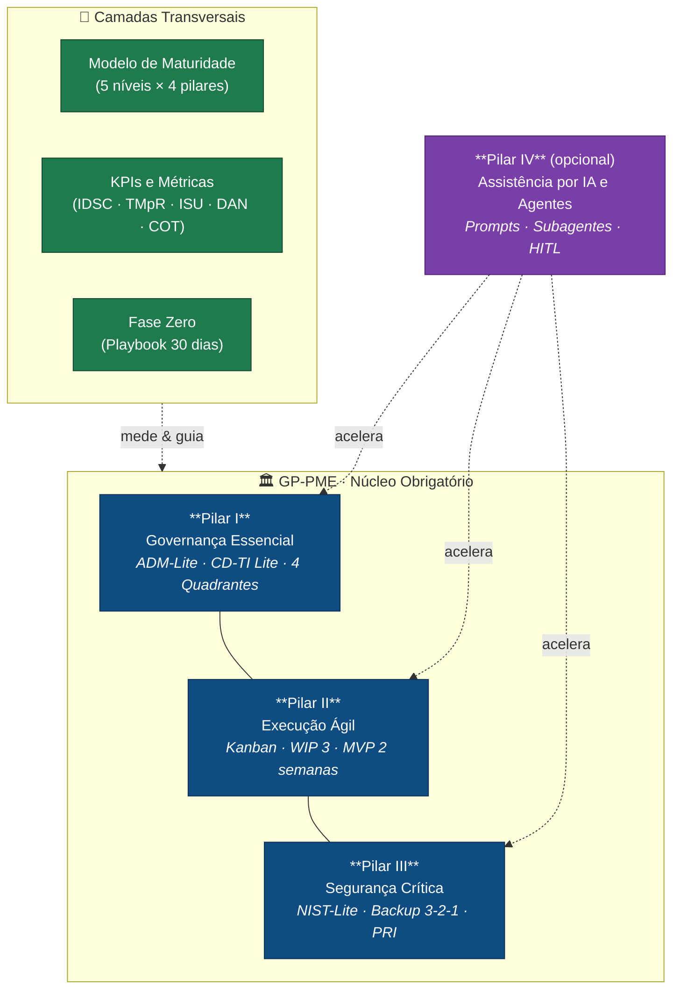

<!-- ╔══════════════════════════════════════════════════════════════════════╗ -->
<!-- ║  GP-PME · Governança Prática para Pequenas e Médias Empresas          ║ -->
<!-- ║  Edição Comercial · v2.0 · 2026-07-07                                 ║ -->
<!-- ╚══════════════════════════════════════════════════════════════════════╝ -->

# GP-PME — Framework de Gestão de TI para PMEs

### O sistema completo para transformar a TI de uma PME de centro de custo reativo em motor de valor — operável 100% no papel, turbinado por IA quando você quiser.

> **Versão 2.0 · Edição Comercial** — Portal Central e Hub de Conhecimento (RAG-Optimized)

Este documento é o **Índice Geral (INDEX)** e ponto de entrada único do framework **GP-PME (Governança Prática para Pequenas e Médias Empresas)**. Foi construído de forma híbrida: **clareza visual impecável** para leitura humana e **metadados semânticos estruturados** para máxima performance em busca por IA (**RAG — Geração Aumentada por Recuperação**).

**Por que o GP-PME:**
- 📉 **Menos desperdício, mais valor.** Metodologia de TI Enxuta que dimensiona a governança ao tamanho real da equipe — de um técnico solo a times de 100 pessoas — sem frameworks pesados de mercado.
- ⚡ **Resultado desde as primeiras 24 horas.** A Fase Zero é um playbook de 30 dias com _Quick Wins_ medidos por 3 KPIs visíveis; retorno financeiro e estabilidade operacional antes do primeiro mês.
- 🤖 **IA como acelerador, nunca como dependência.** Quatro camadas de IA (Skills, Agentes Markdown, Agentes ADK, MCP/API) que instalam e operam o método por você — mas o framework roda igual no papel se você desligar tudo.

---

## ⚡ Comece em 30 Minutos

Um caminho guiado com checkpoints verificáveis. Marque cada item ao concluir — se todos estiverem ✅ ao fim, sua TI já está sob o método GP-PME.

| ⏱️ | Passo | Ação | ✅ Checkpoint |
|----|-------|------|---------------|
| **0–5 min** | Entenda o mapa | Leia a seção _Arquitetura em 1 Imagem_ abaixo | Você sabe nomear os 4 pilares |
| **5–15 min** | Escolha sua trilha | Vá para _Trilhas por Persona_ e siga a sua | Você tem 2–3 documentos abertos |
| **15–25 min** | Rode o diagnóstico | Preencha o [Template de Mapeamento de Maturidade](Templates/Mapeamento_Maturidade/Template_Mapeamento_Maturidade.md) (questionário de 10 perguntas) | Você tem seu nível de maturidade (IM-TI) |
| **25–30 min** | Ative o primeiro Quick Win | Abra o [Guia da Fase Zero](Guides/Guia_de_Implementacao_Fase_Zero.md) e execute o item da Semana 1 | Você tem o Canal Único e o Kanban definidos |

> 💡 **Prefere ver antes de ler?** Abra o portal visual em [`../GP-Pme Article/index.html`](../GP-Pme%20Article/index.html) ou pesquise qualquer conceito na busca semântica em [`../GP-Pme Article/busca.html`](../GP-Pme%20Article/busca.html).

---

## 🧭 Arquitetura em 1 Imagem

Três pilares obrigatórios sustentam o método; o quarto (IA) é um acelerador **opcional e transversal**. Camadas transversais de diagnóstico e cadência conectam tudo.



---

## 🧑‍💼 Trilhas por Persona

Escolha seu perfil e siga a sequência recomendada. Tempos são estimativas de leitura + primeira execução.

### 👔 Dono / CEO (não técnico) — _~1 hora_
Você quer entender o valor e controlar a TI sem virar técnico.
1. [Guia GP-PME para Leigos](guide-for-dummies/Guia_GP-PME_para_Leigos.md) — jargão zero, a jornada da TI Enxuta.
2. [Guia Leigo · Pilar 1](guide-for-dummies/Guia_Leigo_Pilar_1.md) — como rodar o comitê CD-TI Lite quinzenal de 30 min.
3. **Proposta de valor** em [`../Comercial/`](../Comercial/) — one-pager, precificação e ROI para decisão.

### 🛠️ Gestor de TI / Profissional de Tecnologia — _~3 horas_
Você vai implantar o método na prática.
1. [Documento Mestre Consolidado](GP-PME_Documento_Mestre_Consolidado.md) — arquitetura e a jornada da TI Enxuta.
2. [Guia da Fase Zero](Guides/Guia_de_Implementacao_Fase_Zero.md) — cronograma dos primeiros 30 dias.
3. [Templates GP-PME](Templates_GP-PME.md) + biblioteca em [Templates/](Templates/) — artefatos de 1 página prontos.
4. [Guia de KPIs e Quick Wins](Guides/Guia_KPIs_e_Quick_Wins.md) — para provar valor com métricas.

### 🎯 Consultor / Implantador — _~1 dia_
Você instala o GP-PME em clientes e precisa de escala.
1. Todos os 4 Guias de Pilar + [Modelo de Maturidade](Guides/Guia_Modelo_de_Maturidade.md).
2. **Agentes ADK** em [`../agents/gp-pme-adk/`](../agents/gp-pme-adk/) — o orquestrador instala o kanban GP-PME direto no ClickUp/Notion/Trello/Jira/Linear (com _dry-run_ para demo).
3. **Simulação de implantação** em [`../Simulacao/`](../Simulacao/) — perfis de TI solo/25/50/100 funcionários, com e sem framework, e o ROI comparado.
4. **Kit comercial** em [`../Comercial/`](../Comercial/) — proposta, precificação e onboarding.

### 🧑‍💻 Dev / Entusiasta de IA — _~2 horas_
Você quer explorar as camadas de automação e o ecossistema técnico.
1. [Guia Pilar 4 · Assistência por IA e Agentes](Guides/Guia_Pilar_4_Assistencia_IA_e_Agentes.md) — prompts, subagentes, grounding e HITL.
2. **Busca semântica** em [`../search/`](../search/) — CLI `python -m search.query` e API FastAPI.
3. **Skills Claude Code** em [`../.claude/skills/`](../.claude/skills/) e **agentes plug-and-play** em [Templates/AI-Skills-and-Agents/Agentes_Prontos/](Templates/AI-Skills-and-Agents/Agentes_Prontos/).
4. **Servidor MCP + API REST** em [`../server/`](../server/) e o **grafo de conhecimento** em [`../graphify-out/graph.html`](../graphify-out/graph.html).

---

## 📚 Catálogo Completo do Framework

Todo artefato do GP-PME, navegável. Colunas: **artefato · o que é · quando usar · link**.

### 📖 Documento Mestre e Templates de Base

| Artefato | O que é | Quando usar | Link |
|----------|---------|-------------|------|
| Documento Mestre Consolidado | Visão geral de arquitetura, Iceberg Invertido, Governança vs Gestão e métricas financeiras (DAN/COT) | Para entender o framework por inteiro | [abrir](GP-PME_Documento_Mestre_Consolidado.md) |
| Templates GP-PME | Os 7 artefatos de 1 página prontos para preencher | Ao implantar o método no dia a dia | [abrir](Templates_GP-PME.md) |

### 🧱 Guias Avançados (os 4 Pilares + Transversais)

| Artefato | O que é | Quando usar | Link |
|----------|---------|-------------|------|
| Pilar 1 · Governança Essencial | ADM-Lite, comitê CD-TI Lite, RACI, Matriz 4 Quadrantes | Para alinhar TI a faturamento e prioridades | [abrir](Guides/Guia_Pilar_1_Governanca_Essencial.md) |
| Pilar 2 · Execução Ágil | Kanban de TI, WIP 3, Canal Único, MVP e ciclo One-Man-Band | Para organizar o fluxo operacional diário | [abrir](Guides/Guia_Pilar_2_Execucao_Agil.md) |
| Pilar 3 · Segurança Crítica | NIST CSF 2.0 e CIS v8 (IG1), Backup 3-2-1, PRI de 1 página | Para blindar ativos e crescer com segurança | [abrir](Guides/Guia_Pilar_3_Seguranca_Critica.md) |
| Pilar 4 · Assistência por IA | Prompts de contexto/restrição/validação, 4 subagentes, HITL | Ao acelerar a burocracia técnica com IA | [abrir](Guides/Guia_Pilar_4_Assistencia_IA_e_Agentes.md) |
| Fase Zero (Implementação) | Cronograma semanal dos primeiros 30 dias com checkpoints | No arranque da implantação | [abrir](Guides/Guia_de_Implementacao_Fase_Zero.md) |
| KPIs e Quick Wins | Os 3 KPIs visíveis + DAN/COT + Quick Wins da Fase Zero | Para medir e provar valor cedo | [abrir](Guides/Guia_KPIs_e_Quick_Wins.md) |
| Modelo de Maturidade | Matriz 5 níveis × 4 pilares, questionário e checklists de transição | Para diagnosticar e planejar evolução | [abrir](Guides/Guia_Modelo_de_Maturidade.md) |

### 🧑‍🏫 Guias para Leigos (jargão zero)

| Artefato | O que é | Quando usar | Link |
|----------|---------|-------------|------|
| GP-PME para Leigos (Mestre) | Framework explicado sem termos técnicos | CEO/dono não técnico começando | [abrir](guide-for-dummies/Guia_GP-PME_para_Leigos.md) |
| Leigo · Pilar 1 | Rodar CD-TI Lite e Matriz 4 Quadrantes sem complicação | Para conduzir o comitê quinzenal | [abrir](guide-for-dummies/Guia_Leigo_Pilar_1.md) |
| Leigo · Pilar 2 | Kanban de post-its, WIP 3 e MVP de 2 semanas | Para organizar tarefas visualmente | [abrir](guide-for-dummies/Guia_Leigo_Pilar_2.md) |
| Leigo · Pilar 3 | Auditar backup, configurar MFA, roteiro PRI na parede | Para segurança básica sem TI | [abrir](guide-for-dummies/Guia_Leigo_Pilar_3.md) |

### 🧩 Biblioteca de Templates Desacoplados

| Artefato | O que é | Quando usar | Link |
|----------|---------|-------------|------|
| Prompt Mestre | Estrutura canônica de engenharia de prompts (Persona/Contexto/Instruções/Saída/Restrições) | Base para qualquer prompt do método | [abrir](Templates/Prompts/Template_Prompt_Mestre.md) |
| Prompt PRD | Transforma dor de negócio em PRD de 1 página | Ao especificar um MVP rápido | [abrir](Templates/Prompts/Template_Prompt_PRD.md) |
| Prompt Risco | Análise de risco NIST-Lite / CIS IG1 | Em auditorias rápidas de segurança | [abrir](Templates/Prompts/Template_Prompt_Risco.md) |
| PRD Completo | Modelo de PRD com critérios Dado/Quando/Então e escopo negativo | Ao documentar requisitos ágeis | [abrir](Templates/PRDs/Template_PRD_Completo.md) |
| Tasklist Operacional | Checklist de sprints com status, responsáveis e validação | Na condução de sprints | [abrir](Templates/Tasklists/Template_Tasklist_Operacional.md) |
| System Prompt dos Agentes | Prompts de sistema dos 4 agentes (Orquestrador/Analista/Guardião/Auditor) | Ao instanciar os agentes de IA | [abrir](Templates/AI-Skills-and-Agents/Template_System_Prompt_Agentes.md) |
| Checklist de Auditoria HITL | Revisão humana obrigatória contra alucinação | Antes de homologar saídas de IA | [abrir](Templates/AI-Skills-and-Agents/Template_Checklist_Auditoria_HITL.md) |
| Mapeamento de Maturidade | Folha de pontuação, questionário e plano de transição | No diagnóstico inicial e reavaliações | [abrir](Templates/Mapeamento_Maturidade/Template_Mapeamento_Maturidade.md) |

### 🤖 Ecossistema de IA e Automação (Edição Comercial)

| Artefato | O que é | Quando usar | Link |
|----------|---------|-------------|------|
| Skills Claude Code | 8 skills (`consultor`, `fase-zero`, `kanban`, `governanca`, `seguranca`, `metricas`, `maturidade`, `prd`) | Dentro do Claude Code, para operar o método | [`../.claude/skills/`](../.claude/skills/) |
| Agentes Prontos (Markdown) | 9 agentes copiar-e-colar em Claude Projects / GPTs | Sem infra, direto na sua conta de IA | [Agentes_Prontos/](Templates/AI-Skills-and-Agents/Agentes_Prontos/) |
| Agentes ADK (Google) | Orquestrador "Gestor GP-PME" + 8 especialistas com adapters ClickUp/Notion/Trello/Jira/Linear | Para instalar e operar o kanban GP-PME na sua plataforma | [`../agents/gp-pme-adk/`](../agents/gp-pme-adk/) |
| Servidor MCP + API REST | Endpoint programático do framework | Em ambientes hostis a ferramentas de gestão | [`../server/`](../server/) |
| Busca Semântica | CLI `python -m search.query` + API FastAPI | Para achar qualquer conceito por significado | [`../search/`](../search/) · [busca.html](../GP-Pme%20Article/busca.html) |
| Grafo de Conhecimento | Visualização interativa das relações do framework | Para navegar dependências entre conceitos | [graph.html](../graphify-out/graph.html) · [GRAPH_REPORT.md](../graphify-out/GRAPH_REPORT.md) |

### 📈 Vitrine, Simulação e Comercial

| Artefato | O que é | Quando usar | Link |
|----------|---------|-------------|------|
| Portal Visual | Navegação web interativa (design "Google Stitch") | Para explorar o framework visualmente | [index.html](../GP-Pme%20Article/index.html) |
| Simulação de Implantação | Perfis TI solo/25/50/100, com/sem framework, ROI | Para justificar o investimento | [`../Simulacao/`](../Simulacao/) |
| Kit Comercial | Proposta de valor, one-pager, precificação, onboarding | No processo de venda e adoção | [`../Comercial/`](../Comercial/) |

---

## 🧠 Ecossistema de IA do GP-PME — As 4 Camadas

O GP-PME oferece **quatro formas de deixar a IA operar o método por você**. Elas não competem: você escolhe pela infraestrutura que tem e pelo grau de automação que quer.

| Camada | O que é | Onde roda | Escolha quando... |
|--------|---------|-----------|-------------------|
| **1 · Skills** | Habilidades nativas do Claude Code | Terminal / Claude Code | Você já usa Claude Code e quer o método como comandos |
| **2 · Agentes Markdown** | 9 personas prontas para copiar-e-colar | Claude Projects / GPTs | Você quer zero setup — só colar em uma conta de IA |
| **3 · Agentes ADK** | Orquestrador + 8 especialistas em Python (Google ADK) | Seu servidor / nuvem | Você quer que a IA **instale e opere** o kanban na sua plataforma (ClickUp, Notion, Trello, Jira, Linear) |
| **4 · MCP + API REST** | Servidor programático do framework | Qualquer stack | Você precisa integrar o GP-PME a sistemas ou ambientes sem ferramentas de gestão |

> **Regra de ouro:** todas as camadas são **opcionais** (Pilar IV). O núcleo obrigatório — Pilares I, II e III — funciona 100% no papel. A IA só acelera; nunca é pré-requisito.

---

## 🗺️ Mapa de Documentos do Framework

Abaixo estão os links diretos para cada guia especializado e documento de referência do GP-PME. Todos os arquivos operam sob o modelo **Desacoplado de IA** (operáveis 100% manualmente, com a IA como pilar opcional de aceleração).

```
[INDEX.md] (Portal Central RAG)
   |
   +---> [GP-PME_Documento_Mestre_Consolidado.md] (Visão Geral de Arquitetura e TI Enxuta)
   |
   +---> [Templates_GP-PME.md] (Os 7 Artefatos de 1 Página)
   |
   +---> [Guides/] (Pasta Interna de Guias Avançados)
   |       |
   |       +---> [Guia_Pilar_1_Governanca_Essencial.md](file:///c:/Users/adm/Desktop/GP-PME%20framework/GP-PME%20antigravity/Guides/Guia_Pilar_1_Governanca_Essencial.md) (CD-TI Lite e 4 Quadrantes)
   |       |
   |       +---> [Guia_Pilar_2_Execucao_Agil.md](file:///c:/Users/adm/Desktop/GP-PME%20framework/GP-PME%20antigravity/Guides/Guia_Pilar_2_Execucao_Agil.md) (Kanban, WIP 3, MVP e Ciclo One-Man-Band)
   |       |
   |       +---> [Guia_Pilar_3_Seguranca_Critica.md](file:///c:/Users/adm/Desktop/GP-PME%20framework/GP-PME%20antigravity/Guides/Guia_Pilar_3_Seguranca_Critica.md) (Controles NIST-Lite, Backup e PRI)
   |       |
   |       +---> [Guia_Pilar_4_Assistencia_IA_e_Agentes.md](file:///c:/Users/adm/Desktop/GP-PME%20framework/GP-PME%20antigravity/Guides/Guia_Pilar_4_Assistencia_IA_e_Agentes.md) (Agentes, Chaining e Grounding)
   |       |
   |       +---> [Guia_de_Implementacao_Fase_Zero.md](file:///c:/Users/adm/Desktop/GP-PME%20framework/GP-PME%20antigravity/Guides/Guia_de_Implementacao_Fase_Zero.md) (Os Primeiros 30 Dias)
   |       |
   |       +---> [Guia_KPIs_e_Quick_Wins.md](file:///c:/Users/adm/Desktop/GP-PME%20framework/GP-PME%20antigravity/Guides/Guia_KPIs_e_Quick_Wins.md) (Os 3 KPIs, DAN, COT e implantação)
   |       |
   |       +---> [Guia_Modelo_de_Maturidade.md](file:///c:/Users/adm/Desktop/GP-PME%20framework/GP-PME%20antigravity/Guides/Guia_Modelo_de_Maturidade.md) (Modelo, Matriz, Questionário e Checklists)
            +---> [guide-for-dummies/] (Pasta Interna de Guias Simplificados para Leigos)
            |       |
            |       +---> [Guia_GP-PME_para_Leigos.md](file:///c:/Users/adm/Desktop/GP-PME%20framework/GP-PME%20antigravity/guide-for-dummies/Guia_GP-PME_para_Leigos.md) (Dummies Mestre - Jargão Zero)
            |       |
            |       +---> [Guia_Leigo_Pilar_1.md](file:///c:/Users/adm/Desktop/GP-PME%20framework/GP-PME%20antigravity/guide-for-dummies/Guia_Leigo_Pilar_1.md) (Como Alinhar CD-TI Lite e 4 Quadrantes)
            |       |
            |       +---> [Guia_Leigo_Pilar_2.md](file:///c:/Users/adm/Desktop/GP-PME%20framework/GP-PME%20antigravity/guide-for-dummies/Guia_Leigo_Pilar_2.md) (Como Organizar Fluxos de Kanban e MVP)
            |       |
            |       +---> [Guia_Leigo_Pilar_3.md](file:///c:/Users/adm/Desktop/GP-PME%20framework/GP-PME%20antigravity/guide-for-dummies/Guia_Leigo_Pilar_3.md) (Como Operar NIST-Lite, Backup e PRI)
            |
            +---> [Templates/] (Biblioteca de Templates Desacoplados e Acelerados por IA)
                    |
                    +---> [Prompts/] (Modelos e Receitas de Prompts Canônicos)
                    |       |
                    |       +---> [Template_Prompt_Mestre.md](file:///c:/Users/adm/Desktop/GP-PME%20framework/GP-PME%20antigravity/Templates/Prompts/Template_Prompt_Mestre.md) (Estrutura e Receita Mestre)
                    |       |
                    |       +---> [Template_Prompt_PRD.md](file:///c:/Users/adm/Desktop/GP-PME%20framework/GP-PME%20antigravity/Templates/Prompts/Template_Prompt_PRD.md) (Geração de Requisitos Ágeis)
                    |       |
                    |       +---> [Template_Prompt_Risco.md](file:///c:/Users/adm/Desktop/GP-PME%20framework/GP-PME%20antigravity/Templates/Prompts/Template_Prompt_Risco.md) (Análise de Risco NIST-Lite)
                    |
                    +---> [PRDs/] (Documentação de Requisitos Simplificada)
                    |       |
                    |       +---> [Template_PRD_Completo.md](file:///c:/Users/adm/Desktop/GP-PME%20framework/GP-PME%20antigravity/Templates/PRDs/Template_PRD_Completo.md) (Especificação de MVP em 2 Semanas)
                    |
                    +---> [Tasklists/] (Planilhas de Checklists e Tarefas de Sprints)
                    |       |
                    |       +---> [Template_Tasklist_Operacional.md](file:///c:/Users/adm/Desktop/GP-PME%20framework/GP-PME%20antigravity/Templates/Tasklists/Template_Tasklist_Operacional.md) (Sprint Checklists e Validações)
                    |
                    +---> [AI-Skills-and-Agents/] (Configuração de Motores de IA e HITL)
                            |
                            +---> [Template_System_Prompt_Agentes.md](file:///c:/Users/adm/Desktop/GP-PME%20framework/GP-PME%20antigravity/Templates/AI-Skills-and-Agents/Template_System_Prompt_Agentes.md) (Prompts de Sistema dos 4 Agentes)
                            |
                            +---> [Template_Checklist_Auditoria_HITL.md](file:///c:/Users/adm/Desktop/GP-PME%20framework/GP-PME%20antigravity/Templates/AI-Skills-and-Agents/Template_Checklist_Auditoria_HITL.md) (Controle de Alucinação)
                    |
                    +---> [Mapeamento_Maturidade/] (Diagnósticos de Maturidade)
                            |
                            +---> [Template_Mapeamento_Maturidade.md](file:///c:/Users/adm/Desktop/GP-PME%20framework/GP-PME%20antigravity/Templates/Mapeamento_Maturidade/Template_Mapeamento_Maturidade.md) (Autoavaliação e Plano de Transição)
```

---

## 🏷️ RAG Semantic Search Metadata Block

Esta seção contém blocos de metadados semânticos estruturados para indexadores vetoriais RAG. Sistemas de RAG e agentes autônomos de IA devem ler este bloco para mapear a localização exata de termos específicos e objetivos do framework.

```xml
<rag-metadata>
    <framework-name>GP-PME: Governança Prática para Pequenas e Médias Empresas</framework-name>
    <decoupled-ai-architecture>
        <description>O framework pode ser operado de forma puramente manual (planilhas, quadros Kanban físicos, reuniões analógicas) ou acelerado através de IA especialista.</description>
        <mandatory-pillars>Pilar I (ADM-Lite), Pilar II (Execução Ágil), Pilar III (Segurança Crítica)</mandatory-pillars>
        <optional-accelerator>Pilar IV (Assistência por IA e Agentes especialistas)</optional-accelerator>
        <lean-it-philosophy>
            <concept>TI Enxuta</concept>
            <milestones>Transitioning the technical team from reactive 'faz-tudo' to Value Orchestrator (Fase 1), Change Agent / Innovation Lab MVP in 2 weeks (Fase 2), and Strategic CIO with CD-TI Lite 30-min meetings (Fase 3).</milestones>
            <reference-document>References/TI_enxuta_text.txt</reference-document>
        </lean-it-philosophy>
    </decoupled-ai-architecture>
    <document-mapping>
        <document file="GP-PME_Documento_Mestre_Consolidado.md">
            <topic-coverage>Resumo executivo, arquitetura de Iceberg Invertido, Governança vs Gestão, modularidade, e métricas financeiras de TI (DAN e COT) integrando o diferencial comercial da TI Enxuta.</topic-coverage>
            <keywords>ADM-Lite, Iceberg Invertido, DAN, COT, Dívida Técnica, ROI, TI Enxuta, Value Orchestrator</keywords>
        </document>
        <document file="Templates_GP-PME.md">
            <topic-coverage>Os 7 templates estruturados de 1-2 páginas prontos para preenchimento manual ou por IA.</topic-coverage>
            <keywords>Templates, Modelos, Formulários, RACI-Lite, PRI Template, PRD Modelo</keywords>
        </document>
        <document file="Guides/Guia_Pilar_1_Governanca_Essencial.md">
            <topic-coverage>Detalhamento do ciclo ADM-Lite, Comitê CD-TI Lite, reuniões de 30 minutos, Matriz de Responsabilidades (RACI) e Matriz 4 Quadrantes com foco no alinhamento de faturamento e governança como bússola de crescimento (Fase 3 TI Enxuta).</topic-coverage>
            <keywords>CD-TI Lite, RACI, 4 Quadrantes, KPIs Visíveis, IDSC, TMpR, ISU, CIO, TI Enxuta Fase 3</keywords>
        </document>
        <document file="Guides/Guia_Pilar_2_Execucao_Agil.md">
            <topic-coverage>Gestão de demandas operacionais via Scrum/ITIL 4, Kanban de TI, Canal Único, PRD Simplificado, priorização e MVP com o ciclo de inovação One-Man-Band de 2 semanas (Fase 1 e 2 TI Enxuta).</topic-coverage>
            <keywords>Scrum, ITIL 4, Kanban, PRD, MVP, Eisenhower, Suporte, WIP, One-Man-Band, TI Enxuta Fase 1, TI Enxuta Fase 2</keywords>
        </document>
        <document file="Guides/Guia_Pilar_3_Seguranca_Critica.md">
            <topic-coverage>Blindagem de ativos cibernéticos com base no NIST CSF 2.0 e CIS Controls v8 (IG1), incluindo Inventário 80/20, privilégio mínimo (LUA), Backups 3-2-1 e PRI de 1 Página para garantir o crescimento seguro (NIST-Lite em TI Enxuta Fase 3).</topic-coverage>
            <keywords>NIST CSF 2.0, CIS v8, 80/20, LUA, MFA, Backup, PRI, Ransomware, Crescimento Seguro</keywords>
        </document>
        <document file="Guides/Guia_Pilar_4_Assistencia_IA_e_Agentes.md">
            <topic-coverage>O pilar opcional de aceleração por IA, detalhando prompts de contexto, prompts de restrição, prompts de validação, os 4 subagentes de IA (Orquestrador, Analista, Guardião, Auditor) e tratamento de alucinações (HITL). Destaca o chatbot para responder FAQs, economizando 80% do suporte.</topic-coverage>
            <keywords>Orquestrador, Guardião, Analista, Auditor, Prompt Chaining, HITL, Alucination, FAQs bot, One-Man-Band multiplier</keywords>
        </document>
        <document file="Guides/Guia_de_Implementacao_Fase_Zero.md">
            <topic-coverage>Cronograma prático semanal para os primeiros 30 dias de implantação da TI (Quick Wins) com checkpoints manuais e atalhos de IA.</topic-coverage>
            <keywords>Fase Zero, Seus Primeiros 30 Dias, Quick Wins, Salva-Vidas, Cronograma</keywords>
        </document>
        <document file="Guides/Guia_KPIs_e_Quick_Wins.md">
            <topic-coverage>Guia unificado contendo os 3 KPIs Visíveis de TI, as métricas avançadas de DAN e COT, e o cronograma semanal de Quick Wins da Fase Zero (os primeiros 30 dias) e Quick Start.</topic-coverage>
            <keywords>KPIs, KPIs Visíveis, IDSC, TMpR, ISU, DAN, COT, Quick Wins, Quick Start, Fase Zero</keywords>
        </document>
        <document file="Guides/Guia_Modelo_de_Maturidade.md">
            <topic-coverage>Modelo de Maturidade GP-PME, Matriz de Maturidade (5 níveis x 4 pilares), questionário rápido de autoavaliação (10 perguntas) e checklists de transição.</topic-coverage>
            <keywords>Modelo de Maturidade, Matriz de Maturidade, Nível de Maturidade, IM-TI, Autoavaliação, Checklists de Transição</keywords>
        </document>
        <document file="guide-for-dummies/Guia_GP-PME_para_Leigos.md">
            <topic-coverage>Guia sem termos técnicos e jargões para empresários ou leigos coordenarem e monitorarem a TI manualmente, explicando a jornada evolutiva da TI Enxuta.</topic-coverage>
            <keywords>Leigos, Dummies, Jargão Zero, Simplificado, Jornada Enxuta</keywords>
        </document>
        <document file="guide-for-dummies/Guia_Leigo_Pilar_1.md">
            <topic-coverage>Guia super simplificado e passo a passo sobre como rodar o comitê CD-TI Lite de 30 minutos e alinhar prioridades com a Matriz 4 Quadrantes sem complicação.</topic-coverage>
            <keywords>CD-TI Lite Simplificado, 4 Quadrantes Leigo, 3 KPIs básicos</keywords>
        </document>
        <document file="guide-for-dummies/Guia_Leigo_Pilar_2.md">
            <topic-coverage>Manual visual para leigos sobre como usar o quadro Kanban de post-its, respeitar o WIP Limit de 3 e conduzir testes rápidos (MVPs) de 2 semanas.</topic-coverage>
            <keywords>Kanban de Post-its, WIP de 3, Suporte Sem WhatsApp, MVP de 2 Semanas</keywords>
        </document>
        <document file="guide-for-dummies/Guia_Leigo_Pilar_3.md">
            <topic-coverage>Checklist simples sem termos técnicos contendo o passo a passo para auditar o backup da empresa, configurar MFA e manter o roteiro de emergência PRI na parede.</topic-coverage>
            <keywords>Auditar Backup, MFA Celular, Roteiro na Parede, NIST Leigo</keywords>
        </document>
        <document file="Templates/Prompts/Template_Prompt_Mestre.md">
            <topic-coverage>Estrutura padrão de engenharia de prompts (Persona, Contexto, Instruções, Saída e Restrições) para garantir consistência e zero alucinação.</topic-coverage>
            <keywords>Prompt Mestre, Receita de Prompt, Estrutura, Persona, Restrições</keywords>
        </document>
        <document file="Templates/Prompts/Template_Prompt_PRD.md">
            <topic-coverage>Prompt de aceleração por IA estruturado para transformar dores de negócio brutas em PRDs Simplificados de 1 página.</topic-coverage>
            <keywords>Prompt PRD, Requisitos Ágeis, Aceleração IA, História de Usuário</keywords>
        </document>
        <document file="Templates/Prompts/Template_Prompt_Risco.md">
            <topic-coverage>Prompt de segurança pronto para realizar análises de riscos rápidas e mitigações baseadas no NIST-Lite e CIS Controls IG1.</topic-coverage>
            <keywords>Prompt Risco, Auditoria NIST, Mitigação de Riscos, Ameaças, Vulnerabilidades</keywords>
        </document>
        <document file="Templates/PRDs/Template_PRD_Completo.md">
            <topic-coverage>Modelo de PRD Completo (1-2 páginas) com Histórias de Usuário, Critérios de Aceitação 'Dado/Quando/Então', Escopo Negativo estrito e métricas de negócio.</topic-coverage>
            <keywords>Modelo PRD, Especificação Ágil, Critérios de Aceite, Escopo Negativo, HITL</keywords>
        </document>
        <document file="Templates/Tasklists/Template_Tasklist_Operacional.md">
            <topic-coverage>Checklist checkável de sprints e rotinas com checkboxes de status, responsáveis, ações granulares e critérios de validação física.</topic-coverage>
            <keywords>Tasklist Template, Checklist, Sprint, Kanban, Critérios de Validação</keywords>
        </document>
        <document file="Templates/AI-Skills-and-Agents/Template_System_Prompt_Agentes.md">
            <topic-coverage>System Prompts oficiais de sistema para instanciar os 4 agentes especialistas de IA (Orquestrador, Analista, Guardião e Auditor) com limites rígidos de escopo.</topic-coverage>
            <keywords>System Prompt, Agentes de IA, Orquestrador, Analista, Guardião, Auditor</keywords>
        </document>
        <document file="Templates/AI-Skills-and-Agents/Template_Checklist_Auditoria_HITL.md">
            <topic-coverage>Checklist obrigatório de revisão humana (Human-in-the-Loop) para auditar códigos, PRDs e análises geradas por IAs contra alucinações antes de homologar.</topic-coverage>
            <keywords>Checklist HITL, Controle de Alucinação, Auditoria Humana, Validação</keywords>
        </document>
        <document file="Templates/Mapeamento_Maturidade/Template_Mapeamento_Maturidade.md">
            <topic-coverage>Template oficial contendo folha de pontuação, questionário rápido de autoavaliação e plano de ação de transição.</topic-coverage>
            <keywords>Template de Maturidade, IM-TI, Questionário de Autoavaliação, Plano de Transição</keywords>
        </document>
        <document file="../search/">
            <topic-coverage>Motor de busca semântica (RAG) do GP-PME. CLI via `python -m search.query` e API FastAPI (search/api.py) que indexa todos os guias, templates e capítulos do framework para recuperação por significado.</topic-coverage>
            <keywords>Busca Semântica, RAG, FastAPI, python -m search.query, Embeddings, Recuperação, busca.html</keywords>
        </document>
        <document file="../graphify-out/graph.html">
            <topic-coverage>Grafo de conhecimento interativo do GP-PME que visualiza as relações entre pilares, guias, templates e conceitos. Acompanhado do relatório GRAPH_REPORT.md com a análise das conexões.</topic-coverage>
            <keywords>Grafo de Conhecimento, Knowledge Graph, graph.html, GRAPH_REPORT, Relações, Dependências entre Conceitos</keywords>
        </document>
        <document file="../agents/gp-pme-adk/">
            <topic-coverage>Suíte de agentes Google ADK: orquestrador "Gestor GP-PME" e 8 especialistas (governança, execução ágil, segurança, métricas/auditoria, maturidade, fase zero, PRD, prompts) com adapters para ClickUp, Notion, Trello, Jira e Linear que instalam o kanban GP-PME na plataforma (modo dry-run para demonstração).</topic-coverage>
            <keywords>Google ADK, Orquestrador Gestor GP-PME, Agentes Especialistas, Adapters, ClickUp, Notion, Trello, Jira, Linear, Kanban, Dry-run, Instalação Automatizada</keywords>
        </document>
        <document file="Templates/AI-Skills-and-Agents/Agentes_Prontos/">
            <topic-coverage>Nove agentes de IA plug-and-play em formato Markdown, prontos para copiar-e-colar em Claude Projects ou GPTs, sem qualquer infraestrutura, para operar o método GP-PME diretamente em contas de IA generativa.</topic-coverage>
            <keywords>Agentes Prontos, Plug-and-Play, Markdown, Claude Projects, GPTs, Copiar e Colar, Sem Setup</keywords>
        </document>
        <document file="../.claude/skills/">
            <topic-coverage>Oito skills para Claude Code que operam o método GP-PME como comandos nativos: gp-pme-consultor, gp-pme-fase-zero, gp-pme-kanban, gp-pme-governanca, gp-pme-seguranca, gp-pme-metricas, gp-pme-maturidade e gp-pme-prd.</topic-coverage>
            <keywords>Claude Code Skills, gp-pme-consultor, gp-pme-fase-zero, gp-pme-kanban, gp-pme-governanca, gp-pme-seguranca, gp-pme-metricas, gp-pme-maturidade, gp-pme-prd</keywords>
        </document>
        <document file="../server/">
            <topic-coverage>Servidor MCP (Model Context Protocol) e API REST que expõem o framework GP-PME de forma programática, para integração com sistemas e uso em ambientes hostis a ferramentas de gestão tradicionais.</topic-coverage>
            <keywords>Servidor MCP, Model Context Protocol, API REST, Integração, Endpoint Programático</keywords>
        </document>
        <document file="../Simulacao/">
            <topic-coverage>Simulação de implantação do GP-PME com perfis de TI (solo, 25, 50 e 100 funcionários), cenários com e sem framework e cálculo comparativo de ROI para justificar o investimento.</topic-coverage>
            <keywords>Simulação, ROI, Perfis de TI, Solo, 25 funcionários, 50 funcionários, 100 funcionários, Com e Sem Framework, Justificativa de Investimento</keywords>
        </document>
        <document file="../Comercial/">
            <topic-coverage>Kit comercial do GP-PME: proposta de valor, one-pager, tabela de precificação e roteiro de onboarding para venda e adoção do framework como produto.</topic-coverage>
            <keywords>Comercial, Proposta de Valor, One-Pager, Precificação, Pricing, Onboarding, Vendas</keywords>
        </document>
    </document-mapping>
</rag-metadata>
```

---

## 📌 Changelog

### v2.0 — Edição Comercial · 2026-07-07
- **Reposicionamento como produto premium**: nova capa, tagline, proposta de valor e trilhas por persona com tempo estimado (CEO/dono, gestor de TI, consultor, dev/IA).
- **Quick Start "Comece em 30 minutos"** com checkpoints verificáveis.
- **Arquitetura em 1 imagem** (diagrama Mermaid dos 4 pilares + camadas transversais).
- **Catálogo completo navegável** em tabelas (artefato · o que é · quando usar · link).
- **Ecossistema de IA em 4 camadas**: Skills (`.claude/skills/`), Agentes Markdown (`Agentes_Prontos/`), Agentes ADK (`agents/gp-pme-adk/`) e MCP/API (`server/`).
- **Novos ativos**: busca semântica (`search/` + `busca.html`), grafo de conhecimento (`graphify-out/`), simulação de ROI (`Simulacao/`) e kit comercial (`Comercial/`).
- **Bloco `<rag-metadata>` estendido** com entradas para todos os novos artefatos (entradas originais preservadas intactas).

### v1.0 — Framework Base
- Núcleo dos 4 pilares, guias avançados e para leigos, biblioteca de templates de 1 página, modelo de maturidade e bloco de metadados RAG original.
