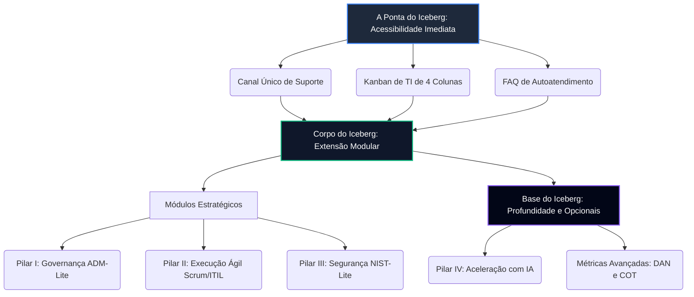
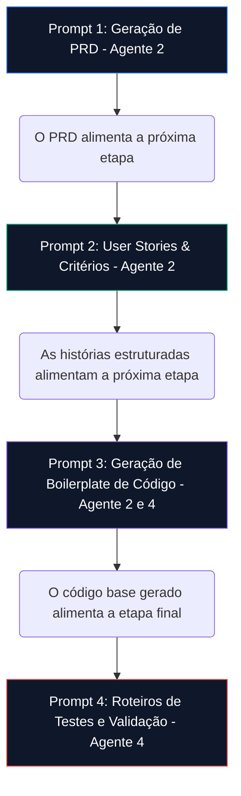

# GP-PME: Framework de Governança de TI para PMEs - Arquitetura Técnica e Métricas de Desempenho (Manual Técnico Completo)

**Autor**: Antigravity AI (sob a direção de Andre Victor)
**Versão**: 6.0 (Técnica Aprofundada e Consolidada - TI Enxuta Integrada)
**Data**: 02 de Junho de 2026

---

## Resumo Executivo

O **GP-PME (Governança Prática para Pequenas e Médias Empresas)** é um framework de Governança e Gestão de TI integrado, enxuto e adaptativo, desenhado especificamente para suprir as dores operacionais e riscos cibernéticos enfrentados por PMEs. Através da arquitetura modular do **"Iceberg Invertido"**, o framework destila e simplifica as normas globais mais reconhecidas de governança e infraestrutura crítica (ISO/IEC 38500:2024, COBIT 2019, ITIL 4, NIST CSF 2.0 e CIS Controls v8) em processos simples e de baixíssimo overhead operacional.

Este manual técnico compila toda a arquitetura teórica do framework, detalhando os seus seis capítulos fundamentais, os guias de suporte avançados para cada pilar operacional e o playbook de implantação para os primeiros 30 dias (Fase Zero), fornecendo uma base canônica completa e rigorosa para implementação profissional.

---

## 🗺️ Mapa Arquitetural do Framework (Iceberg Invertido)



---

# PARTE I: CAPÍTULOS DO FRAMEWORK

## Capítulo 1: Arquitetura Geral e Princípios Fundamentais

### 1.1. O Modelo "Iceberg Invertido" e a Modularidade do Framework
O GP-PME adota o conceito de **"Iceberg Invertido"** como sua arquitetura fundamental. Na superfície, o framework apresenta uma camada de **acessibilidade imediata**, focada em *Quick Wins* (vitórias rápidas) e ferramentas de diagnóstico operacional para PMEs (como Kanban de fluxo e suporte por canal único) que resolvem o caos no primeiro dia de implantação. 

À medida que a organização amadurece, camadas mais profundas são reveladas, oferecendo módulos especializados (Pilar I, II e III) e profundidade acadêmica (DAN, COT e Pilar IV). Esta abordagem evita a sobrecarga inicial e permite que a PME progrida no seu próprio ritmo, sem custos iniciais e de forma adaptativa.

### 1.2. A Filosofia da TI Enxuta
Diferente dos grandes frameworks corporativos tradicionais (como COBIT e ITIL corporativos), que exigem departamentos de conformidade inteiros e geram custos burocráticos inviáveis para PMEs, o GP-PME reconhece que o framework deve se adaptar ao tamanho da equipe, e não o contrário. 

A **TI Enxuta** empodera a equipe técnica reduzida — frequentemente composta por um único profissional (*One-Man-Band*) — a transitar de um "faz-tudo" reativo para um **Orquestrador de Valor** (Fase 1), progredindo até se tornar um **Agente de Mudança** focado em micro-inovação rápida (Fase 2) e, eventualmente, parceiro estratégico do negócio como **Chief Innovation Officer (CIO)** da PME (Fase 3).

### 1.3. Princípios de Design
*   **Adaptabilidade**: Flexibilidade inerente para se ajustar a diferentes contextos de PMEs e orçamentos, permitindo customização total.
*   **Acionabilidade**: Foco 100% na execução pragmática, oferecendo guias passo a passo, templates de 1 página e checklists de validação binária.
*   **Mensurabilidade**: Desempenho e valor avaliados através de métricas claras que traduzem termos técnicos em linguagem financeira de negócios (KPIs, DAN e COT).
*   **Incrementalidade**: Implementação concebida como uma jornada de melhoria contínua, permitindo absorver os processos sem paralisar a rotina.

### 1.4. Mapeamento aos Frameworks Basilares
O GP-PME simplifica e consolida os maiores frameworks globais de governança e cibersegurança cibernética:
1.  **Pilar I: Governança Essencial** $\rightarrow$ Adaptado da **ISO/IEC 38500:2024** e do **COBIT 2019** (APO02 - Managed Strategy), simplificando a tomada de decisão no ciclo ADM-Lite.
2.  **Pilar II: Execução Ágil** $\rightarrow$ Adaptado do **ITIL 4 SVS** (Incident e Request Management) e do **Scrum Framework** (Sprints curtas), criando o Ciclo de Serviço Micro-Adaptativo.
3.  **Pilar III: Segurança Crítica** $\rightarrow$ Adaptado do **NIST CSF 2.0** e do **CIS Controls v8 (IG1)**, operando 4 controles analógicos mínimos de baixo custo.
4.  **Pilar IV: Aceleração com IA** $\rightarrow$ Transversal de IA com grounding em dados locais e crivo *Human-in-the-loop* (HITL) contra alucinações.

---

## Capítulo 2: Pilar I: Governança Essencial (ADM-Lite)

Focado em alinhar a TI com a estratégia de negócio do CEO de forma enxuta e puramente manual:

### 2.1. O Ciclo ADM-Lite
*   **Avaliar (A)**: O Gestor de TI e o CEO avaliam quinzenalmente o andamento da tecnologia contra as metas operacionais e dores de setores comerciais da PME.
*   **Dirigir (D)**: As prioridades de investimentos e verbas de TI são direcionadas utilizando a **Matriz 4 Quadrantes**.
*   **Monitorar (M)**: O desempenho técnico e comercial é medido através do acompanhamento manual dos **3 KPIs Visíveis**.

### 2.2. O Ritual CD-TI Lite (Comitê de Direção de TI de Baixo Custo)
Uma reunião periódica quinzenal ou mensal de apenas **30 minutos**, com pauta e tempo rígidos entre o CEO/Dono da PME e o Gestor de TI:
1.  **Revisão dos KPIs (5 minutos)**: Análise rápida do IDSC (uptime de sistemas), TMpR (velocidade de chamados) e satisfação.
2.  **Alinhamento Tático (15 minutos)**: Análise visual dos cartões priorizados na Matriz 4 Quadrantes e status do Kanban.
3.  **Análise de Riscos (5 minutos)**: Monitoramento dos backups testados e debate sobre a dívida técnica DAN.
4.  **Decisões e Fechamento (5 minutos)**: Aprovação rápida de orçamentos (COT), assinatura física da ata simplificada de 1 página.

### 2.3. Artefatos de Governança Estratégica (Manual)
*   **Matriz RACI-Lite**: Tabela de 1 página contendo quem executa (Responsável) e quem aprova (Aprovador) cada serviço essencial de TI.
*   **Matriz 4 Quadrantes**: Painel de alinhamento visual de 1 página dividindo as iniciativas da quinzena em quatro quadrantes de valor comercial: Q1: Injeção de Receita (Vender Mais), Q2: Redução de Custos (Economizar), Q3: Experiência e Agilidade (Agilizar), e Q4: Resiliência e Segurança (Proteger).
*   **KPIs Visíveis**:
    *   *IDSC (Índice de Disponibilidade de Serviços Críticos)*: Meta **> 99.5%**.
    *   *TMpR (Tempo Médio para Resolução)*: Velocidade de encerramento de chamados.
    *   *ISU (Índice de Satisfação do Usuário)*: Meta **> 4.5/5.0**.

---

## Capítulo 3: Pilar II: Execução Ágil (Ciclo de Serviço Micro-Adaptativo)

Operacionaliza a gestão diária de incidentes e novos projetos de tecnologia de forma 100% manual e sem burocracias:

### 3.1. Quadro Kanban de Fluxo
Todas as demandas (incidentes de suporte e melhorias) são gerenciadas visualmente em uma lousa física contendo 4 colunas estritas:
1.  *A Fazer (Backlog)*: Fila de tarefas, ordenadas por prioridade estratégica do CD-TI Lite.
2.  *Em Andamento*: O que o técnico de TI está executando fisicamente no momento.
    *   **Regra de Ouro (WIP Limit)**: Estipulado em no máximo **3 tarefas simultâneas** por técnico, garantindo foco e rapidez no encerramento de pendências.
3.  *Em Teste*: Demandas concluídas pela TI aguardando a validação e assinatura do colaborador solicitante.
4.  *Concluído*: Demandas testadas e entregues.

### 3.2. Canal Único de Suporte
Para eliminar interrupções constantes e perda de chamados, a PME utiliza um **ponto de entrada unificado obrigatório** (como formulário eletrônico simples ou e-mail específico de suporte). O técnico só inicia chamados que estejam registrados no Canal Único, o qual gera automaticamente cartões para a coluna *A Fazer* do Kanban.

### 3.3. Ciclo de Inovação de 2 Semanas (O MVP)
Para desenvolvimento de novas melhorias comerciais (Laboratório de Inovação - Fase 2):
*   **PRD Simplificado**: Documento padrão de apenas **1 página** especificando a dor, a história de usuário ("Como [persona], eu quero... para..."), critérios binários de aceitação (Dado/Quando/Então), escopo negativo e métricas.
*   **MVP (Produto Mínimo Viável)**: Desenvolvimento da versão mais simples do recurso em no máximo **2 semanas**, implantando-o como um piloto controlado para um grupo de usuários para coletar feedbacks reais imediatos.

---

## Capítulo 4: Pilar III: Segurança Crítica (NIST-Lite)

Proteção essencial dos dados e sistemas baseando-se em controles binários manuais de baixo custo, garantindo crescimento seguro:

### 4.1. Os 4 Controles Críticos Mínimos
1.  **Inventário 80/20 de Ativos Críticos**: Planilha contendo o mapeamento dos 20% de softwares, bancos de dados e notebooks de diretores que geram 80% do faturamento da empresa. Toda a nossa prioridade de segurança se concentra neles.
2.  **Princípio do Privilégio Mínimo e MFA**: Remoção sistemática de acessos de "Administrador local" dos colaboradores comuns nos computadores (LUA) e ativação mandatória de Autenticação de Dois Fatores (MFA) em contas de e-mail e sistemas.
3.  **Backups Automatizados e Testados**: Cópia de segurança diária automática dos dados do Inventário 80/20 para a nuvem. O Gestor de TI deve realizar um **teste manual de restauração a cada 3 meses**, registrando o sucesso e apresentando-o em ata para o CD-TI Lite.
4.  **Plano de Resposta a Incidentes (PRI) de 1 Página**: Checklist físico impresso fixado na sala de TI listando os contatos de emergência e os 3 passos imediatos de contenção caso a empresa sofra um ataque cibernético (ex: desplugar cabos de rede sem desligar as máquinas afetadas).

---

## Capítulo 5: Métricas Avançadas (DAN e COT) e KPIs

Traduz os passivos tecnológicos e investimentos de TI em linguagem comercial e matemática para alinhamento com o financeiro:

### 5.1. Dívida de Arquitetura Normalizada (DAN)
Expressa a proporção acumulada de passivos tecnológicos (remendos de código, switches antigos, servidores obsoletos) em relação ao orçamento disponível na PME:

$$\text{DAN} = \frac{\text{Custo Estimado de Refatoração da Dívida Técnica (Horas Técnicas $\times$ Custo-Hora)}}{\text{Orçamento Anual de TI da PME}}$$

*   **Zonas de Risco**:
    *   *🟢 DAN < 0.15 (Saudável)*: Arquitetura estável e de fácil evolução.
    *   *🟡 0.15 $\le$ DAN $\le$ 0.35 (Alerta)*: Gargalos técnicos começam a atrasar novos projetos comerciais. Exige projetos de COT.
    *   *🔴 DAN > 0.35 (Crítico)*: Risco iminente de parada geral inesperada de sistemas vitais. Exige intervenção imediata de COT.

### 5.2. Custo da Otimização Tecnológica (COT)
Representa o aporte de verbas focado na redução da dívida técnica de arquitetura (reduzir o DAN), migrações de nuvem ou automações. O gestor calcula o ROI da otimização relacionando a redução de custos operacionais ou perdas evitadas em relação ao investimento aportado:

$$\text{ROI do COT (\%)} = \left( \frac{\text{Redução Mensal de Custos Operacionais ou Perdas Evitadas}}{\text{Investimento Total Aportado no COT}} \right) \times 100$$

---

## Capítulo 6: O Motor de IA e a Engenharia de Prompts Institucionalizada

A Inteligência Artificial Generativa atua como um multiplicador de produtividade do *One-Man-Band*, operando sob regras rígidas para garantir conformidade profissional de mercado:

### 6.1. Pipeline de Prompts Encadeados (Prompt Chaining)
Para desenvolver novas funcionalidades ou automatizar a TI de ponta a ponta sem ruídos, o ecossistema GP-PME orquestra um pipeline de 4 prompts encadeados de forma lógica:



### 6.2. Protocolo de Tratamento de Alucinações (Alucination Treatment Protocol)
*   **Ancoragem Semântica (Grounding)**: Toda e qualquer saída dos agentes deve ser ancorada na base de dados reais da PME e nas referências metodológicas dos guias locais.
*   **Human-in-the-loop (HITL)**: Proibição de colocar em produção qualquer especificação, política ou código gerado por IA sem antes passar pela validação técnica, aprovação e assinatura física/digital do Gestor de TI humano.
*   **Registro Obrigatório de Gaps**: Se informações técnicas cruciais forem omitidas no prompt, a IA deve se abster de inventar e sinalizar o gap explicitamente como uma "Pendência do Negócio" no final da resposta.

---

# PARTE II: GUIAS DE SUPORTE AVANÇADOS

---

## Guia de Suporte do Pilar 1: Governança Essencial (CD-TI Lite e 4 Quadrantes)

### 1. Operação do ADM-Lite
O comitê CD-TI Lite deve ser executado de forma enxuta e rígida a cada 15 dias. O Gestor de TI prepara a planilha dos 3 KPIs Visíveis e os cartões de projetos antes da reunião.

### 2. A Matriz 4 Quadrantes de Priorização
O preenchimento da Matriz é feito conectando as iniciativas técnicas aprovadas diretamente aos objetivos comerciais da empresa:

```
+------------------------------------+------------------------------------+
|  QUADRANTE 1: INJEÇÃO DE RECEITA  |  QUADRANTE 2: REDUÇÃO DE CUSTOS   |
|  (Ajudar a Vender Mais)            |  (Economizar Dinheiro na Empresa)  |
|                                    |                                    |
|  Exemplo: Configurar Pix nas lojas |  Exemplo: Desativar licenças de    |
|  ou otimizar o site de vendas.     |  sistemas que ninguém usa na rede. |
+------------------------------------+------------------------------------+
|  QUADRANTE 3: EXPERIÊNCIA E CLAREZA |  QUADRANTE 4: RESILIÊNCIA E RISCOS |
|  (Atender Equipe e Clientes Rápido) |  (Evitar Ataques e Parada Geral)   |
|                                    |                                    |
|  Exemplo: Criar base de FAQs para  |  Exemplo: Configurar backups em    |
|  o time resolver dúvidas sozinhos. |  nuvem e testar a recuperação.     |
+------------------------------------+------------------------------------+
```

---

## Guia de Suporte do Pilar 2: Execução Ágil (Kanban e MVP)

### 1. Gestão de Fluxo no Kanban
O limite de WIP de no máximo 3 tarefas simultâneas em andamento deve ser vigiado rigorosamente pelo Gestor de TI. Nenhuma tarefa nova entra na coluna "Em Andamento" se já houver 3 cartões ativos. Isso evita o gargalo de tarefas inacabadas e foca o esforço técnico em fechar demandas abertas.

### 2. O Processo de Inovação MVP de 2 Semanas
1.  **Dores mapeadas**: Identificação de um processo de negócio lento (ex: digitação manual de relatórios de vendas).
2.  **Especificação**: Rascunho do PRD de 1 página definindo a dor e a história do usuário.
3.  **Desenvolvimento ágil**: Criação da versão mais simples em 2 semanas.
4.  **Validação**: Testes manuais guiados em grupo de testes coletando feedback contínuo.

---

## Guia de Suporte do Pilar 3: Segurança Crítica (NIST-Lite e PRI)

### 1. Checklist de Controles NIST-Lite
O Gestor de TI deve auditar mensalmente os seguintes controles manuais mínimos:
*   [ ] **Inventário 80/20**: Planilha local de ativos críticos atualizada com sucesso.
*   [ ] **Contas LUA**: Usuários comuns sem privilégios de administrador nas máquinas.
*   [ ] **Contas MFA**: MFA obrigatório ativado em 100% dos e-mails e acessos.
*   [ ] **Conformidade de Backup**: Backup automático diário em nuvem operacional.
*   [ ] **Teste de Restauro**: Teste prático de restauração de backup concluído com sucesso nos últimos 90 dias.
*   [ ] **PRI**: Checklist de resposta a incidentes de 1 página fixado na parede da TI.

### 2. Plano de Resposta a Incidentes (PRI) de 1 Página
Em caso de infecção por vírus ransomware na rede:
*   **Passo 1 (Contenção)**: Desplugar cabos de rede e desativar o Wi-Fi das máquinas suspeitas **sem desligar a máquina**.
*   **Passo 2 (Notificação)**: Ligar imediatamente para os números de emergência da TI colados na folha física.
*   **Passo 3 (Recuperação)**: Iniciar formatação completa das máquinas e restaurar dados através da cópia limpa do backup em nuvem.

---

## Guia de Suporte do Pilar 4: Assistência por IA e Agentes

### 1. Os 4 Agentes Especialistas de IA
*   **Agente 1: Orquestrador Estratégico (Pilar I)**: Gera pautas e relatórios para o CD-TI Lite em português direto para o CEO.
*   **Agente 2: Analista Scrum (Pilar II)**: Traduz dores operacionais em PRDs de 1 página e histórias de usuário.
*   **Agente 3: Guardião NIST (Pilar III)**: Desenha políticas rápidas de cibersegurança e checklists preventivos.
*   **Agente 4: Auditor DAN/COT (Métricas)**: Efetua cálculos matemáticos do DAN, ROI do COT e analisa gaps de alucinações.

### 2. Checklist de Auditoria HITL (Validação Humana)
Antes de aprovar qualquer saída de IA, o Gestor de TI humano deve assinar os seguintes itens:
- [ ] O documento possui referências explícitas a dados reais fornecidos no prompt.
- [ ] O artefato está livre de jargões técnicos complexos e tem no máximo 1 a 2 páginas.
- [ ] A recomendação de TI aponta explicitamente qual norma ou pilar do framework a ampara.
- [ ] O output está livre de estimativas de ROI impossíveis de rastrear ou CVEs falsas.

---

# PARTE III: PLAYBOOK DE IMPLANTAÇÃO (FASE ZERO - 30 DIAS)

---

## Cronograma Semanal de Implantação

```
[Semana 1: Organizar o Caos] -> [Semana 2: Automatizar e Proteger] -> [Semana 3: Formalizar e Alinhar] -> [Semana 4: Medir e Consolidar]
```

*   **Semana 1 (Dias 1 a 7) - Organizar o Caos**: Diagnóstico rápido de dores, implantação do quadro Kanban de post-its com WIP limit de 3 e estabelecimento do Canal Único obrigatório de suporte (eliminando chats informais).
*   **Semana 2 (Dias 8 a 14) - Automatizar e Proteger**: Criação da base de FAQs para autoatendimento dos colaboradores (eliminando 80% do suporte de Nível 1), confecção do Inventário 80/20 de ativos críticos e configuração dos backups cloud.
*   **Semana 3 (Dias 15 a 21) - Formalizar e Alinhar**: Preenchimento e afixação do PRI de 1 página na sala de TI, agendamento do primeiro comitê CD-TI Lite de 30 minutos e confecção manual da Matriz 4 Quadrantes.
*   **Semana 4 (Dias 22 a 30) - Medir e Consolidar**: Definição e coleta dos 3 KPIs Visíveis, teste prático manual de restauração do backup cloud e transição de fase com o indicador de dívida de TI DAN calculado.

---

## Referências Bibliográficas

*   **[1]** ISO/IEC 38500:2024. *Information technology — Governance of IT for the organization*.
*   **[2]** ISACA. (2019). *COBIT 2019 Framework: Governance and Management Objectives*.
*   **[3]** Axelos. (2019). *ITIL Foundation: ITIL 4 edition*.
*   **[4]** NIST. (2024). *NIST Cybersecurity Framework (CSF) 2.0*.
*   **[5]** CIS. (2023). *CIS Critical Security Controls Version 8: A Community Defense Guide for Safeguarding Critical Assets*.
*   **[6]** Verdecchia, R. (2022). *Empirical evaluation of an architectural technical debt index in software-intensive systems*.
*   **[7]** Schwaber, K., & Sutherland, J. (2020). *The Scrum Guide™: The Definitive Guide to Scrum*.
*   **[8]** OpenAI. (2023). *GPT Best Practices: Prompt Engineering Guidelines*.

---

## Glossário de Termos Técnicos

*   **ADM-Lite**: Processo contínuo de Avaliar, Dirigir e Monitorar a TI, adaptado da ISO 38500 para pequenas e médias empresas.
*   **CD-TI Lite**: Comitê de Direção de TI de baixo custo, materializado por uma reunião quinzenal de 30 minutos entre CEO e TI.
*   **COT**: Custo da Otimização Tecnológica, representando aportes focados especificamente em reduzir o DAN ou automatizar fluxos.
*   **DAN**: Dívida de Arquitetura Normalizada, medindo o passivo tecnológico acumulado em relação ao orçamento disponível da TI.
*   **HITL**: *Human-in-the-loop* (Humano no controle), representando a exigência mandatória de aprovação humana de saídas da IA.
*   **IDSC**: Índice de Disponibilidade de Serviços Críticos, representando a porcentagem de tempo que sistemas essenciais ficam no ar.
*   **LUA**: *Least User Access* (Privilégio Mínimo), representando contas padrão de colaboradores sem privilégios de administrador.
*   **MFA**: *Multi-Factor Authentication* (Autenticação de Dois Fatores) mandatória ativada em e-mails e sistemas corporativos.
*   **MVP**: Produto Mínimo Viável, representando versões utilizáveis de novas ferramentas construídas em ciclos rápidos de 2 semanas.
*   **PRI**: Plano de Resposta a Incidentes de 1 página fixado fisicamente na TI para isolamento rápido em casos de ataques hacker.
*   **PRD**: *Product Requirements Document* de 1 página, contendo a especificação rápida de requisitos e critérios de projetos de TI.
*   **WIP**: *Work in Progress* (Trabalho em Progresso) limitado em no máximo 3 tarefas simultâneas para garantir foco técnico.
