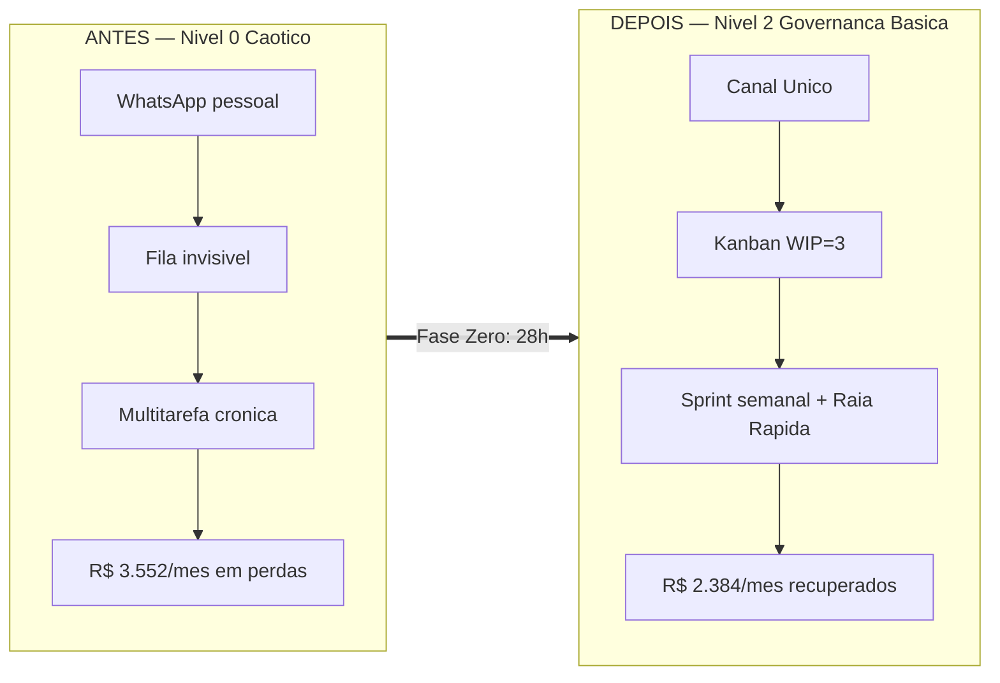

# Perfil A — "TI Solo": o técnico faz-tudo de uma PME de ~10 pessoas

> Simulação de ROI do framework **GP-PME**. Todas as fórmulas vêm de [`Calculadora_ROI.md`](./Calculadora_ROI.md); os números são conservadores e as premissas estão declaradas. Custo-hora de TI deste perfil: **`Ch` = R$ 44/h** (salário bruto de referência R$ 5.000 → `(5.000 × 1,55) / 176 ≈ R$ 44`).

---

## 1. Retrato da empresa

| Item | Descrição |
| :--- | :--- |
| **Setor** | Escritório de contabilidade / serviços profissionais |
| **Porte** | 10 colaboradores (8 usuários de sistemas + 2 sócios) |
| **Faturamento** | ~R$ 1,8 milhão/ano |
| **Equipe de TI** | **1 técnico faz-tudo** (CLT, R$ 5.000 bruto), acumula suporte, infraestrutura, backups e "quebra-galho" de sistema |
| **Orçamento anual de TI** | ~R$ 108.000 (salário com encargos ~R$ 93k + licenças/infra ~R$ 15k) |
| **Stack** | Google Workspace, ERP contábil desktop (ex.: Domínio/Alterdata) em servidor local, Wi-Fi único, 12 notebooks, backup manual em HD externo, suporte via **WhatsApp pessoal do técnico** |

O técnico é competente, mas está preso no papel de **"faz-tudo" reativo** descrito no Nível 0 do Modelo de Maturidade: apaga incêndios o dia inteiro e nunca chega às tarefas que geram valor.

---

## 2. Sem o framework — a dor narrada

São 7h40 e o celular do técnico já tem 4 mensagens: "a impressora fiscal parou", "não consigo entrar no e-mail", "o sistema tá lento", "esqueci minha senha". Nenhuma virou chamado — viraram interrupções. Ele resolve a mais barulhenta, esquece as outras, e às 11h um sócio reclama que "ninguém fez nada do que pedi". À tarde o servidor do ERP trava por 40 minutos e a emissão de guias para. O backup? "Tá no HD, acho que rodou ontem." Ninguém testou uma restauração este ano.

Não há Canal Único, não há Kanban, não há métrica. O trabalho existe, mas é **invisível** — e o que é invisível não pode ser priorizado nem defendido diante do dono.

### Tabela de linha-de-base (o "antes")

**Premissas de cálculo declaradas** — jornada `J` = 176 h/mês, encargos `f` = 1,55, custo-hora TI `Ch` = **R$ 44/h**, custo-hora do usuário final `Cu` = **R$ 25/h**, horas comerciais/ano `Hc` = **2.500 h**.

| Métrica | Valor (antes) | Como foi estimado |
| :--- | :---: | :--- |
| **IDSC** (disponibilidade de serviços críticos) | **97,5%** | ERP e e-mail caem com frequência; ~2,5% do tempo comercial parado |
| **Horas paradas/ano** | **62,5 h** | `(1 − 0,975) × 2.500` |
| **TMpR** (tempo médio de resolução) | **9,0 h** | Chamado informal fica horas "esquecido" antes de ser tocado |
| **ISU** (satisfação do usuário, 1–5) | **3,4** | Usuários reclamam de sumiço de pedidos e retrabalho |
| **Incidentes/ano** | **~360** | ~30/mês (média informal); ~3,0 por colaborador/mês |
| **Horas de TI desperdiçadas/mês** | **40 h** | Multitarefa, fila invisível e chamados informais retrabalhados |
| **Horas de retrabalho dos usuários/mês** | **30 h** | Digitação dupla, planilhas refeitas, e-mails reenviados |
| **DAN** (Dívida de Arquitetura Normalizada) | **0,20 🟡 Alerta** | `(480 h × R$ 44) / R$ 108.000 = 0,196` — servidor instável, integrações manuais, zero documentação |

### Custo mensal das dores (fórmulas §4 da Calculadora)

```
CTD (TI desperdiçado)   = 40 h × R$ 44 = R$ 1.760/mês
CRM (retrabalho usuário)= 30 h × R$ 25 = R$   750/mês
CHP                     = (8 colab × R$ 25) + 0 = R$ 200/h
Perda_Indisp            = 200 × (62,5 / 12)     = R$ 1.042/mês
------------------------------------------------------------
Custo total das dores   ≈ R$ 3.552/mês  (≈ R$ 42.624/ano)
```
> `%_Receita_em_Risco = 0`: ignoramos a margem contábil perdida em cada parada, para não inflar o número.

**IM-TI de partida: Nível 0 — Caótico** (1 de 10 respostas "Sim" no questionário de maturidade).

---

## 3. Implantação semana a semana

Com equipe de uma pessoa, a regra é **modularidade estrita**: nada de metodologia pesada. A IA aqui é **opcional** (atalho, não dependência) — o técnico solo executa tudo de forma manual e analógica.

### Fase Zero — os primeiros 30 dias (Salva-Vidas)

Fonte: `Guia_de_Implementacao_Fase_Zero.md`. Custo: **~28 h** do técnico (parte no próprio expediente, migrando o caos existente).

| Semana | Ação | Artefato usado | Horas |
| :--- | :--- | :--- | :---: |
| **1** | Diagnóstico de maturidade; Kanban de 4 colunas com **WIP = 3**; **Canal Único** (Google Forms + comunicado assinado pelo sócio "fim do suporte por WhatsApp pessoal") | `Templates/Mapeamento_Maturidade/Template_Mapeamento_Maturidade.md`; `Templates/Tasklists` | 10 h |
| **2** | **FAQ de 5 itens** (senha, Wi-Fi, impressora fiscal, VPN, e-mail); **Inventário 80/20** (servidor ERP + 2 notebooks dos sócios); **Backup 3-2-1** automatizado em nuvem + **1 teste de restauração < 30 min** | `Templates_GP-PME.md` (Inventário 80/20) | 8 h |
| **3** | **PRI de 1 página** fixado na parede (contatos do provedor, suporte ERP, passos de isolamento); 1º **CD-TI Lite** de 30 min com os sócios + **Matriz 4 Quadrantes** | `Templates/PRDs`; PRI do `Guia_Pilar_3` | 5 h |
| **4** | Planilha dos **3 KPIs** (IDSC, TMpR, ISU); retrospectiva; recálculo do IM-TI | Calculadora §1 | 5 h |

**Entregável Fase Zero**: IM-TI sobe de Nível 0 → **Nível 1 (Reativo Organizado)**.

### Fases Um a Três (meses 2 a 12)

- **Fase Um — Orquestrador de Valor**: cadência de **sprint semanal** de 1 semana (planejamento de 15 min) e **Raia Rápida** para emergências (`Guia_Pilar_2`). O tempo antes perdido em multitarefa começa a voltar.
- **Fase Dois — Agente de Mudança**: um primeiro **MVP de 2 semanas** (ex.: automação do relatório mensal de honorários), validando o "Laboratório de Inovação" mesmo com uma pessoa só.
- **Fase Três — Parceiro Estratégico**: cálculo da **DAN** e priorização da dívida técnica no CD-TI Lite; endereçamento do servidor instável.

> **Onde a IA acelera (opcional neste perfil)**: um agente de triagem simples no Canal Único pode responder às FAQs de Nível 1 antes de abrir cartão, e um assistente de PRD reduz a burocracia do MVP. Para o técnico solo, isso é *ganho de fôlego*, não requisito — o ROI abaixo **não** conta com IA.

---

## 4. Com o framework — resultados justificados

### Aos 90 dias

- **TMpR cai de 9,0 h → 5,5 h**: com o **Canal Único**, o chamado deixa de morrer no WhatsApp e entra visível no Kanban; a fila invisível some e nada mais fica "esquecido".
- **IDSC sobe de 97,5% → 99,0%**: o **Inventário 80/20** identifica o servidor do ERP como ativo nº 1 e o **backup testado** encurta drasticamente a recuperação de qualquer falha.
- **Autoatendimento**: a **FAQ** resolve ~40% das dúvidas rotineiras (senha, Wi-Fi) sem tocar o técnico.
- **IM-TI: Nível 2 (Governança Básica)** — CD-TI Lite e segurança essencial ativos.

### Aos 12 meses (estado estabilizado — base do ROI)

| Métrica | Antes | Depois (12 m) | Mecanismo do framework |
| :--- | :---: | :---: | :--- |
| IDSC | 97,5% | **99,5%** | Inventário 80/20 + Backups 3-2-1 testados |
| Horas paradas/ano | 62,5 h | **12,5 h** | `(1 − 0,995) × 2.500` |
| TMpR | 9,0 h | **4,0 h** | Canal Único elimina a fila invisível |
| ISU | 3,4 | **4,5** | Chamados param de sumir; feedback pós-atendimento |
| Horas TI desperdiçadas/mês | 40 h | **15 h** | WIP = 3 + Raia Rápida acabam com a multitarefa |
| Horas retrabalho/mês | 30 h | **12 h** | Menos parada e menos digitação dupla |
| DAN | 0,20 🟡 | **0,10 🟢** | Matriz 4 Quadrantes corta tarefas sem valor; dívida do servidor endereçada |

### Ganho mensal (fórmula §4.4 da Calculadora)

```
Saved_CTD  = (40 − 15) h × R$ 44 = 25 × 44 = R$ 1.100
Saved_CRM  = (30 − 12) h × R$ 25 = 18 × 25 = R$   450
Perda_Indisp_depois = 200 × (12,5 / 12) = R$ 208
Saved_Indisp = 1.042 − 208 = R$ 834
------------------------------------------------------
Ganho_Mensal = 1.100 + 450 + 834 = R$ 2.384/mês  (≈ R$ 28.608/ano)
```

---

## 5. Antes × Depois

| Dimensão | Antes (Nível 0) | Depois — 12 m (Nível 2) |
| :--- | :--- | :--- |
| Entrada de chamados | WhatsApp pessoal, corredor | **Canal Único** (Forms) → Kanban |
| Fluxo de trabalho | Multitarefa caótica | **WIP = 3** + sprint semanal |
| Disponibilidade (IDSC) | 97,5% | **99,5%** |
| Resolução (TMpR) | 9,0 h | **4,0 h** |
| Satisfação (ISU) | 3,4 | **4,5** |
| Backup | HD manual, não testado | **3-2-1 em nuvem, testado** |
| Dívida técnica (DAN) | 0,20 🟡 | 0,10 🟢 |
| Papel do técnico | Faz-tudo reativo | **Orquestrador de Valor** |



---

## 6. ROI, payback e cenários

### Investimento (COT — fórmula §2.2 da Calculadora)

```
Custos_Indiretos = 28 h (Fase Zero) + ~40 h (Fases 1-3 no ano) = 68 h ≈ 70 h × R$ 44 = R$ 3.080
Custos_Diretos   = R$ 1.200 (backup em nuvem/ano) + R$ 1.000 (treinamento/licenças) = R$ 2.200
------------------------------------------------------------------------------
COT = 3.080 + 2.200 = R$ 5.280
```

### ROI e Payback

```
ROI_Pratico = (Ganho_Mensal × 12 / COT) × 100 = (2.384 × 12 / 5.280) × 100 = 542% ao ano
Payback     = COT / Ganho_Mensal = 5.280 / 2.384 = 2,2 meses
```

### Cenários

| Cenário | Premissa | Ganho mensal | ROI anual | Payback |
| :--- | :--- | :---: | :---: | :---: |
| **Esperado** | Ganho integral projetado | R$ 2.384 | **542%** | **2,2 meses** |
| **Conservador** | Apenas 60% do ganho (haircut de 40%) | R$ 1.430 | **325%** | **3,7 meses** |

Mesmo no cenário pessimista, o investimento se paga em **menos de 4 meses** — e a maior parte do COT é tempo que a empresa **já pagava**.

---

## 7. Riscos evitados (upside de segurança — não entra no ROI acima)

Apresentado à parte para manter o ROI conservador. Fonte: `Guia_Pilar_3_Seguranca_Critica.md` — os **10 controles NIST-Lite** (destilação do CIS Controls v8, IG1).

### Custo de risco evitado (fórmula §5 da Calculadora)

```
Risco_Evitado_Ano = (Prob_SEM − Prob_COM) × Custo_Médio_por_Incidente
                   = (0,18 − 0,05) × R$ 40.000 = 0,13 × 40.000 = R$ 5.200/ano
```
> Um ransomware num escritório de contabilidade não trava só a operação — trava obrigações fiscais dos clientes, com risco de multa e perda de contratos. R$ 40.000 é uma estimativa conservadora de custo direto (parada + recuperação).

### Mapa dos 10 controles NIST-Lite (o que a Fase Zero blindou)

| # | Controle | Status após implantação | Risco que mitiga |
| :---: | :--- | :--- | :--- |
| 1 | Inventário de Hardware | ✅ (80/20: servidor + notebooks dos sócios) | Ativo crítico "invisível" sem proteção |
| 2 | Inventário de Software | 🟡 Parcial (ERP e Workspace mapeados) | Software pirata / desatualizado |
| 3 | Gestão de Vulnerabilidades | 🟡 Em andamento (updates do SO) | Exploração de falha conhecida |
| 4 | Configurações Seguras | 🟡 Parcial | Serviços desnecessários expostos |
| 5 | Contas de Acesso + **MFA** | ✅ (MFA no Workspace e no banco) | Roubo de credencial / phishing |
| 6 | **Privilégio Mínimo (LUA)** | ✅ (admin local removido) | Malware que se instala e se espalha |
| 7 | Defesas contra Malware | ✅ (antivírus nativo ativo) | Vírus / trojan |
| 8 | **Backup 3-2-1 testado** | ✅ (restauração < 30 min validada) | Perda total de dados por ransomware |
| 9 | Firewall / Proteção de Rede | 🟡 (firewall do SO + roteador) | Acesso externo indevido |
| 10 | **Treinamento de Conscientização** | ✅ (checklist anti-phishing) | Engenharia social / golpe do boleto |

**Upside total do Perfil A**: **~R$ 5.200/ano** de risco evitado, *somados* aos R$ 28.608/ano de ganho de produtividade. Não contabilizamos isso no ROI de 542% — se o fizéssemos, o retorno subiria.
