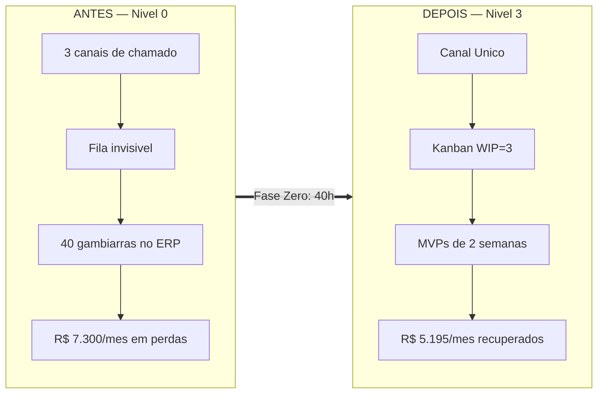

# Perfil B — PME de 25 funcionários: a TI de "1 a 2 pessoas" no limite

> Simulação de ROI do framework **GP-PME**. Este perfil é o **caso de referência da [Calculadora_ROI.md](./Calculadora_ROI.md)** — os exemplos resolvidos da Calculadora (COT R$ 9.570, ganho R$ 5.195/mês, ROI 651%, payback 1,84 meses, DAN 0,193) são exatamente os números desta empresa. Custo-hora de TI: **`Ch` = R$ 53/h** (salário bruto de referência R$ 6.000 → `(6.000 × 1,55) / 176 ≈ R$ 53`).

---

## 1. Retrato da empresa

| Item | Descrição |
| :--- | :--- |
| **Setor** | Comércio/distribuição regional com braço de e-commerce |
| **Porte** | 25 colaboradores (vendas, faturamento, estoque, administrativo) |
| **Faturamento** | ~R$ 8 milhões/ano |
| **Equipe de TI** | **1 analista pleno** (R$ 6.000 bruto) + **1 estagiário** meio-período que ajuda no suporte |
| **Orçamento anual de TI** | **R$ 220.000** (salários com encargos + licenças ERP + link + nuvem) |
| **Stack** | ERP de gestão (nuvem híbrida), plataforma de e-commerce, Microsoft 365, servidor de arquivos local, 25 estações, checkout online integrado ao ERP |

A empresa cresceu rápido e a TI virou **gargalo**: o analista pleno é bom, mas está afogado em chamados e "puxadinhos" no ERP; o estagiário resolve o que consegue. Time-to-market de qualquer melhoria comercial é indefinido.

---

## 2. Sem o framework — a dor narrada

O e-commerce é o orgulho do dono, mas toda semana "o checkout deu erro" chega por três canais: WhatsApp do analista, e-mail do estagiário e o dono gritando no corredor. Ninguém sabe quantos chamados existem — só que **nunca acabam**. O ERP tem 40 "gambiarras" acumuladas (planilhas que alimentam o sistema na mão, relatórios que ninguém confia). Quando o servidor de arquivos cai, 13 pessoas do faturamento ficam sem nota fiscal até o analista "dar um jeito". O backup existe, mas nunca foi restaurado num teste real.

O custo disso é grande e **totalmente invisível** para o CEO, que só enxerga "a TI que vive apagando incêndio e nunca entrega o que prometeu".

### Tabela de linha-de-base (o "antes")

**Premissas declaradas** — `J` = 176 h/mês, `f` = 1,55, `Ch` = **R$ 53/h**, `Cu` = **R$ 25/h**, `Hc` = **3.500 h/ano** (operação estendida por causa do e-commerce).

| Métrica | Valor (antes) | Como foi estimado |
| :--- | :---: | :--- |
| **IDSC** | **97,5%** | Checkout e ERP instáveis; ~2,5% do tempo comercial parado |
| **Horas paradas/ano** | **87,5 h** | `(1 − 0,975) × 3.500` |
| **TMpR** | **8,0 h** | Chamado disperso demora a ser tocado |
| **ISU** (1–5) | **3,3** | Usuários reclamam de lentidão e retrabalho no ERP |
| **Incidentes/ano** | **~744** | ~62/mês → 2,48 por colaborador/mês |
| **Horas de TI desperdiçadas/mês** | **60 h** | Multitarefa, fila invisível, "puxadinhos" no ERP |
| **Horas de retrabalho dos usuários/mês** | **70 h** | Planilhas manuais que alimentam o ERP, digitação dupla |
| **DAN** | **0,193 🟡 Alerta** | `(800 h × R$ 53) / R$ 220.000 = 0,193` — 40 integrações manuais e ERP com gambiarras |

### Custo mensal das dores (fórmulas §4 da Calculadora)

```
CTD (TI desperdiçado)   = 60 h × R$ 53 = R$ 3.180/mês
CRM (retrabalho usuário)= 70 h × R$ 25 = R$ 1.750/mês
CHP                     = (13 colab × R$ 25) + 0 = R$ 325/h
Perda_Indisp            = 325 × (87,5 / 12)      = R$ 2.370/mês
------------------------------------------------------------
Custo total das dores   ≈ R$ 7.300/mês  (≈ R$ 87.600/ano)
```
> `%_Receita_em_Risco = 0`: ignoramos a venda perdida no checkout fora do ar, para não inflar o número.

**IM-TI de partida: Nível 0 — Caótico** (2 de 10 "Sim").

---

## 3. Implantação semana a semana

Equipe de 1,5 pessoa: a Fase Zero é conduzida pelo analista, com o estagiário assumindo o Nível 1 de suporte à medida que a FAQ e o Kanban desafogam. Custo total da Fase Zero: **~40 h** de TI.

### Fase Zero — os primeiros 30 dias

Fonte: `Guia_de_Implementacao_Fase_Zero.md`.

| Semana | Ação | Artefato usado | Horas |
| :--- | :--- | :--- | :---: |
| **1** | Diagnóstico IM-TI; **Kanban** (Trello) 4 colunas, **WIP = 3** por técnico; **Canal Único** (formulário 365) + comunicado do CEO encerrando o suporte por WhatsApp | `Templates/Mapeamento_Maturidade/Template_Mapeamento_Maturidade.md` | 14 h |
| **2** | **FAQ / bot de triagem** (senha, VPN, checkout, nota fiscal, impressora) resolvendo ~40%; **Inventário 80/20** (ERP, servidor de arquivos, plataforma e-commerce); **Backup 3-2-1** em nuvem + **teste de restauração < 30 min** | `Templates_GP-PME.md` | 12 h |
| **3** | **PRI de 1 página** assinado pelo CEO; 1º **CD-TI Lite** de 30 min + **Matriz 4 Quadrantes** (que já elimina ~1/3 das "gambiarras" sem valor) | `Guia_Pilar_3` (PRI); `Templates/PRDs` | 7 h |
| **4** | Planilha dos **3 KPIs**; retrospectiva; recálculo do IM-TI → **Nível 1** | Calculadora §1 | 7 h |

### Fases Um a Três (meses 2 a 12)

- **Fase Um**: **sprint semanal** + **Raia Rápida** (`Guia_Pilar_2`) domam a multitarefa; estagiário assume Nível 1 via FAQ.
- **Fase Dois**: **MVP de 2 semanas** — automatizar as planilhas que alimentam o ERP na mão (fonte nº 1 de retrabalho). PRD Simplificado.
- **Fase Três**: cálculo e ataque da **DAN** — as 40 integrações manuais viram o backlog de otimização do CD-TI Lite.

> **Onde a IA acelera (opcional)**: o **Analista de Execução Ágil (IA)** (`Templates/AI-Skills-and-Agents/Agentes_Prontos/Agente_Execucao_Agil.md`) redige os PRDs dos MVPs a partir da dor ditada pelo dono; o bot de triagem no Canal Único filtra o Nível 1. O ROI abaixo **não** depende disso.

---

## 4. Com o framework — resultados justificados

### Aos 90 dias

- **TMpR 8,0 h → 5,0 h**: o **Canal Único** acaba com a fila invisível de três canais; o Kanban torna o backlog visível e priorizável.
- **IDSC 97,5% → 99,0%**: o **Inventário 80/20** prioriza checkout/ERP e o **backup testado** encurta a recuperação.
- **~40% dos chamados** viram autoatendimento (FAQ/bot); o estagiário absorve o resto do Nível 1.
- **IM-TI: Nível 2 (Governança Básica)**.

### Aos 12 meses (estado estabilizado — base do ROI)

| Métrica | Antes | Depois (12 m) | Mecanismo do framework |
| :--- | :---: | :---: | :--- |
| IDSC | 97,5% | **99,5%** | Inventário 80/20 + Backups 3-2-1 |
| Horas paradas/ano | 87,5 h | **15,5 h** | `(1 − 0,9956) × 3.500 ≈ 15,5` |
| TMpR | 8,0 h | **4,0 h** | Canal Único elimina a fila invisível |
| ISU | 3,3 | **4,5** | Nada mais some; feedback pós-atendimento |
| Horas TI desperdiçadas/mês | 60 h | **20 h** | WIP = 3 + Raia Rápida acabam com a multitarefa |
| Horas retrabalho/mês | 70 h | **25 h** | MVP automatiza as planilhas que alimentavam o ERP |
| DAN | 0,193 🟡 | **0,12 🟢** | Matriz 4 Quadrantes corta gambiarras; integrações refatoradas |
| Maturidade | Nível 0 | **Nível 3 (Inovação Incremental)** | Ciclo MVP rodando + DAN sob gestão |

### Ganho mensal (fórmula §4.4 da Calculadora)

```
Saved_CTD  = (60 − 20) h × R$ 53 = 40 × 53 = R$ 2.120
Saved_CRM  = (70 − 25) h × R$ 25 = 45 × 25 = R$ 1.125
Perda_Indisp_depois = 325 × (15,5 / 12) = R$ 420
Saved_Indisp = 2.370 − 420 = R$ 1.950
------------------------------------------------------
Ganho_Mensal = 2.120 + 1.125 + 1.950 = R$ 5.195/mês  (≈ R$ 62.340/ano)
```
> Este é exatamente o `Ganho_Mensal` usado nos exemplos §3.1 e §3.2 da Calculadora.

---

## 5. Antes × Depois

| Dimensão | Antes (Nível 0) | Depois — 12 m (Nível 3) |
| :--- | :--- | :--- |
| Entrada de chamados | WhatsApp + e-mail + corredor | **Canal Único** → Kanban |
| Fluxo | Multitarefa; 40 gambiarras | **WIP = 3** + MVPs de 2 semanas |
| Disponibilidade (IDSC) | 97,5% | **99,5%** |
| Resolução (TMpR) | 8,0 h | **4,0 h** |
| Satisfação (ISU) | 3,3 | **4,5** |
| Retrabalho no ERP | 70 h/mês manuais | **25 h/mês** (planilhas automatizadas) |
| Dívida técnica (DAN) | 0,193 🟡 | 0,12 🟢 |
| Papel da TI | Gargalo reativo | **Motor de valor (Agente de Mudança)** |



---

## 6. ROI, payback e cenários

### Investimento (COT — fórmula §2.2 da Calculadora)

```
Custos_Indiretos = 90 h de TI (Fase Zero + Fases 1-3) × R$ 53 = R$ 4.770
Custos_Diretos   = R$ 1.800 (backup em nuvem/ano) + R$ 3.000 (treinamento) = R$ 4.800
------------------------------------------------------------------------------
COT = 4.770 + 4.800 = R$ 9.570
```

### ROI e Payback

```
ROI_Pratico = (5.195 × 12 / 9.570) × 100 = (62.340 / 9.570) × 100 = 651% ao ano
Payback     = 9.570 / 5.195 = 1,84 meses  (≈ 8 semanas)
```

### Cenários

| Cenário | Premissa | Ganho mensal | ROI anual | Payback |
| :--- | :--- | :---: | :---: | :---: |
| **Esperado** | Ganho integral projetado | R$ 5.195 | **651%** | **1,8 meses** |
| **Conservador** | Apenas 60% do ganho | R$ 3.117 | **391%** | **3,1 meses** |

---

## 7. Riscos evitados (upside de segurança — não entra no ROI acima)

Fonte: `Guia_Pilar_3_Seguranca_Critica.md` — os **10 controles NIST-Lite** (CIS Controls v8, IG1).

### Custo de risco evitado (fórmula §5 da Calculadora)

```
Risco_Evitado_Ano = (0,20 − 0,05) × R$ 80.000 = 0,15 × 80.000 = R$ 12.000/ano
```
> Este é o exemplo resolvido da própria Calculadora (§5): ransomware numa PME, custo médio R$ 80.000, probabilidade caindo de 20% para 5%/ano com Backups 3-2-1 + MFA + LUA + PRI.

### Mapa dos 10 controles NIST-Lite

| # | Controle | Status após implantação | Risco que mitiga |
| :---: | :--- | :--- | :--- |
| 1 | Inventário de Hardware | ✅ (80/20: ERP, servidor, e-commerce) | Ativo crítico sem proteção |
| 2 | Inventário de Software | ✅ (ERP, 365, plataforma) | Software desatualizado/pirata |
| 3 | Gestão de Vulnerabilidades | 🟡 Em andamento (updates + patch do ERP) | Exploração de falha conhecida |
| 4 | Configurações Seguras | 🟡 Parcial | Serviços expostos sem necessidade |
| 5 | Contas de Acesso + **MFA** | ✅ (MFA no 365, e-commerce e financeiro) | Roubo de credencial / phishing |
| 6 | **Privilégio Mínimo (LUA)** | ✅ (admin local removido nas estações) | Malware que se instala e se espalha |
| 7 | Defesas contra Malware | ✅ (antivírus corporativo) | Vírus / ransomware |
| 8 | **Backup 3-2-1 testado** | ✅ (restauração < 30 min validada trimestralmente) | Perda total de dados |
| 9 | Firewall / Proteção de Rede | 🟡 (firewall + segmentação básica) | Acesso externo indevido |
| 10 | **Treinamento de Conscientização** | ✅ (checklist anti-phishing + política de senhas) | Golpe do boleto / engenharia social |

**Upside total do Perfil B**: **~R$ 12.000/ano** de risco evitado, *além* dos R$ 62.340/ano de ganho de produtividade. Fora do ROI de 651% — se contabilizado, o retorno subiria.
