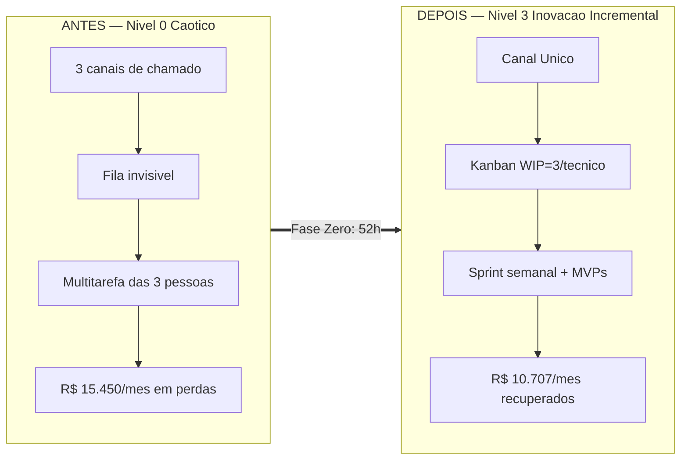

# Perfil C — PME de 50 funcionários: a TI que ganha seu primeiro gestor

> Simulação de ROI do framework **GP-PME**. Todas as fórmulas vêm de [`Calculadora_ROI.md`](./Calculadora_ROI.md); os números são conservadores e as premissas estão declaradas. Custo-hora de TI deste perfil: **`Ch` = R$ 62/h (blended)** — a equipe passa a ter 3 pessoas com salários diferentes, então usamos a média ponderada: 2 técnicos a ~R$ 53/h e 1 gestor a ~R$ 88/h (`(10.000 × 1,55) / 176 ≈ R$ 88`).

---

## 1. Retrato da empresa

| Item | Descrição |
| :--- | :--- |
| **Setor** | Indústria leve / manufatura com distribuição própria |
| **Porte** | 50 colaboradores (produção, PCP, comercial, financeiro, expedição) |
| **Faturamento** | ~R$ 20 milhões/ano |
| **Equipe de TI** | **3 pessoas**: 1 analista pleno + 1 técnico júnior + **o primeiro gestor de TI contratado** (R$ 10.000 bruto), que ainda opera no braço além de coordenar |
| **Orçamento anual de TI** | **R$ 500.000** (3 salários com encargos ~R$ 380k + ERP/MES + link redundante + nuvem ~R$ 120k) |
| **Stack** | ERP industrial + MES de chão de fábrica, Microsoft 365, servidor local de arquivos, coletores de código de barras, ~50 estações, VPN para 2 filiais comerciais |

A empresa acaba de contratar seu **primeiro gestor de TI** justamente porque o modelo "1 a 2 técnicos apagando incêndio" estourou. Mas o gestor chegou sem processo: herdou três pessoas puxando chamados por canais diferentes e nenhuma métrica para mostrar ao dono. O framework é o que transforma a contratação em governança, e não em "mais um técnico caro".

---

## 2. Sem o framework — a dor narrada

O gestor novo passa a primeira semana descobrindo que ninguém sabe quantos chamados existem: o técnico júnior anota num caderno, o analista atende por WhatsApp, e a parada de linha vira ligação direta para o celular de quem estiver mais perto. Quando o MES do chão de fábrica trava, **a produção para de apontar** e o PCP fica cego — mas isso nunca virou número, virou "a TI de novo". O ERP acumulou dezenas de integrações manuais (planilhas que a expedição preenche à mão e sobem para o sistema à noite). O backup roda, "acham", mas nunca houve um teste de restauração com a linha parada de verdade.

O gestor sabe que precisa provar valor rápido, ou o dono vai concluir que "contratar chefe de TI foi desperdício". Ele tem o problema clássico do **Nível 0 com equipe**: mais gente, mesmo caos, e agora com folha de pagamento maior.

### Tabela de linha-de-base (o "antes")

**Premissas de cálculo declaradas** — jornada `J` = 176 h/mês, encargos `f` = 1,55, custo-hora TI `Ch` = **R$ 62/h (blended)**, custo-hora do usuário final `Cu` = **R$ 25/h**, horas comerciais/ano `Hc` = **3.600 h** (operação industrial em dois turnos parciais).

| Métrica | Valor (antes) | Como foi estimado |
| :--- | :---: | :--- |
| **IDSC** (disponibilidade de serviços críticos) | **97,5%** | ERP/MES instáveis; ~2,5% do tempo comercial parado |
| **Horas paradas/ano** | **90 h** | `(1 − 0,975) × 3.600` |
| **TMpR** (tempo médio de resolução) | **8,0 h** | Três canais dispersos; chamado demora a ser tocado |
| **ISU** (satisfação do usuário, 1–5) | **3,3** | Chão de fábrica e comercial reclamam de parada e retrabalho |
| **Incidentes/ano** | **~1.320** | ~110/mês → 2,2 por colaborador/mês |
| **Horas de TI desperdiçadas/mês** | **100 h** | 3 pessoas em multitarefa, fila invisível, "puxadinhos" no ERP/MES |
| **Horas de retrabalho dos usuários/mês** | **145 h** | Planilhas manuais alimentando ERP, digitação dupla na expedição |
| **DAN** (Dívida de Arquitetura Normalizada) | **0,186 🟡 Alerta** | `(1.500 h × R$ 62) / R$ 500.000 = 0,186` — integrações manuais ERP↔MES, zero documentação |

### Custo mensal das dores (fórmulas §4 da Calculadora)

```
CTD (TI desperdiçado)   = 100 h × R$ 62 = R$ 6.200/mês
CRM (retrabalho usuário)= 145 h × R$ 25 = R$ 3.625/mês
CHP                     = (30 colab × R$ 25) + 0 = R$ 750/h
Perda_Indisp            = 750 × (90 / 12)        = R$ 5.625/mês
------------------------------------------------------------
Custo total das dores   ≈ R$ 15.450/mês  (≈ R$ 185.400/ano)
```
> `%_Receita_em_Risco = 0`: ignoramos a margem de produção perdida a cada parada de linha, para não inflar o número.

**IM-TI de partida: Nível 0 — Caótico** (2 de 10 respostas "Sim" no questionário de maturidade).

---

## 3. Implantação semana a semana

Com **3 pessoas e um gestor**, a implantação já pode paralelizar: o gestor conduz a governança (Canal Único, CD-TI, KPIs) enquanto os dois técnicos migram o caos existente para o Kanban. Custo total da Fase Zero: **~52 h** de TI somadas.

### Fase Zero — os primeiros 30 dias (Salva-Vidas)

Fonte: `Guia_de_Implementacao_Fase_Zero.md`.

| Semana | Ação | Artefato usado | Horas |
| :--- | :--- | :--- | :---: |
| **1** | Diagnóstico de maturidade; **Kanban** (Trello/Planner) 4 colunas com **WIP = 3 por técnico**; **Canal Único** (formulário 365) + comunicado do dono encerrando os três canais informais | `Templates/Mapeamento_Maturidade/Template_Mapeamento_Maturidade.md` | 18 h |
| **2** | **FAQ / bot de triagem** (senha, VPN, coletor, MES, impressora) resolvendo ~40%; **Inventário 80/20** (ERP, MES, servidor de arquivos); **Backup 3-2-1** em nuvem + **teste de restauração < 30 min com a linha simulada parada** | `Templates_GP-PME.md` (Inventário 80/20) | 14 h |
| **3** | **PRI de 1 página** assinado pelo dono; 1º **CD-TI Lite** de 30 min conduzido pelo **gestor de TI** + **Matriz 4 Quadrantes** (que já corta ~1/3 dos "puxadinhos" sem valor) | `Guia_Pilar_3` (PRI); `Templates/PRDs` | 12 h |
| **4** | Painel dos **3 KPIs** (IDSC, TMpR, ISU); retrospectiva; recálculo do IM-TI → **Nível 1** | Calculadora §1 | 8 h |

**Entregável Fase Zero**: IM-TI sobe de Nível 0 → **Nível 1 (Reativo Organizado)**, agora com um gestor que consegue mostrar números ao dono.

### Fases Um a Três (meses 2 a 12)

- **Fase Um — Orquestrador de Valor**: **sprint semanal** + **Raia Rápida** para paradas de linha (`Guia_Pilar_2`). O gestor deixa de operar e passa a planejar; os dois técnicos rodam o fluxo com WIP.
- **Fase Dois — Agente de Mudança**: **MVP de 2 semanas** — automatizar a planilha de expedição que alimenta o ERP na mão (fonte nº 1 de retrabalho). PRD Simplificado.
- **Fase Três — Parceiro Estratégico**: cálculo e ataque da **DAN** — as integrações manuais ERP↔MES viram o backlog de refatoração priorizado no CD-TI Lite.

> **Onde a IA acelera (opcional neste perfil)**: o **Agente Orquestrador/Gestor** (`Templates/AI-Skills-and-Agents/Agentes_Prontos/Agente_Orquestrador_Gestor_GP-PME.md`) monta o Kanban e a cadência de sprint; o **Agente de Métricas e Auditoria** (`.../Agente_Metricas_e_Auditoria.md`) roda o painel mensal de KPIs sem consumir o tempo do gestor; o **Agente de PRD** (`.../Agente_PRD.md`) redige os MVPs. Para este porte a IA é **ganho de escala**, não requisito — o ROI abaixo **não** depende dela.

---

## 4. Com o framework — resultados justificados

### Aos 90 dias

- **TMpR cai de 8,0 h → 5,0 h**: o **Canal Único** funde os três canais numa fila visível; o Kanban torna o backlog priorizável pelo gestor.
- **IDSC sobe de 97,5% → 99,0%**: o **Inventário 80/20** eleva ERP/MES a ativos nº 1 e o **backup testado** encurta a recuperação de qualquer parada de linha.
- **Autoatendimento**: a **FAQ/bot** resolve ~40% das dúvidas rotineiras; o técnico júnior absorve o resto do Nível 1.
- **IM-TI: Nível 2 (Governança Básica)** — CD-TI Lite mensal e segurança essencial ativos.

### Aos 12 meses (estado estabilizado — base do ROI)

| Métrica | Antes | Depois (12 m) | Mecanismo do framework |
| :--- | :---: | :---: | :--- |
| IDSC | 97,5% | **99,5%** | Inventário 80/20 + Backups 3-2-1 testados |
| Horas paradas/ano | 90 h | **18 h** | `(1 − 0,995) × 3.600` |
| TMpR | 8,0 h | **4,0 h** | Canal Único elimina a fila invisível dos três canais |
| ISU | 3,3 | **4,5** | Chamados param de sumir; feedback pós-atendimento |
| Horas TI desperdiçadas/mês | 100 h | **39 h** | WIP = 3 + Raia Rápida acabam com a multitarefa das 3 pessoas |
| Horas retrabalho/mês | 145 h | **48 h** | MVP automatiza a planilha de expedição que alimentava o ERP |
| DAN | 0,186 🟡 | **0,12 🟢** | Matriz 4 Quadrantes corta puxadinhos; integrações ERP↔MES refatoradas |
| Maturidade | Nível 0 | **Nível 3 (Inovação Incremental)** | Ciclo MVP rodando + DAN sob gestão |

### Ganho mensal (fórmula §4.4 da Calculadora)

```
Saved_CTD  = (100 − 39) h × R$ 62 = 61 × 62 = R$ 3.782
Saved_CRM  = (145 − 48) h × R$ 25 = 97 × 25 = R$ 2.425
Perda_Indisp_depois = 750 × (18 / 12) = R$ 1.125
Saved_Indisp = 5.625 − 1.125 = R$ 4.500
------------------------------------------------------
Ganho_Mensal = 3.782 + 2.425 + 4.500 = R$ 10.707/mês  (≈ R$ 128.484/ano)
```

---

## 5. Antes × Depois

| Dimensão | Antes (Nível 0) | Depois — 12 m (Nível 3) |
| :--- | :--- | :--- |
| Entrada de chamados | 3 canais (caderno, WhatsApp, ligação) | **Canal Único** (Forms) → Kanban |
| Fluxo de trabalho | Multitarefa das 3 pessoas | **WIP = 3/técnico** + sprint semanal |
| Disponibilidade (IDSC) | 97,5% | **99,5%** |
| Resolução (TMpR) | 8,0 h | **4,0 h** |
| Satisfação (ISU) | 3,3 | **4,5** |
| Retrabalho no ERP/MES | 145 h/mês manuais | **48 h/mês** (planilha automatizada) |
| Dívida técnica (DAN) | 0,186 🟡 | 0,12 🟢 |
| Papel do gestor de TI | Chefe operando no braço | **Orquestrador de Valor com KPIs** |



---

## 6. ROI, payback e cenários

### Investimento (COT — fórmula §2.2 da Calculadora)

```
Custos_Indiretos = 140 h de TI (Fase Zero 52 h + Fases 1-3 ~88 h) × R$ 62 = R$ 8.680
Custos_Diretos   = R$ 3.600 (backup em nuvem/ano) + R$ 6.000 (treinamento) + R$ 2.400 (licença Kanban/ferramentas) = R$ 12.000
------------------------------------------------------------------------------
COT = 8.680 + 12.000 = R$ 20.680
```

### ROI e Payback

```
ROI_Pratico = (Ganho_Mensal × 12 / COT) × 100 = (10.707 × 12 / 20.680) × 100 = 621% ao ano
Payback     = COT / Ganho_Mensal = 20.680 / 10.707 = 1,9 meses
```

### Cenários

| Cenário | Premissa | Ganho mensal | ROI anual | Payback |
| :--- | :--- | :---: | :---: | :---: |
| **Esperado** | Ganho integral projetado | R$ 10.707 | **621%** | **1,9 meses** |
| **Conservador** | Apenas 60% do ganho (haircut de 40%) | R$ 6.424 | **373%** | **3,2 meses** |

Mesmo no cenário pessimista, o investimento se paga em **pouco mais de 3 meses** — e ~42% do COT é tempo de TI que a empresa **já pagava** na folha das 3 pessoas.

---

## 7. Riscos evitados (upside de segurança — não entra no ROI acima)

Apresentado à parte para manter o ROI conservador. Fonte: `Guia_Pilar_3_Seguranca_Critica.md` — os **10 controles NIST-Lite** (destilação do CIS Controls v8, IG1).

### Custo de risco evitado (fórmula §5 da Calculadora)

```
Risco_Evitado_Ano = (Prob_SEM − Prob_COM) × Custo_Médio_por_Incidente
                   = (0,20 − 0,05) × R$ 120.000 = 0,15 × 120.000 = R$ 18.000/ano
```
> Numa indústria, um ransomware não trava só o e-mail: para o MES, congela o apontamento de produção e a expedição, com risco de multa contratual por atraso de entrega. R$ 120.000 é uma estimativa conservadora de custo direto (parada de linha + recuperação).

### Mapa dos 10 controles NIST-Lite (o que a Fase Zero blindou)

| # | Controle | Status após implantação | Risco que mitiga |
| :---: | :--- | :--- | :--- |
| 1 | Inventário de Hardware | ✅ (80/20: ERP, MES, servidor, coletores) | Ativo crítico "invisível" sem proteção |
| 2 | Inventário de Software | ✅ (ERP, MES, 365 mapeados) | Software pirata / desatualizado |
| 3 | Gestão de Vulnerabilidades | 🟡 Em andamento (updates + patch do ERP/MES) | Exploração de falha conhecida |
| 4 | Configurações Seguras | 🟡 Parcial (hardening dos servidores) | Serviços desnecessários expostos |
| 5 | Contas de Acesso + **MFA** | ✅ (MFA no 365, ERP e financeiro) | Roubo de credencial / phishing |
| 6 | **Privilégio Mínimo (LUA)** | ✅ (admin local removido das estações) | Malware que se instala e se espalha |
| 7 | Defesas contra Malware | ✅ (antivírus corporativo gerenciado) | Vírus / ransomware |
| 8 | **Backup 3-2-1 testado** | ✅ (restauração < 30 min validada trimestralmente) | Perda total de dados / parada de MES |
| 9 | Firewall / Proteção de Rede | 🟡 (firewall + segmentação chão de fábrica × escritório) | Acesso externo indevido / propagação |
| 10 | **Treinamento de Conscientização** | ✅ (checklist anti-phishing + política de senhas) | Golpe do boleto / engenharia social |

**Upside total do Perfil C**: **~R$ 18.000/ano** de risco evitado, *somados* aos R$ 128.484/ano de ganho de produtividade. Não contabilizamos isso no ROI de 621% — se o fizéssemos, o retorno subiria.
