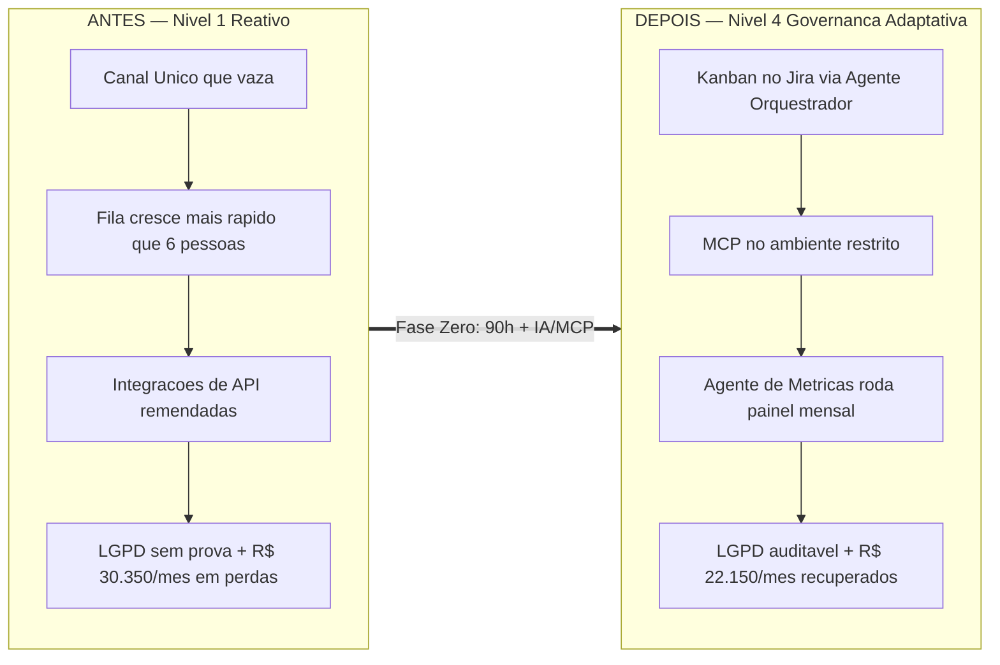

# Perfil D — empresa de 100 funcionários: governança adaptativa sob pressão de LGPD

> Simulação de ROI do framework **GP-PME**. Todas as fórmulas vêm de [`Calculadora_ROI.md`](./Calculadora_ROI.md); os números são conservadores e as premissas estão declaradas. Custo-hora de TI deste perfil: **`Ch` = R$ 70/h (blended)** — equipe de 5 a 8 pessoas, salário médio de referência R$ 7.950 bruto (`(7.950 × 1,55) / 176 ≈ R$ 70`). Este é o único perfil que **começa no Nível 1** (já saiu do caos puro) e onde os **agentes de IA + servidor MCP são centrais**, não opcionais, na implantação.

---

## 1. Retrato da empresa

| Item | Descrição |
| :--- | :--- |
| **Setor** | Serviços B2B com grande base de dados pessoais de clientes (saúde/financeiro/educação) |
| **Porte** | 100 colaboradores (operação, atendimento, comercial, backoffice, produto) |
| **Faturamento** | ~R$ 45 milhões/ano |
| **Equipe de TI** | **6 pessoas** (1 coordenador, 3 analistas de suporte/infra, 1 dev de integrações, 1 foco em segurança/**DPO técnico**) — dimensionável de 5 a 8 |
| **Orçamento anual de TI** | **R$ 1.200.000** (6 salários com encargos ~R$ 890k + ERP/CRM + nuvem + link redundante + ferramentas ~R$ 310k) |
| **Stack** | ERP + CRM em nuvem, plataforma proprietária de atendimento, Microsoft 365, ambiente de dados restrito (LGPD), 100+ estações, integrações via API, 2 filiais |

A empresa já saiu do caos puro — tem Canal Único informal, backup rodando e um coordenador. O problema agora é **escala e conformidade**: 100 usuários geram um volume de chamados que a governança de Nível 1 não segura, e a base de dados pessoais coloca a **LGPD** como risco de negócio (multa de até 2% do faturamento). O dono não quer "mais um técnico" — quer **governança adaptativa** que prove conformidade e absorva crescimento sem estourar a folha. É aqui que os agentes de IA e o servidor MCP deixam de ser luxo e viram infraestrutura da operação.

---

## 2. Sem o framework — a dor narrada

O Canal Único existe, mas "vaza": gerentes ainda ligam direto para o coordenador nas urgências, e cada analista prioriza do seu jeito. O volume de 100 usuários enche a fila mais rápido do que 6 pessoas conseguem drenar, e o backlog cresce sem que ninguém consiga dizer ao dono **o que** está travado e **por quê**. As integrações via API entre CRM, plataforma de atendimento e ERP acumularam remendos — quando uma quebra, o atendimento cai e clientes ficam sem resposta. E paira a pergunta que ninguém sabe responder no comitê: **"se a Autoridade Nacional bater à porta amanhã, provamos onde estão os dados pessoais e quem os acessa?"** Hoje, não.

O custo é grande, parcialmente visível (há algum KPI), mas **a conformidade LGPD é um passivo silencioso** que só aparece quando vira incidente — e aí é tarde.

### Tabela de linha-de-base (o "antes")

**Premissas de cálculo declaradas** — jornada `J` = 176 h/mês, encargos `f` = 1,55, custo-hora TI `Ch` = **R$ 70/h (blended)**, custo-hora do usuário final `Cu` = **R$ 25/h**, horas comerciais/ano `Hc` = **4.500 h** (operação de atendimento estendida).

| Métrica | Valor (antes) | Como foi estimado |
| :--- | :---: | :--- |
| **IDSC** (disponibilidade de serviços críticos) | **98,5%** | Já em Nível 1; instabilidade concentrada nas integrações de API (~1,5% parado) |
| **Horas paradas/ano** | **67,5 h** | `(1 − 0,985) × 4.500` |
| **TMpR** (tempo médio de resolução) | **6,5 h** | Há fila, mas o vazamento de canais ainda atrasa a priorização |
| **ISU** (satisfação do usuário, 1–5) | **3,6** | Volume alto satura a equipe; usuários esperam demais |
| **Incidentes/ano** | **~2.400** | ~200/mês → 2,0 por colaborador/mês |
| **Horas de TI desperdiçadas/mês** | **180 h** | 6 pessoas em multitarefa, priorização inconsistente, remendos de API |
| **Horas de retrabalho dos usuários/mês** | **260 h** | Digitação dupla entre CRM/ERP, exportações manuais, correções de dados |
| **DAN** (Dívida de Arquitetura Normalizada) | **0,175 🟡 Alerta** | `(3.000 h × R$ 70) / R$ 1.200.000 = 0,175` — integrações de API remendadas, sem catálogo de dados |

### Custo mensal das dores (fórmulas §4 da Calculadora)

```
CTD (TI desperdiçado)   = 180 h × R$ 70 = R$ 12.600/mês
CRM (retrabalho usuário)= 260 h × R$ 25 = R$  6.500/mês
CHP                     = (80 colab × R$ 25) + 0 = R$ 2.000/h
Perda_Indisp            = 2.000 × (67,5 / 12)     = R$ 11.250/mês
------------------------------------------------------------
Custo total das dores   ≈ R$ 30.350/mês  (≈ R$ 364.200/ano)
```
> `%_Receita_em_Risco = 0`: ignoramos a receita de atendimento perdida a cada queda de API, para não inflar o número. (O risco LGPD é tratado à parte, na seção 7.)

**IM-TI de partida: Nível 1 — Reativo Organizado** (4 de 10 respostas "Sim").

---

## 3. Implantação semana a semana

Com **6 pessoas e conformidade em jogo**, a implantação já nasce **assistida por IA e integrada ao ambiente restrito**. Aqui os agentes ADK/skills e o **servidor MCP** do framework não são atalho — são a forma de operar governança em escala sem contratar. Custo total da Fase Zero: **~90 h** de TI somadas.

### Fase Zero — os primeiros 30 dias (Consolidar e Blindar)

Fonte: `Guia_de_Implementacao_Fase_Zero.md`. Como a empresa já está em Nível 1, a Fase Zero foca em **fechar os vazamentos** e **instrumentar conformidade**, não em construir do zero.

| Semana | Ação | Artefato / agente usado | Horas |
| :--- | :--- | :--- | :---: |
| **1** | Diagnóstico de maturidade; o **Agente Orquestrador/Gestor instala o Kanban no Jira** com WIP e Raia Rápida e migra o backlog disperso; fechamento formal dos canais paralelos (comunicado do CEO) | `Agentes_Prontos/Agente_Orquestrador_Gestor_GP-PME.md`; `agents/` (ADK); board no Jira | 30 h |
| **2** | **Servidor MCP** publicado no **ambiente de dados restrito**, expondo de forma controlada FAQ, catálogo de ativos e status de backup aos agentes (sem tirar dados do perímetro LGPD); **Inventário 80/20** + **catálogo de dados pessoais**; **Backup 3-2-1** + teste de restauração < 30 min | `server/` (MCP); `Agente_Seguranca.md`; `Templates_GP-PME.md` | 24 h |
| **3** | **PRI de 1 página** + **playbook de incidente LGPD** (notificação à ANPD em 72 h) auditados pelo **Agente de Segurança**; 1º **CD-TI Lite** com o DPO técnico; **Matriz 4 Quadrantes** | `Guia_Pilar_3` (PRI); `Agente_Seguranca.md`; `Template_Checklist_Auditoria_HITL.md` | 20 h |
| **4** | O **Agente de Métricas e Auditoria roda o painel mensal** (IDSC, TMpR, ISU + indicadores de conformidade) automaticamente; retrospectiva; recálculo do IM-TI → **Nível 2** | `Agentes_Prontos/Agente_Metricas_e_Auditoria.md` | 16 h |

**Entregável Fase Zero**: IM-TI sobe de Nível 1 → **Nível 2 (Governança Básica)** com trilha de auditoria LGPD instrumentada.

### Fases Um a Três (meses 2 a 12)

- **Fase Um — Orquestrador de Valor**: sprint semanal + Raia Rápida orquestrados pelo agente; o coordenador governa por exceção, olhando o painel em vez de tocar chamado.
- **Fase Dois — Agente de Mudança**: **MVPs de 2 semanas** encadeados — o primeiro elimina a digitação dupla CRM↔ERP (maior fonte de retrabalho). O **Agente de PRD** redige cada MVP; a esteira **HITL** (`Template_Checklist_Auditoria_HITL.md`) garante revisão humana antes de qualquer mudança tocar dados pessoais.
- **Fase Três — Parceiro Estratégico / Governança Adaptativa**: **DAN** sob gestão contínua (integrações de API refatoradas e catalogadas); os agentes passam a sugerir priorização a partir das próprias métricas — a governança começa a **se autoajustar** (Nível 4).

> **Onde a IA é central (não opcional) neste perfil**: o **Agente Orquestrador** (`Agente_Orquestrador_Gestor_GP-PME.md`) instala e mantém o Kanban; o **Agente de Métricas** (`Agente_Metricas_e_Auditoria.md`) roda o painel mensal sem consumir a equipe; o **servidor MCP** (`server/`) atende o **ambiente restrito** dando contexto aos agentes sem violar o perímetro LGPD; o **Agente de Segurança** (`Agente_Seguranca.md`) audita PRI e conformidade. Toda ação sensível passa por **HITL** — humano no laço. Diferente dos perfis A–C, **parte do ganho de escala do Perfil D depende dessa camada de IA** para caber em 6 pessoas.

---

## 4. Com o framework — resultados justificados

### Aos 90 dias

- **TMpR cai de 6,5 h → 4,5 h**: o fechamento dos canais paralelos + Raia Rápida orquestrada eliminam o vazamento de priorização.
- **IDSC sobe de 98,5% → 99,3%**: o **Inventário 80/20** prioriza as integrações de API e o **backup testado** encurta a recuperação; o painel do Agente de Métricas expõe o gargalo real.
- **Autoatendimento**: FAQ servida via MCP resolve ~45% das dúvidas de Nível 1 antes de abrir cartão.
- **IM-TI: Nível 3 (Inovação Incremental)** — ciclo de MVP e conformidade LGPD instrumentada rodando.

### Aos 12 meses (estado estabilizado — base do ROI)

| Métrica | Antes | Depois (12 m) | Mecanismo do framework |
| :--- | :---: | :---: | :--- |
| IDSC | 98,5% | **99,7%** | Inventário 80/20 + Backups 3-2-1 + integrações de API refatoradas |
| Horas paradas/ano | 67,5 h | **13,5 h** | `(1 − 0,997) × 4.500` |
| TMpR | 6,5 h | **3,5 h** | Canal Único sem vazamento + Raia Rápida orquestrada por agente |
| ISU | 3,6 | **4,6** | Fila drenada; painel de métricas + feedback pós-atendimento |
| Horas TI desperdiçadas/mês | 180 h | **60 h** | WIP + orquestração por agente acabam com a multitarefa das 6 pessoas |
| Horas retrabalho/mês | 260 h | **70 h** | MVP elimina a digitação dupla CRM↔ERP |
| DAN | 0,175 🟡 | **0,11 🟢** | Matriz 4 Quadrantes + integrações de API catalogadas e refatoradas |
| Maturidade | Nível 1 | **Nível 4 (Governança Adaptativa)** | Agentes sugerem priorização a partir das métricas; conformidade contínua |

### Ganho mensal (fórmula §4.4 da Calculadora)

```
Saved_CTD  = (180 − 60) h × R$ 70 = 120 × 70 = R$ 8.400
Saved_CRM  = (260 − 70) h × R$ 25 = 190 × 25 = R$ 4.750
Perda_Indisp_depois = 2.000 × (13,5 / 12) = R$ 2.250
Saved_Indisp = 11.250 − 2.250 = R$ 9.000
------------------------------------------------------
Ganho_Mensal = 8.400 + 4.750 + 9.000 = R$ 22.150/mês  (≈ R$ 265.800/ano)
```

---

## 5. Antes × Depois

| Dimensão | Antes (Nível 1) | Depois — 12 m (Nível 4) |
| :--- | :--- | :--- |
| Entrada de chamados | Canal Único que "vaza" | **Canal Único fechado** + FAQ via MCP |
| Fluxo de trabalho | 6 pessoas priorizando cada uma do seu jeito | **Kanban no Jira orquestrado por agente** |
| Disponibilidade (IDSC) | 98,5% | **99,7%** |
| Resolução (TMpR) | 6,5 h | **3,5 h** |
| Satisfação (ISU) | 3,6 | **4,6** |
| Retrabalho (CRM↔ERP) | 260 h/mês manuais | **70 h/mês** (integração automatizada) |
| Dívida técnica (DAN) | 0,175 🟡 | 0,11 🟢 |
| Conformidade LGPD | Passivo silencioso, não provável | **Catálogo de dados + trilha de auditoria + playbook ANPD** |
| Papel da TI | Coordenação reativa em escala | **Governança adaptativa assistida por IA** |



---

## 6. ROI, payback e cenários

### Investimento (COT — fórmula §2.2 da Calculadora)

```
Custos_Indiretos = 540 h de TI (Fase Zero 90 h + Fases 1-3 ~450 h) × R$ 70 = R$ 37.800
Custos_Diretos   = R$ 10.000 (backup/DR em nuvem robusto/ano)
                 + R$ 10.000 (treinamento + consultoria LGPD)
                 + R$  8.000 (Jira + servidor MCP + plataforma de agentes/licenças)
                 = R$ 28.000
------------------------------------------------------------------------------
COT = 37.800 + 28.000 = R$ 65.800
```
> O COT deste perfil é o maior das quatro simulações — mais horas de implantação (equipe maior, ambiente restrito) e a camada de IA/MCP nos custos diretos. Ainda assim, ~57% do COT é tempo de TI que a empresa **já pagava** na folha das 6 pessoas.

### ROI e Payback

```
ROI_Pratico = (Ganho_Mensal × 12 / COT) × 100 = (22.150 × 12 / 65.800) × 100 = 404% ao ano
Payback     = COT / Ganho_Mensal = 65.800 / 22.150 = 3,0 meses
```

### Cenários

| Cenário | Premissa | Ganho mensal | ROI anual | Payback |
| :--- | :--- | :---: | :---: | :---: |
| **Esperado** | Ganho integral projetado | R$ 22.150 | **404%** | **3,0 meses** |
| **Conservador** | Apenas 60% do ganho (haircut de 40%) | R$ 13.290 | **242%** | **5,0 meses** |

Mesmo no cenário pessimista, o investimento se paga em **5 meses** — e isso ignora completamente o risco LGPD evitado, que neste perfil é o maior de todos.

---

## 7. Riscos evitados (upside de segurança + LGPD — não entra no ROI acima)

Apresentado à parte para manter o ROI conservador. Fonte: `Guia_Pilar_3_Seguranca_Critica.md` — os **10 controles NIST-Lite** (destilação do CIS Controls v8, IG1). Neste perfil o vetor dominante não é só a parada operacional: é o **vazamento de dados pessoais** e a sanção da **LGPD**.

### Custo de risco evitado (fórmula §5 da Calculadora)

```
Risco_Evitado_Ano = (Prob_SEM − Prob_COM) × Custo_Médio_por_Incidente
                   = (0,20 − 0,04) × R$ 250.000 = 0,16 × 250.000 = R$ 40.000/ano
```
> Para uma empresa que trata dados pessoais em escala, o "incidente" combina ransomware **e** vazamento sujeito à LGPD: parada + recuperação + notificação à ANPD + sanção + dano reputacional. R$ 250.000 é uma estimativa conservadora do custo direto médio; a multa administrativa da LGPD pode chegar a **2% do faturamento** (aqui, até ~R$ 900 mil), o que colocaria o risco evitado em outra ordem de grandeza. Mantemos R$ 250.000 para não inflar.

### Mapa dos 10 controles NIST-Lite + camada LGPD (o que a Fase Zero blindou)

| # | Controle | Status após implantação | Risco que mitiga |
| :---: | :--- | :--- | :--- |
| 1 | Inventário de Hardware | ✅ (80/20: ERP, CRM, plataforma, servidores) | Ativo crítico "invisível" sem proteção |
| 2 | Inventário de Software + **catálogo de dados pessoais** | ✅ (base LGPD mapeada: onde estão e quem acessa) | Dados pessoais sem rastreabilidade → sanção LGPD |
| 3 | Gestão de Vulnerabilidades | ✅ (ciclo de patch + varredura das APIs) | Exploração de falha conhecida |
| 4 | Configurações Seguras | ✅ (hardening + segregação do ambiente restrito) | Serviços expostos / vazamento lateral |
| 5 | Contas de Acesso + **MFA** | ✅ (MFA em 365, CRM, ERP e ambiente de dados) | Roubo de credencial / acesso indevido a dados pessoais |
| 6 | **Privilégio Mínimo (LUA)** | ✅ (acesso a dados pessoais por necessidade, revisado) | Acesso excessivo → exposição LGPD |
| 7 | Defesas contra Malware | ✅ (EDR gerenciado) | Ransomware / exfiltração |
| 8 | **Backup 3-2-1 testado** | ✅ (restauração < 30 min validada trimestralmente) | Perda/sequestro de dados |
| 9 | Firewall / Proteção de Rede | ✅ (segmentação + perímetro do ambiente restrito) | Movimentação lateral até os dados pessoais |
| 10 | **Treinamento + playbook LGPD (ANPD 72 h)** | ✅ (anti-phishing + notificação de incidente ensaiada) | Engenharia social + descumprimento do prazo legal de notificação |

**Upside total do Perfil D**: **~R$ 40.000/ano** de risco evitado (piso conservador; a exposição LGPD real é maior), *somados* aos R$ 265.800/ano de ganho de produtividade. Não contabilizamos isso no ROI de 404% — se o fizéssemos, o retorno subiria de forma expressiva.
