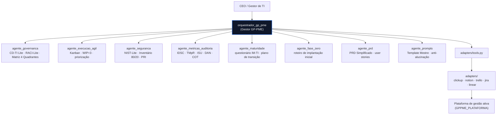

# Agentes GP-PME (Google ADK)

Pacote de agentes de IA que operacionalizam o framework **GP-PME** (Gestão de
TI Enxuta e Micro-Adaptativa para Pequenas e Médias Empresas) usando o
[Google Agent Development Kit](https://google.github.io/adk-docs/) (ADK).

Um agente orquestrador ("Gestor GP-PME") conduz o diagnóstico e a implantação
do framework, delegando para 8 especialistas — um por tema — e operando o
quadro Kanban diretamente na ferramenta de gestão da empresa (ClickUp,
Notion, Trello, Jira ou Linear).

## O que é

O GP-PME organiza a TI de uma PME em 4 pilares (Governança, Execução Ágil,
Segurança, IA) e uma Fase Zero de implantação. Este pacote traduz cada peça
do framework — guias, templates, questionários e checklists — em agentes
conversacionais que um CEO ou um técnico de TI sozinho ("One-Man-Band") pode
usar diretamente, sem precisar ler os guias inteiros.

Nenhum agente inventa dados: quando falta informação (orçamento, métricas,
nomes de sistemas), a resposta é "DADO INSUFICIENTE" em vez de uma suposição.
Ações destrutivas ou irreversíveis em plataformas externas sempre pedem
confirmação humana (HITL — Human-in-the-loop).

## Arquitetura



- **Orquestrador** (`orquestrador_gp_pme`): único `root_agent` pensado para
  ser executado. Diagnostica maturidade, conduz a Fase Zero, instala o
  quadro canônico na plataforma e delega perguntas de domínio aos
  especialistas via `sub_agents`.
- **8 especialistas**: cada um é um agente independente (`agente_x/agent.py`)
  com ferramentas locais (sem rede) — cálculo de KPIs, scoring, geração de
  artefatos em texto — destiladas dos guias e templates do framework.
- **5 adapters**: implementam a interface `adapters/base.py` para cada
  plataforma suportada. Só o orquestrador os utiliza, via
  `adapters/tools.py`.

## Instalação

Pré-requisitos: Python ≥ 3.10.

```powershell
cd "agents\gp-pme-adk"
pip install -r requirements.txt
```

Copie o arquivo de configuração e preencha o que for necessário:

```powershell
copy .env.example .env
```

`GOOGLE_API_KEY` é **obrigatória** para rodar os agentes de verdade (ela
autentica as chamadas ao Gemini feitas pelo `google-adk`). Sem ela, `adk
run`/`adk web` falham ao iniciar. As credenciais de plataforma (Trello,
ClickUp etc.) são opcionais — sem elas, o adapter ativo roda em modo
dry-run automaticamente.

## Executando

A partir de `agents/gp-pme-adk/`:

```powershell
# CLI interativa, conversando com o orquestrador
adk run orquestrador_gp_pme

# Interface web local (chat + inspeção de ferramentas/sub-agentes)
adk web
```

`adk web` sobe um servidor local e lista todos os agentes do diretório
(`orquestrador_gp_pme` e cada `agente_x`) para você escolher com qual
conversar — útil para testar um especialista isoladamente.

## Variáveis de ambiente

| Variável | Obrigatória | Padrão | Descrição |
|---|---|---|---|
| `GOOGLE_API_KEY` | Sim (para rodar) | — | Chave da API do Google AI Studio / Gemini. Obtenha em https://aistudio.google.com/app/apikey |
| `GPPME_MODEL` | Não | `gemini-2.5-flash` | Modelo Gemini usado por todos os agentes. |
| `GPPME_PLATAFORMA` | Não | `trello` | Plataforma de gestão ativa: `clickup` \| `notion` \| `trello` \| `jira` \| `linear`. |
| `GPPME_DRY_RUN` | Não | vazio | `1` força modo simulação mesmo com credenciais configuradas. Se vazio, dry-run liga sozinho quando faltar credencial. |
| `CLICKUP_TOKEN` | Não | — | Token de API do ClickUp. |
| `NOTION_TOKEN` | Não | — | Token da integração Notion. |
| `TRELLO_KEY` / `TRELLO_TOKEN` | Não | — | Chave e token de API do Trello. |
| `JIRA_URL` / `JIRA_EMAIL` / `JIRA_TOKEN` | Não | — | URL do site Jira Cloud, e-mail da conta e token de API. |
| `LINEAR_API_KEY` | Não | — | Chave de API pessoal do Linear. |

Veja `.env.example` para instruções de onde gerar cada credencial.

## Exemplo de conversa

```
Você: instale o GP-PME no meu Trello

Gestor GP-PME: Antes de instalar, preciso de um diagnóstico rápido de
maturidade — vou te passar o questionário de 10 perguntas (Sim/Não) do
agente_maturidade...

[usuário responde]

Gestor GP-PME: IM-TI = 3/10 → Nível 1 (Reativo Organizado). Vou seguir com
a Fase Zero antes de montar o quadro. [...roteiro do agente_fase_zero...]

Vou agora instalar o quadro canônico no Trello (colunas: A Fazer → Em
Andamento (máx 3) → Em Teste → Concluído, com as 8 tarefas da Fase Zero em
"A Fazer"). Confirma que posso prosseguir? [SIMULADO — sem TRELLO_KEY/
TRELLO_TOKEN configurados, dry-run ativo]

Você: pode

Gestor GP-PME: Quadro simulado com sucesso (dry-run). Para aplicar de
verdade, configure TRELLO_KEY e TRELLO_TOKEN no .env e peça novamente.
```

## Modo dry-run

Com `GPPME_DRY_RUN=1` (ou faltando credencial da plataforma escolhida),
nenhum adapter faz chamada de rede: as ações ficam simuladas e acumuladas em
`acoes_planejadas`, com payloads realistas. É o modo padrão para demonstrar
o framework sem tocar em dados reais, e o modo usado pelos testes
automatizados (`tests/test_adapters_dry_run.py`).

## Troubleshooting (Windows)

- **Caminho com espaço**: o repositório vive em `GP-PME framework\`. Sempre
  use aspas em comandos: `cd "agents\gp-pme-adk"`.
- **`adk` não é reconhecido**: confirme que `pip install -r requirements.txt`
  rodou no mesmo Python/venv do `PATH` atual; reabra o terminal se acabou de
  instalar.
- **Erro de `GOOGLE_API_KEY` ausente**: verifique se `.env` está na pasta
  `agents/gp-pme-adk/` (mesmo nível deste README) — o `python-dotenv` só
  carrega arquivos `.env` locais, não do diretório do repositório.
- **Emojis/acentos quebrados no console**: o PowerShell padrão do Windows
  às vezes usa `cp1252`. Rode `chcp 65001` antes, ou use o Terminal
  moderno do Windows (UTF-8 por padrão).
- **`ModuleNotFoundError: adapters` ao rodar testes fora da pasta**: rode
  `pytest` sempre a partir de `agents/gp-pme-adk/` — o `sys.path` é ajustado
  relativo a esse diretório.
