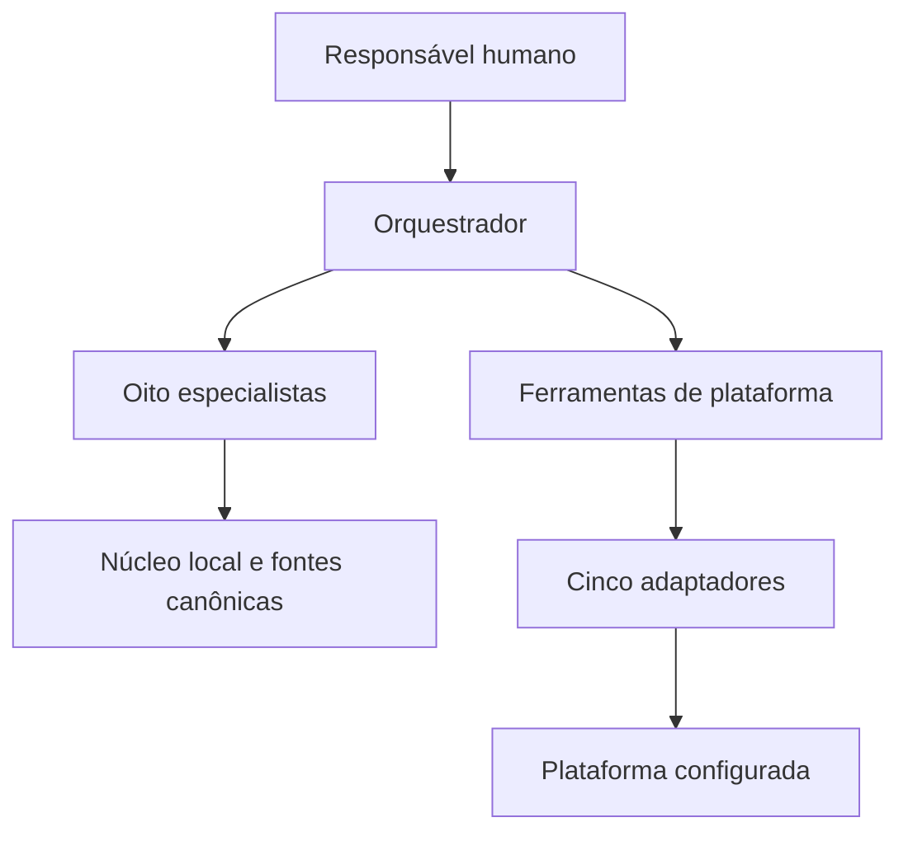

# GEAR — assistência opcional com Google ADK

Este pacote prepara rascunhos, cálculos e propostas de organização para o GEAR. A operação do framework e o nível máximo de maturidade podem ser alcançados sem IA. Fonte editorial: [documentação canônica](../../framework/README.md); referência técnica existente: [Google ADK](https://google.github.io/adk-docs/).

## Componentes e responsabilidades

Há um orquestrador e oito especialistas implementados. Eles distribuem tarefas técnicas; sua quantidade não cria novos domínios do framework. Os três domínios são governança e direção, execução e serviços, segurança e continuidade.

| Módulo | Tarefa e limite |
| --- | --- |
| `orquestrador_gp_pme` | Encaminha tarefas e usa adaptadores de plataforma |
| `agente_governanca` | RACI-Lite, decisões conjuntas e matriz valor/esforço |
| `agente_execucao_agil` | Roteiro de trabalho e contagem agregada; conferir executor |
| `agente_seguranca` | Menções textuais e rascunho de resposta; não estima risco por palavras |
| `agente_metricas_auditoria` | Cálculos e verificações pendentes; não certifica entregas |
| `agente_maturidade` | Questionário local e lacunas com evidências |
| `agente_fase_zero` | Agenda apenas os 30 dias iniciais, sem transição automática |
| `agente_prd` | Rascunho e triagem lexical de títulos; não valida viabilidade |
| `agente_prompts` | Modelo de instruções e contagem de menções; não garante acerto |

`adapters/tools.py` conecta o orquestrador a cinco adaptadores: ClickUp, Notion, Trello, Jira e Linear. As funções locais não consultam rede; os adaptadores podem produzir efeitos externos quando há credenciais e o dry-run não foi forçado. Conferir destino, alçada e autorização antes de executar.



## Instalar e executar

Requer Python 3.10 ou superior e dependências do pacote. A partir desta pasta:

```powershell
python -m pip install -r requirements.txt
Copy-Item -LiteralPath .env.example -Destination .env
adk run orquestrador_gp_pme
```

`adk web` oferece a interface local e seleção de agentes. Use ambiente com credenciais do provedor configuradas para o modelo escolhido. O código atual usa Gemini e `GOOGLE_API_KEY`; sem acesso válido, chamadas reais não foram demonstradas. Não colocar segredos em documentos ou controle de versão.

| Variável | Função |
| --- | --- |
| `GOOGLE_API_KEY` | Acesso ao provedor no caminho Gemini configurado |
| `GPPME_MODEL` | Padrão do código: `gemini-2.5-flash` |
| `GPPME_PLATAFORMA` | Padrão `trello`; opções clickup, notion, trello, jira, linear |
| `GPPME_DRY_RUN` | `1` força propostas locais mesmo com credenciais |
| `CLICKUP_TOKEN` | Credencial de ClickUp |
| `NOTION_TOKEN` | Credencial de integração Notion |
| `TRELLO_KEY`, `TRELLO_TOKEN` | Credenciais de Trello |
| `JIRA_URL`, `JIRA_EMAIL`, `JIRA_TOKEN` | Site e credenciais Jira |
| `LINEAR_API_KEY` | Credencial de Linear |

Os nomes GP-PME permanecem em módulos, variáveis e contratos por compatibilidade. Não indicam outra edição conceitual.

## Proposta, execução e evidência

`GPPME_DRY_RUN=1`, ou ausência de credenciais da plataforma, prepara ações em `acoes_planejadas` sem chamada de rede. A resposta traz `dry_run`. IDs e URLs simulados são dados de teste; não demonstram criação de um quadro real. Esse modo não dispensa credencial de modelo se a conversa usar ADK.

O quadro tem A Fazer, Em Andamento, Em Teste e Concluído. O rótulo histórico “Em Andamento (máx 3)” permanece nos adaptadores, mas o limite é por executor e abrange testes e bloqueios. Sem executor ou informação de início, não atestar cumprimento de WIP. Emergência requer registro de decisão e efeito sobre trabalho já iniciado.

Exemplo de procedimento: nomear responsáveis, aplicar diagnóstico com evidências, escolher a plataforma, revisar a proposta dry-run e conferir autorização antes de uma chamada real. A proposta inicial contém oito tarefas-semente; o checklist detalhado do núcleo contém nove passos. Uma lista criada não comprova execução desses passos.

As instruções pedem dados insuficientes e fontes, mas o modelo pode errar. Conferir conteúdo e evidência antes de uso. Funções de PRD e prompt fazem buscas lexicais; títulos presentes não demonstram critérios testáveis, aprovação humana ou qualidade.

## Verificação e problemas de execução

Na raiz: `python -m unittest discover -s tests -v`. A suíte original de adaptadores pode ser executada a partir desta pasta: `python -m pytest tests/test_adapters_dry_run.py`. Os testes dry-run verificam contratos locais; não validam APIs das plataformas, SDK em conversa real ou efetividade organizacional.

Em Windows, usar aspas em caminhos com espaços. Se `adk` não estiver no PATH, conferir o Python/ambiente que recebeu as dependências. Se houver erro de credencial, conferir a configuração do ambiente sem imprimir a chave. Para importação de `adapters` na suíte original, executar na pasta do pacote. Configuração de encoding UTF-8 pode ser feita pelo terminal ou com `PYTHONIOENCODING=utf-8`.

MCPs deste usuário são geridos pelo hub global, com clientes por URL; [serviços](../../server/README.md) registra a política. Não instalar servidor MCP por cliente ou neste pacote por inferência.

